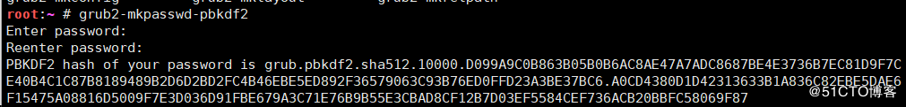
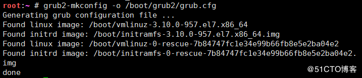
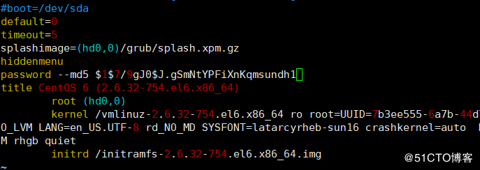

## centos7配置

<!--more-->

### 1.生成密码

```
root:~ # grub2-mkpasswd-pbkdf2
```



### 2.编辑文件

```
root:~ # vim /etc/grub.d/00_header
```


```
cat <<EOF
set superusers='root'
password_pbkdf2  root grub.pbkdf2.sha512.10000.B26A27BDB528B6B5C06979B5E0EFD8B9B436D96629C78B062A2B161945BE38965118BB13D2D88C09FFC415DDE73BBD294795F00F08279957DA0132978E0A69D0.8A506D6B41740DEB74A1C618D0E34BC1DBC0578800C40599670D81BF13DA3DC5D0427C21325BAAEC73A12789A096BD077A06B918F5A74C420A4B291CFD059E76
EOF
```

### 3.更新grub信息

```
root:~ # grub2-mkconfig -o /boot/grub2/grub.cfg
```



### 测试(显示引导时按e进入输入密码模式)成功


## centos6配置

### 获取密文密码

```
# grub-md5-crypt
```

### 编辑文件(在title行上面加入password –md5)

```
vim /boot/grub/grub.conf
password --md5 
```



### 重启测试(按p进入grub)输入密码才可修改，成功