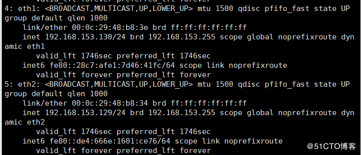
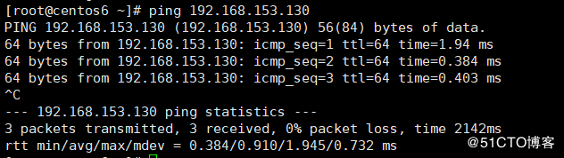

常用的绑定驱动模式有:
mode=0平衡负载模式:平时两块网卡均工作，且自动备援，采用Switch支援。
mode=1自动备援模式:平时只有一块网卡工作，故障后自动替换为另外的网卡。
mode=2平衡策略模式:此模式提供负载平衡和容错能力
mode=6:平衡负载模式:平时两块网卡均工作，且自动备援，无须设置Switch支援。

<!--more-->

### 1.添加2块网卡


### 2.确认网卡正常工作



### 3.添加新网卡配置文件

#### 现在新添加的两块网卡均无配置文件需手动添加


### ifcfg-eth1

```
TYPE=Ethernet
DEVICE=eth1
ONBOOT=yes
BOOTPROTO=none
USERCTL=no
MASTER=bond0
SLAVE=yes
```

### ifcfg-eth2

```
TYPE=Ethernet
DEVICE=eth2
ONBOOT=yes
BOOTPROTO=none
USERCTL=no
MASTER=bond0
SLAVE=yes
```

### ifcfg-bond0

```
TYPE=Bond
BOOTPROTO=none
ONBOOT=yes
USERCTL=no
DEVICE=bond0
IPADDR=192.168.153.130
NETMASK=255.255.255.0
BONDING_OPTS= “miimon=100 mode=0”   //模式0，miimon是用来进行链路监测
```

### 4.bond配置,修改modprobe相关设定文件

需要关闭NetworkManager服务

```
# systemctl stop NetworkManager
# systemctl disable NetworkManager
```

### 5.查看内核是否加载bonding

重启网络服务

```
systemctl restart network
```

查看内核是否加载

```
# lsmod |grep bonding
```


### 6.查看是否成功(eth1与eth2 MAC地址已同步说明绑定成功)


在另一台同网段虚拟机也可以ping通


### 7.多网卡也只需添加一块网卡写入配置文件即可