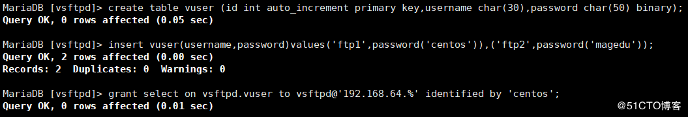

### 环境：

两台主机，一台ftp 服务器， 一台mysql server

<!--more-->

------

**mysql服务器：**
\* yum源

```
[root@localhost ~]#vim /etc/yum.repos.d/mariadb.repo 
[mariadb]
name = MariaDB
baseurl = https://mirrors.ustc.edu.cn/mariadb/yum/10.2/centos7-amd64/
gpgcheck=0
```

- 安装与数据库建立表

```
[root@localhost ~]# yum clean all
[root@localhost ~]# yum install -y mariadb mariadb-server
[root@localhost ~]# systemctl start mariadb
[root@localhost ~]# mysql
MariaDB [(none)]> use vsftpd
Database changed

MariaDB [vsftpd]> create table vuser (id int auto_increment primary key,username char(30),password char(50) binary);
Query OK, 0 rows affected (0.05 sec)

MariaDB [vsftpd]> insert vuser(username,password)values('ftp1',password('centos')),('ftp2',password('magedu'));
Query OK, 2 rows affected (0.00 sec)
Records: 2  Duplicates: 0  Warnings: 0

MariaDB [vsftpd]> grant select on vsftpd.vuser to vsftpd@'192.168.64.%' identified by 'centos';
Query OK, 0 rows affected (0.01 sec)
```



------

**ftp服务器:**
\* 1编译安装pam_mysql.so

> 下载地址：http://prdownloads.sourceforge.net/pam-mysql/pam_mysql-0.7RC1.tar.gz

```
[root@localhost ~]# yum install gcc gcc-c++ pam-devel mariadb-devel
[root@localhost ~]# tar xf pam_mysql-0.7RC1.tar.gz 
[root@localhost ~/pam_mysql-0.7RC1]# cd pam_mysql-0.7RC1/
[root@localhost ~/pam_mysql-0.7RC1]# ./configure  --with-pam-mods-dir=/lib64/security 
[root@localhost ~/pam_mysql-0.7RC1]#echo $?
0
[root@localhost ~/pam_mysql-0.7RC1]# make && make install
[root@localhost ~/pam_mysql-0.7RC1]#echo $?
0
```

- 2 创建pam配置文件

```
[root@localhost ~]# vim  /etc/pam.d/vsftpd.mysql 
auth required pam_mysql.so user=vsftpd passwd=centos host=192.168.36.17  db=vsftpd table=vuser usercolumn=username passwdcolumn=password crypt=2
account required pam_mysql.so user=vsftpd passwd=centos host=192.168.36.17 db=vsftpd table=vuser usercolumn=username passwdcolumn=password crypt=2
```

- 3 修改vsftpd配置，调用pam配置

```
[root@localhost ~]# yum install vsftpd
[root@localhost ~]# vim /etc/vsftpd/vsftpd.conf
pam_service_name=vsftpd.mysql     修改此行   
加下面三行                                                                                 
guest_enable=YES
guest_username=vuser
user_config_dir=/etc/vsftpd/vusers.d/
[root@localhost ~]# mkdir /etc/vsftpd/vusers.d/
```

- 4 创建系统用户

```
useradd -r -s /sbin/nologin -d /data/ftproot vuser
mkdir /data/ftproot
```

- 5 各个虚拟用户不同的ftp配置

```
[root@localhost ~]# vim  /etc/vsftpd/vusers.d/ftp1 
anon_upload_enable=YES
anon_mkdir_write_enable=YES
anon_other_write_enable=YES
local_root=/data/ftp1

vim /etc/vsftpd/vusers.d/ftp2
anon_upload_enable=YES
anon_mkdir_write_enable=YES
anon_other_write_enable=YES
local_root=/data/ftp2

[root@localhost ~]# mkdir /data/ftp{1,2} -pv
```

- 6禁止匿名用户登录

```
[root@localhost ~]# vim /etc/vsftpd/vsftpd.conf
anonymous_enable=NO
```

- 7测试