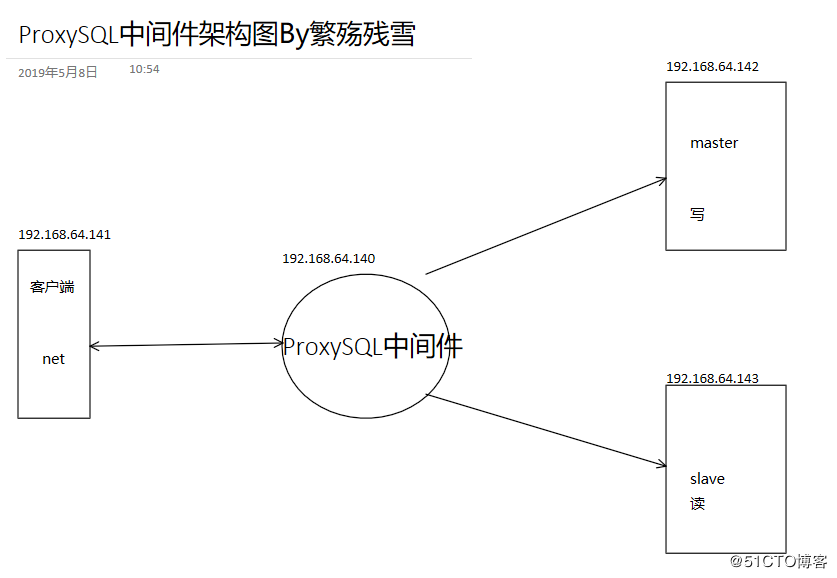
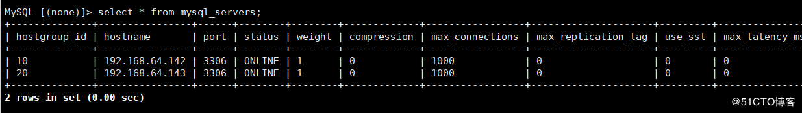

- 在拓扑结构中，ProxySQL部署在应用程序和MySQL集群的中间位置。应用程序向ProxySQL发起SQL语句，ProxySQL分析收到的SQL语句，进行匹配、重写等操作，然后路由给后端MySQL集群中的某实例。

<!--more-->

### 各大网站自己的读写分离中间件

读写分离应用：

> mysql-proxy：Oracle，https://downloads.mysql.com/archives/proxy/
> Atlas:Qihoo,https://github.com/Qihoo360/Atlas/blob/master/README_ZH.md
> dbproxy：美团，https://github.com/Meituan-Dianping/DBProxy
> Cetus：网易乐得，https://github.com/Lede-Inc/cetus
> Amoeba：https://sourceforge.net/projects/amoeba/
> Cobar：阿里巴巴，Amoeba的升级版
> Mycat：基于Cobar， http://www.mycat.io/
> ProxySQL：https://proxysql.com/

### 这里使用ProxySQL

- 两个版本：官方版和percona版，
- percona版是基于官方版基础上修改，C++语言开发，轻量级但性能优异(支持处理千亿级数据)
- 具有中间件所需的绝大多数功能，包括：

> 多种方式的读/写分离
> 定制基于用户、基于schema、基于语句的规则对SQL语句进行路由
> 缓存查询结果
> 后端节点监控
> 官方站点：https://proxysql.com/
> 官方手册：https://github.com/sysown/proxysql/wiki

## 架构图



## 环境准备

- **实现读写分离前，先实现主从复制**
- **注意：slave节点需要设置read_only=1**

| 主机     | 系统    | ip             |
| :------- | :------ | :------------- |
| ProxySQL | centos7 | 192.168.64.140 |
| masterr  | centos7 | 192.168.64.142 |
| slave    | centos7 | 192.168.64.143 |

### 1.实现142，143主从复制

- 142主

```
修改配置 
vim /etc/my.cnf
[mysqld]
server_id=142                                                                                                  
binlog_format=row 建议

查看位置信息
root:~ # mysql -e "show master logs;"
+------------------+-----------+
| Log_name     | File_size |
+------------------+-----------+
| mysql-bin.000001 |     30343   |
| mysql-bin.000002 |   1038814 |
| mysql-bin.000003 |       245     |
| mysql-bin.000004 |       400     |
+------------------+-----------+

root:~ # systemctl start mariadb.service 
root:~ # mysql -e "grant replication slave on *.* to repluser@'192.168.64.%' identified by 'centos';"
```

- 143从

```
修改配置 
vim /etc/my.cnf
[mysqld]
server_id=143                                                                                                      
read_only #必须加，ProxySQL通过此来判断谁是读服务器

配置同步信息
mysql>CHANGE MASTER TO   
MASTER_HOST='192.168.64.142',  
MASTER_USER='repluser',   
MASTER_PASSWORD='centos',   
MASTER_PORT=3306,   
MASTER_LOG_FILE='mysql-bin.000004',   
MASTER_LOG_POS=400;

启动复制thread
mysql>start slave;
mysql>show slave status\G
```

- 主从已搭建完毕

```
MariaDB [(none)]> show slave status\G
*************************** 1. row ***************************
               Slave_IO_State: Waiting for master to send event
                  Master_Host: 192.168.64.142
                  Master_User: repluser
                  Master_Port: 3306
                Connect_Retry: 60
              Master_Log_File: mysql-bin.000006
          Read_Master_Log_Pos: 245
               Relay_Log_File: localhost-relay-bin.000007
                Relay_Log_Pos: 529
        Relay_Master_Log_File: mysql-bin.000006
             Slave_IO_Running: Yes       #线程都已开启
            Slave_SQL_Running: Yes
            ............
             Master_Server_Id: 142
1 row in set (0.00 sec)
```

## 2.配置ProxySQL

### 1.ProxySQL安装（需yum源）

```
cat <<EOF | tee /etc/yum.repos.d/proxysql.repo
[proxysql_repo]
name= ProxySQL YUM repository
baseurl=http://repo.proxysql.com/ProxySQL/proxysql1.4.x/centos/\$releasever
gpgcheck=1
gpgkey=http://repo.proxysql.com/ProxySQL/repo_pub_key
EOF

root:~ # yum clean all
root:~ # yum repolist
proxysql_repo/7   ProxySQL YUM repository     15

root:~ # yum install -y proxysql mariadb
root:~ # rpm -ql proxysql
/etc/init.d/proxysql   #启动脚本
/etc/proxysql.cnf  #配置文件
/usr/bin/proxysql  #启动程序
/usr/share/proxysql/tools/proxysql_galera_checker.sh
/usr/share/proxysql/tools/proxysql_galera_writer.pl
```

### 2.配置ProxySQL

- 数据库说明：

  > main 是默认的”数据库”名，表里存放后端db实例、用户验证、路由规则等信息。
  > 表名以 runtime_开头的表示proxysql当前运行的配置内容，不能通过dml语句修改，
  > 只能修改对应的不以 runtime_ 开头的（在内存）里的表，然后 LOAD 使其生效，
  > SAVE 使其存到硬盘以供下次重启加载
  > disk 是持久化到硬盘的配置，sqlite数据文件
  > stats 是proxysql运行抓取的统计信息，包括到后端各命令的执行次数、流量、
  > processlist、查询种类汇总/执行时间，等等
  > monitor 库存储 monitor 模块收集的信息，主要是对后端db的健康/延迟检查

- 1.添加监控节点

  

```
root:~ # mysql -uadmin -padmin -P6032 -h127.0.0.1  #连接至本机ProxySQL的数据库
MySQL [(none)]> insert into mysql_servers(hostgroup_id,hostname,port) values(10,'192.168.64.142',3306);
MySQL [(none)]> insert into mysql_servers(hostgroup_id,hostname,port) values(10,'192.168.64.143',3306);
MySQL [(none)]> select * from mysql_servers;
```


\* 2.添加监控后端节点的用户。ProxySQL通过每个节点的read_only值来自动调整它们是属于读组还是写组

- 在master142上执行

```
MySQL> grant replication client on *.* to monitor@'192.168.8.%' identified by 'centos';
```

- ProxySQL上配置监控

```
MySQL [(none)]> set mysql-monitor_username='monitor';
MySQL [(none)]> set mysql-monitor_password='centos';
```

- 加载到RUNTIME，并保存到disk

```
MySQL [(none)]> load mysql variables to runtime;
MySQL [(none)]> save mysql variables to disk;
```

监控模块的指标保存在monitor库的log表中
\* 查看监控连接是否正常的 (对connect指标的监控)：(如果connect_error的结果为NULL则表示正常)

```
MySQL> select * from mysql_server_connect_log;
```

- 查看监控心跳信息 (对ping指标的监控)：

```
MySQL> select * from mysql_server_ping_log;
```

- 查看read_only和replication_lag的监控日志

```
MySQL> select * from mysql_server_read_only_log;
MySQL> select * from mysql_server_replication_lag_log;
```

### 3.设置分组

> 需要修改的是main库中的mysql_replication_hostgroups表，该表有3个字段：
> writer_hostgroup，reader_hostgroup，comment, 指定写组的id为10，读组的id为20

```
MySQL> insert into mysql_replication_hostgroups values(10,20,"test");
将mysql_replication_hostgroups表的修改加载到RUNTIME生效
MySQL> load mysql servers to runtime;
MySQL> save mysql servers to disk;
MySQL [(none)]> select * from mysql_servers;
```



### 4.配置发送SQL语句的用户

在master节点上创建访问用户

```
MySQL> grant all on *.* to sqluser@'192.168.64.%' identified by 'fscx';
```

在ProxySQL配置，将用户sqluser添加到mysql_users表中， default_hostgroup默认
组设置为写组10，当读写分离的路由规则不符合时，会访问默认组的数据库

```
MySQL> insert into mysql_users(username,password,default_hostgroup)values('sqluser','fscx',10);
MySQL> load mysql users to runtime;
MySQL> save mysql users to disk;
```

使用sqluser用户测试是否能路由到默认的10写组实现读、写数据
““
mysql -usqluser -pfscx -P6033 -h127.0.0.1 -e ‘select @@server_id’
mysql -usqluser -pfscx -P6033 -h127.0.0.1 -e ‘create database testdb’
mysql -usqluser -pfscx testdb -P6033 -h127.0.0.1 -e ‘create table t(id int)

```

### 5.在proxysql上配置路由规则，实现读写分离
>与规则有关的表：mysql_query_rules和mysql_query_rules_fast_routing，后者是前者的扩展表，1.4.7之后支持
插入路由规则：将select语句分离到20的读组，select语句中有一个特殊语句
SELECT...FOR UPDATE它会申请写锁，应路由到10的写组
```

MySQL> insert into mysql_query_rules
(rule_id,active,match_digest,destination_hostgroup,apply)VALUES
(1,1,’^SELECT.*FOR UPDATE$’,10,1),(2,1,’^SELECT’,20,1);
MySQL> load mysql query rules to runtime;
MySQL> load mysql query rules to runtime;
““
注意：因ProxySQL根据rule_id顺序进行规则匹配，select … for update规则的
rule_id必须要小于普通的select规则的rule_id

### 6.客户端测试

- 测试读操作是否路由给20的读组
  
- 测试写操作，以事务方式进行测试

