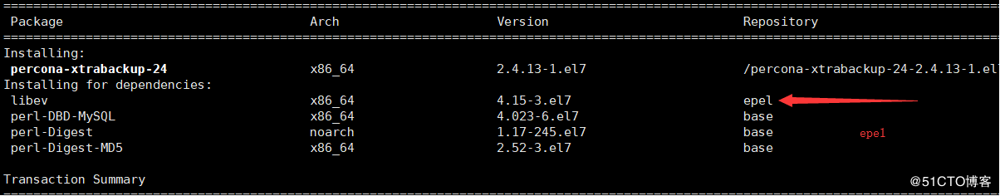
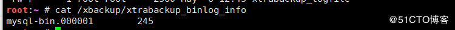
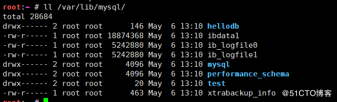

### 注意：版本变化

> xtrabackup版本升级到2.4后，相比之前的2.1有了比较大的变化：
> innobackupex 功能全部集成到 xtrabackup 里面，只有一个 binary程序，另外为了兼容考虑，innobackupex作为 xtrabackup 的软链接，即xtrabacku现在支持非Innodb表备份，并且 Innobackupex 在下一版本中移除，建议通过xtrabackup替换innobackupex

<!--more-->

## 这里mariadb5.5，为centos7默认版本，更高版有很多版本问题很严重

## 个人测试数据库版本10以上均无法使用xtrabackup

## 本次使用数据库5.5版本恢复主机10.4版本可行

## 首先安装xtrabackup

```
yum install percona-xtrabackup 在EPEL源中
```

- > 最新版本下载安装：
  > https://www.percona.com/downloads/XtraBackup/LATEST/

- > 本次实验使用**2.4**版本
  > 下载地址：https://www.percona.com/downloads/Percona-XtraBackup-2.4/LATEST/


```
yum install /root/percona-xtrabackup-24-2.4.13-1.el7.x86_64.rpm #用yum解决依赖性
```



## 使用方法 :备份

```
备份：innobackupex [option] BACKUP-ROOT-DIR
```

> 选项说明：
> –user：该选项表示备份账号
> –password：该选项表示备份的密码
> –host：该选项表示备份数据库的地址
> –databases：该选项接受的参数为数据库名，如果要指定多个数据库，彼此间需要以空格隔开；如：”xtra_test dba_test”，同时，在指定某数据库时，也可以只指定其中的某张表。如：”mydatabase.mytable”。该选项对innodb引擎表无效，还是会备份所有innodb表
> –defaults-file：该选项指定从哪个文件读取MySQL配置，必须放在命令行第一个选项位置
> –incremental：该选项表示创建一个增量备份，需要指定–incremental-basedir
> –incremental-basedir：该选项指定为前一次全备份或增量备份的目录，与–incremental同时使用
> –incremental-dir：该选项表示还原时增量备份的目录
> –include=name：指定表名，格式：databasename.tablename
> **–apply-log：一般情况下,在备份完成后，数据尚且不能用于恢复操作，因为备份的数据中可能会包含尚未提交的事务或已经提交但尚未同步至数据文件中的事务。因此，此时数据文件仍处理不一致状态。此选项作用是通过回滚未提交的事务及同步已经提交的事务至数据文件使数据文件处于一致性状态–use-memory：和–apply-log选项一起使用prepare 备份时，做crashrecovery分配的内存大小，单位字节，也可1MB,1M,1G,1GB等，推荐1G**
> –export：表示开启可导出单独的表之后再导入其他Mysql中
> –redo-only：此选项在prepare base full backup，往其中合并增量备份时候使
> 用，但不包括对最后一个增量备份的合并

## 还原

```
还原：innobackupex --copy-back [选项] BACKUP-DIR
```

选项

> innobackupex –move-back [选项] [–defaults-group=GROUP-NAME] BACKUP-DIR
> **选项说明：**
> –copy-back：做数据恢复时将备份数据文件拷贝到MySQL服务器的datadir
> –move-back：这个选项与–copy-back相似，唯一的区别是它不拷贝文件，
> 而是移动文件到目的地。这个选项移除backup文件，用时候必须小心。使用场
> 景：没有足够的磁盘空间同事保留数据文件和Backup副本

- 还原注意事项：

  > 1.**datadir 目录必须为空**。除非指定innobackupex –force-non-emptydirectorires选项指定，否则–copy-backup选不会覆盖
  > 2.在restore之前,**必须shutdown MySQL实例**，不能将一个运行中的实例restore到datadir目录中
  > 3.由于文件属性会被保留，大部分情况下需要在启动实例之前将文件的属主改为mysql，这些文件将属于创建备份的用户chown -R mysql:mysql /data/mysql以上需要在用户调用innobackupex之前完成
  > 4–force-non-empty-directories：指定该参数时候，使得innobackupex –copy-back或–move-back选项转移文件到非空目录，已存在的文件不会被覆盖。如果–copy-back和–move-back文件需要从备份目录拷贝一个在datadir已经存在的文件，会报错失败

- 备份生成的相关文件

  

> 使用innobackupex备份时，其会调用xtrabackup备份所有的InnoDB表，复制所有关于表结构定义的相关文件(.frm)、以及MyISAM、MERGE、CSV和ARCHIVE表的相关文件，同时还会备份触发器和数据库配置信息相关的文件。这些文件会被保存至一个以时间命名的目录中,在备份时，innobackupex还会在备份目录中创建如下文件：

------

> (1)xtrabackup_info：innobackupex工具执行时的相关信息，包括版本，备份选项，
> 备份时长，备份LSN(log sequence number日志序列号)，BINLOG的位置

------

> (2)xtrabackup_checkpoints：备份类型（如完全或增量）、备份状态（如是否已经为
> prepared状态）和LSN范围信息,每个InnoDB页(通常为16k大小)都会包含一个日志序
> 列号LSN。LSN是整个数据库系统的系统版本号，每个页面相关的LSN能够表明此页面
> 最近是如何发生改变的

------

> (3)xtrabackup_binlog_info：MySQL服务器当前正在使用的二进制日志文件及至备份
> 这一刻为止二进制日志事件的位置，可利用实现基于binlog的恢复

------

> (4)backup-my.cnf：备份命令用到的配置选项信息

------

> (5)xtrabackup_logfile：备份生成的日志文件

## 1完全备份还原

- 1查看当前数据库列表

```
root:~ # mysqlshow 
+--------------------+
|     Databases      |
+--------------------+
| hellodb            |
| information_schema |
| mysql              |
| performance_schema |
| test               |
+--------------------+
```

- 2创建备份文件夹

```
root:~ # mkdir /xbackup
#备份时确保xbackup文件夹空
```

- 3备份

```
root:~ # xtrabackup --backup --target-dir=/xbackup

......

190506 12:38:27 Executing UNLOCK TABLES
190506 12:38:27 All tables unlocked
190506 12:38:27 Backup created in directory '/xbackup/'
190506 12:38:27 [00] Writing /xbackup/backup-my.cnf
190506 12:38:27 [00]        ...done
190506 12:38:27 [00] Writing /xbackup/xtrabackup_info
190506 12:38:27 [00]        ...done
xtrabackup: Transaction log of lsn (1628321) to (1628321) was copied.
190506 12:38:27 completed OK!
```


\* 二进制日志位置


```
root:~ # mysql -e 'show master logs;'
+------------------+-----------+
| Log_name         | File_size |
+------------------+-----------+
| mysql-bin.000001 |       245 |
+------------------+-----------+
```

- 开始结束的lsn号
  
- 版本信息

```
root:~ # cat /xbackup/xtrabackup_info 
uuid = c991e905-6fb9-11e9-83d3-000c29f89546
name = 
tool_name = xtrabackup
tool_command = --backup --target-dir=/xbackup
tool_version = 2.4.13
ibbackup_version = 2.4.13
server_version = 5.5.60-MariaDB
start_time = 2019-05-06 12:45:33
end_time = 2019-05-06 12:45:35
lock_time = 0
binlog_pos = filename 'mysql-bin.000001', position '245'
innodb_from_lsn = 0
innodb_to_lsn = 1628321
partial = N
incremental = N
format = file
compact = N
compressed = N
encrypted = N
```

- 4还原

注意：还原时必须停止服务
在另一台主机上

```
root:~ # systemctl stop  mariadb.service 
root:~ # rm -rf /var/lib/mysql/*            
```

- 5把文件拷至目标主机

```
root:~ # scp -rp /xbackup/ 192.168.64.141:/data/backup/
​```
* 6还原
1）预准备：确保数据一致，提交完成的事务，回滚未完成的事务
​```
root:~ # xtrabackup --prepare --target-dir=/data/backup/xbackup
​```


2）复制到数据库目录
 注意：数据库目录必须为空，MySQL服务不能启动
```

root:~ # xtrabackup –copy-back –target-dir=/data/backup/xbackup –datadir=/var/lib/mysql
““

- 7改权限



```
chown -R mysql:mysql /var/lib/mysql/
```


- 8启动服务

### 一些高版本备份出现的问题

```
root:~ # xtrabackup --backup --target-dir=/data/backup/
xtrabackup: recognized server arguments: 
xtrabackup: recognized client arguments: --backup=1 --target-dir=/data/backup/ 
190506 12:07:38  version_check Connecting to MySQL server with DSN 'dbi:mysql:;mysql_read_default_group=xtrabackup' (using password: NO).
190506 12:07:38  version_check Connected to MySQL server
190506 12:07:38  version_check Executing a version check against the server...
190506 12:07:38  version_check Done.
190506 12:07:38 Connecting to MySQL server host: localhost, user: not set, password: not set, port: not set, socket: not set
Using server version 10.4.4-MariaDB
xtrabackup version 2.4.13 based on MySQL server 5.7.19 Linux (x86_64) (revision id: 3e7ca7c)
xtrabackup: uses posix_fadvise().
xtrabackup: cd to /var/lib/mysql/
xtrabackup: open files limit requested 0, set to 1024
xtrabackup: using the following InnoDB configuration:
xtrabackup:   innodb_data_home_dir = .
xtrabackup:   innodb_data_file_path = ibdata1:12M:autoextend
xtrabackup:   innodb_log_group_home_dir = ./
xtrabackup:   innodb_log_files_in_group = 2
xtrabackup:   innodb_log_file_size = 50331648
InnoDB: Number of pools: 1
InnoDB: Unsupported redo log format. The redo log was created with MariaDB 10.4.4. Please follow the instructions at http://dev.mysql.com/doc/refman/5.7/en/upgrading-downgrading.html
```

## 2增量备份与完全备份组合

准备：

```
root:~ # mkdir /xbackup/{base,inc1,inc2}
root:~ # tree /xbackup/
/xbackup/
├── base  #完全备份
├── inc1  #第一次增量备份
└── inc2   #第二次增量备份

3 directories, 0 files
```

### 1完全备份

```
root:~ # xtrabackup --backup --target-dir=/xbackup/base
```

### 2第一次修改数据，添加两条记录

```
insert teachers (name,age)value('xiaoming',30);
insert teachers (name,age)value('xiaoqiang',40);
```

### 3第一次增量备份

```
root:~ # xtrabackup --backup --target-dir=/xbackup/inc1 --incremental-basedir=/xbackup/base

----------------------------
xtrabackup: Transaction log of lsn (1628972) to (1628972) was copied.
190506 13:34:40 completed OK!
```

### 4第二次修改数据，添加两条记录

```
insert teachers (name,age)value('xiaohong',20);
insert teachers (name,age)value('xiaowang',30);
MariaDB [hellodb]> select * from teachers;
+-----+---------------+-----+--------+
| TID | Name          | Age | Gender |
+-----+---------------+-----+--------+
|   1 | Song Jiang    |  45 | M      |
|   2 | Zhang Sanfeng |  94 | M      |
|   3 | Miejue Shitai |  77 | F      |
|   4 | Lin Chaoying  |  93 | F      |
|   5 | xiaoming      |  30 | NULL   |
|   6 | xiaoqiang     |  40 | NULL   |
|   7 | xiaohong      |  20 | NULL   |
|   8 | xiaowang      |  30 | NULL   |
+-----+---------------+-----+--------+
```

### 5第二次增量备份

```
root:~ # xtrabackup --backup --target-dir=/xbackup/inc2 --incremental-basedir=/xbackup/inc1
```

### 6拷贝文件

```
root:~ # scp -r /xbackup/* 192.168.64.141:/data/backup
```

### 7在目标主机整理文件

- 关闭mariadb
  1）预准备完全备份，此选项–apply-log-only 阻止回滚未完成的事务

```
root:~ # xtrabackup --prepare --apply-log-only --target-dir=/data/backup/base
```

2）合并第1次增量备份到完全备份

```
root:~ # xtrabackup --prepare --apply-log-only --target-dir=/data/backup/base --incremental-dir=/data/backup/inc1
```

3）合并第2次增量备份到完全备份：最后一次还原不需要加选项–apply-log-only

```
root:~ # xtrabackup --prepare --target-dir=/data/backup/base --incremental-dir=/data/backup/inc2
```

4）将整理好的文件复制到mariadb目录

```
root:~ # rm -rf /var/lib/mysql/* 
root:~ # xtrabackup --copy-back --target-dir=/data/backup/base --datadir=/var/lib/mysql
```

5）还原属性：chown -R mysql:mysql /var/lib/mysql
6）启动服务：systemctl start mariadb