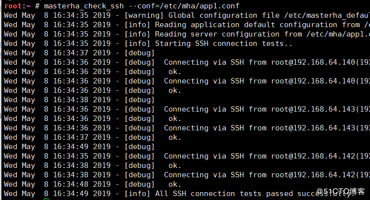
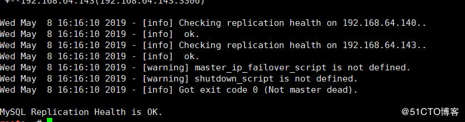
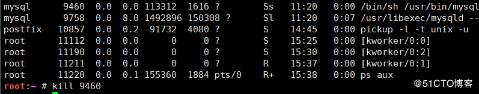

## 1.MHA简介：

> - MHA（Master HighAvailability）目前在MySQL高可用方面是一个相对成熟的解决方案，它由日本DeNA公司youshimaton（现就职于Facebook公司）开发，是一套优秀的作为MySQL高可用性环境下故障切换和主从提升的高可用软件。在MySQL故障切换过程中，MHA能做到在0~30秒之内自动完成数据库的故障切换操作，并且在进行故障切换的过程中，MHA能在最大程度上保证数据的一致性，以达到真正意义上的高可用。
>
>   <!--more-->
>
> - MHA Manager可以单独部署在一台独立的机器上管理多个master-slave集群，也可以部署在一台slave节点上。MHA Node运行在每台MySQL服务器上，MHA Manager会定时探测集群中的master节点，当master出现故障时，它可以自动将最新数据的slave提升为新的master，然后将所有其他的slave重新指向新的master。整个故障转移过程对应用程序完全透明。

## 2.MHA工作原理

> - 1 从宕机崩溃的master保存二进制日志事件（binlog events）
> - 2 识别含有最新更新的slave
> - 3 应用差异的中继日志（relay log）到其他的slave
> - 4 应用从master保存的二进制日志事件（binlog events）
> - 5 提升一个slave为新的master
> - 6 使其他的slave连接新的master进行复制

------

> - MHA软件由两部分组成，Manager工具包和Node工具包
>   Manager : 工具包主要包括以下几个工具：
>   masterha_check_ssh :检查MHA的SSH配置状况
>   masterha_check_repl : 检查MySQL复制状况
>   masterha_manger : 启动MHA
>   masterha_check_status : 检测当前MHA运行状态
>   masterha_master_monitor : 检测master是否宕机
>   masterha_master_switch :故障转移（自动或手动）
>   masterha_conf_host :添加或删除配置的server信息

------

> - Node工具包：这些工具通常由MHA Manager的脚本触发，无需人为操作）主要包括以下几个工具：
>   save_binary_logs 保存和复制master的二进制日志
>   apply_diff_relay_logs 识别差异的中继日志事件并将其差异的事件应用于其他的slave
>   filter_mysqlbinlog 去除不必要的ROLLBACK事件（MHA已不再使用此工具）
>   purge_relay_logs 清除中继日志（不会阻塞SQL线程）
>   注意：为了尽可能的减少主库硬件损坏宕机造成的数据丢失，因此在配置MHA的同时建议配置成MySQL 5.5的半同步复制

## 3架构图


## 4环境搭建

- 142为主
- 140，143为从
- 基于key验证链接

```
在MHA上
root:~ # ssh-keygen 
root:~ # ssh-copy-id 192.168.64.141
root:~ # scp -rp .ssh 192.168.64.140:/root/
root:~ # scp -rp .ssh 192.168.64.142:/root/
root:~ # scp -rp .ssh 192.168.64.143:/root/
```

## 5在master创建账号

```
grant all on *.* to repluser@'192.168.64.%' identified by 'fscx';
grant all on *.* to mhauser@'192.168.64.%' identified by 'fscx' ;
```

## 6实现MHA

安装包在此链接下载

> https://github.com/yoshinorim/mha4mysql-manager/releases
> https://github.com/yoshinorim/mha4mysql-node/releases

- 安装时用yum安装（解决依赖性）

### 1在管理节点上安装两个包

```
mha4mysql-manager
mha4mysql-node
```

### 2在被管理节点安装：

```
mha4mysql-node
```

## 7在管理节点建立配置文件

```
root:~ # mkdir /data
root:~ # mkdir /etc/mha
root:~ # vim /etc/mha/app1.conf
[server default]
user=mhauser
password=fscx
manager_workdir=/data/mha/app1/
manager_log=/data/mha/app1/manager.log
remote_workdir=/data/mha/app1/
ssh_user=root
repl_user=repluser
repl_password=fscx
ping_interval=1
[server1]
hostname=192.168.64.142
candidate_master=1
[server2]
hostname=192.168.64.140
candidate_master=1
[server3]
hostname=192.168.64.143
```

## 8在管理节点，mha验证和启动

```
root:~ # masterha_check_ssh --conf=/etc/mha/app1.conf   #秘钥检查
root:~ # masterha_check_repl --conf=/etc/mha/app1.conf   #复制检查
root:~ # masterha_manager --conf=/etc/mha/app1.conf     #启动
```




## 9.模拟服务器宕机



- 查看143


- 查看140


\* >可以看到master 的 IP 现在为 192.168.64.140本来是和192.168.64.142同步的，说明 MHA 已经把Candicatemaster(master2)提升为了新的master，IO线程和SQL线程也正确运行，MHA 搭建成功!!!
\* 注意：MHA为一次性服务，所以必须将提升为主的服务器配置文件read-only去掉，否则机器重启后不能写入数据

## 最终主从测试

- 在140上新建数据库

  

  

- 在143查看是否同步