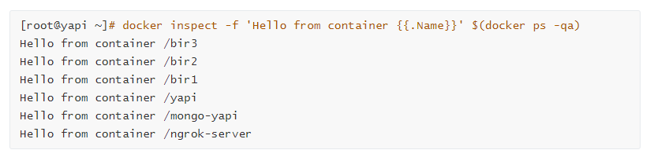
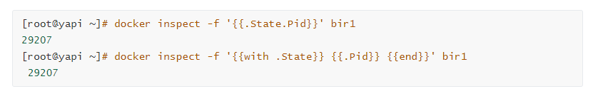
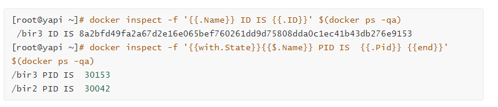
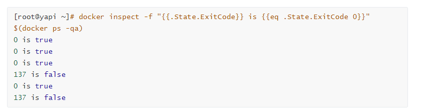
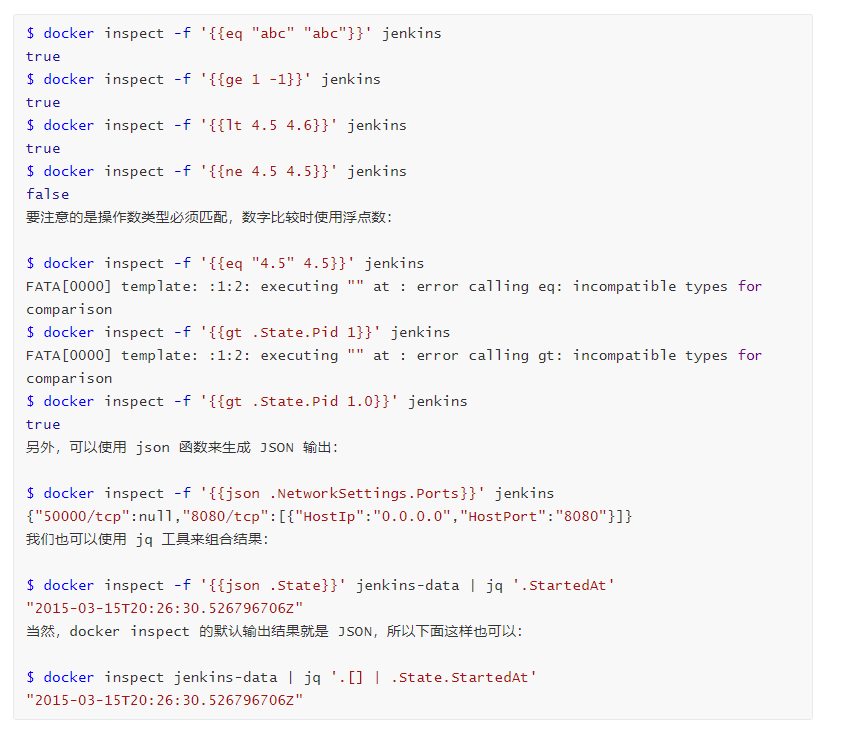

#### 该命令用于获取容器镜像的元数据,其中-f参数可以用于获取指定的数据，例如使用来获取容器的IP地址。

<!--more-->

简单地说，*-f* 的实参是个Go模版，并在容器/镜像的元数据上以该 Go 模版作为输入，最终返回模版指定的数据。



获取PID



### 模版指令

```
{{ }} 语法用于处理模版指令，大括号外的任何字符都将直接输出。
```


### 上下文

“.” 表示“当前上下文”。大多数情况下表示了容器元数据的整个[数据结构](http://lib.csdn.net/base/datastructure)，但在某些情况下可以重新规定上下文，比如使用 *with* 函数：



### 数据类型

inspect 数据可以由浮点数、字符串和布尔组成，可以使用 Go 模版内置函数进行比较判断。虽然 Go 模版支持整数，但目前 inspect 数据中的数值类型都是浮点数，而整数应该对于大多数场景更方便（详见该[Issue](https://github.com/docker/docker/issues/11641)）。使用字符串时可以使用双引号。

数据中不存在的值是不可以用来比较的：

```shell
[root@yapi ~]# docker inspect -f "{{.State.ExitCode}} is {{eq .ExecIDs 1}}" $(docker ps -qa)

Template parsing error: template: :1:25: executing "" at : error calling eq: invalid type for comparison
```

### 数据结构

inspect 数据使用 map 以及数组保存。Map 结构非常简单，前面我们曾经展示过，可以通过 . 的链式来访问 map 内部数据：



### 函数

除了 *index*  函数，其他很多函数也很常用。比如逻辑函数 *and*、*or* 可以返回布尔结果。注意，函数是不能放在中间：


下面是一些常用的比较函数：

- eq (等于)
- ne (不等于)
- lt (小于)
- le (小于等于)
- gt (大于)
- ge (大于等于)



### If 语句

条件语句 *if* 可以和前面的比较函数一起使用：

```
$ docker inspect -f '{{if eq .State.ExitCode 0.0}} 
Normal Exit
{{else if eq .State.ExitCode 1.0}} 
Not a Normal Exit 
{{else}} 
Still Not a Normal Exit 
{{end}}' jenkins

Normal Exit
注意，{{end}} 语句必须有，else if 和 else 按需使用。
```