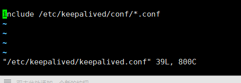
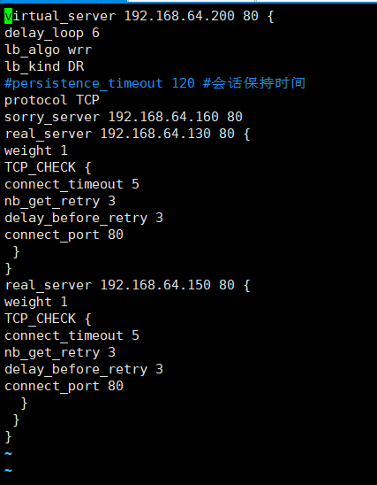

KeepAlived与IPVS

<!--more-->

```
虚拟服务器配置参数：
virtual server （虚拟服务）的定义：
virtual_server IP port #定义虚拟主机IP地址及其端口
virtual_server fwmark int #ipvs的防火墙打标，实现基于防火墙的负载均衡集群
virtual_server group string #将多个虚拟服务器定义成组，将组定义成虚拟服务
virtual_server IP port
{
...
real_server {
...
}
…
}
delay_loop <INT>：检查后端服务器的时间间隔
lb_algo rr|wrr|lc|wlc|lblc|sh|dh：定义调度方法
lb_kind NAT|DR|TUN：集群的类型
persistence_timeout <INT>：持久连接时长
protocol TCP|UDP|SCTP：指定服务协议
sorry_server <IPADDR> <PORT>：所有RS故障时，备用服务器地址
real_server <IPADDR> <PORT>
{
weight <INT> RS权重
notify_up <STRING>|<QUOTED-STRING> RS上线通知脚本
notify_down <STRING>|<QUOTED-STRING> RS下线通知脚本
HTTP_GET|SSL_GET|TCP_CHECK|SMTP_CHECK|MISC_CHEC K { ... }：定义当前主机的健康状态检测方法
}
```





```
virtual_server 192.168.64.200 80 {
delay_loop 6
lb_algo wrr
lb_kind DR
#persistence_timeout 120 #会话保持
protocol TCP
sorry_server 192.168.64.160 80  #也需要执行lvs脚本
real_server 192.168.64.130 80 {
weight 1
TCP_CHECK {
connect_timeout 5
nb_get_retry 3
delay_before_retry 3
connect_port 80
 }
}
real_server 192.168.64.150 80 {
weight 1
TCP_CHECK {
connect_timeout 5
nb_get_retry 3
delay_before_retry 3
connect_port 80
  }
 }
}
```


在realserver执行脚本，绑定vip

```
#!/bin/bash
vip=192.168.64.200
mask='255.255.255.255'
dev=lo:1
#rpm -q httpd &> /dev/null || yum -y install httpd &>/dev/null
service httpd start &> /dev/null && echo "The httpd Server is Ready!"
#echo "<h1>`hostname`</h1>" > /var/www/html/index.html

case $1 in
start)
    echo 1 > /proc/sys/net/ipv4/conf/all/arp_ignore
    echo 1 > /proc/sys/net/ipv4/conf/lo/arp_ignore
    echo 2 > /proc/sys/net/ipv4/conf/all/arp_announce
    echo 2 > /proc/sys/net/ipv4/conf/lo/arp_announce
    ifconfig $dev $vip netmask $mask #broadcast $vip up
    #route add -host $vip dev $dev
    echo "The RS Server is Ready!"
    ;;
stop)
    ifconfig $dev down
    echo 0 > /proc/sys/net/ipv4/conf/all/arp_ignore
    echo 0 > /proc/sys/net/ipv4/conf/lo/arp_ignore
    echo 0 > /proc/sys/net/ipv4/conf/all/arp_announce
    echo 0 > /proc/sys/net/ipv4/conf/lo/arp_announce
    echo "The RS Server is Canceled!"
    ;;
*)
    echo "Usage: $(basename $0) start|stop"
    exit 1
    ;;
esac
测试代码：
while true;do curl http://192.168.7.248 && sleep 1;done
```

### 应用层监测

```
HTTP_GET|SSL_GET：应用层检测
HTTP_GET|SSL_GET {
url {
path <URL_PATH>：定义要监控的URL
status_code <INT>：判断上述检测机制为健康状态的响应码
}
connect_timeout <INTEGER>：连接请求的超时时长
nb_get_retry <INT>：重试次数
delay_before_retry <INT>：重试之前的延迟时长
connect_ip <IP ADDRESS>：向当前RS哪个IP地址发起健康状态检测请求
connect_port <PORT>：向当前RS的哪个PORT发起健康状态检测请求
bindto <IP ADDRESS>：发出健康状态检测请求时使用的源地址
bind_port <PORT>：发出健康状态检测请求时使用的源端口
}
real_server 192.168.7.103 80 {
weight 1
HTTP_GET {
url {
path /index.html
status_code 200
}
}
connect_timeout 5
nb_get_retry 3
delay_before_retry 3
}
```

