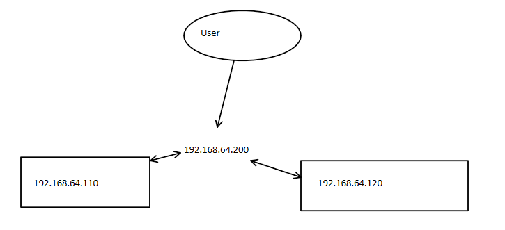
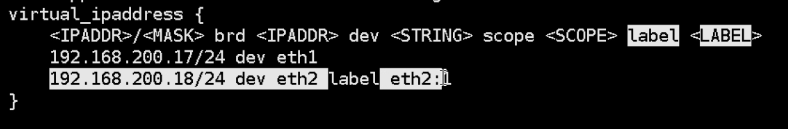

<!--more-->

Keepalived环境准备
• 各节点时间必须同步 tzselect TZ=’Asia/Shanghai’; export TZ
• 关闭selinux和防火墙

• Keepalived安装：

\# yum install keepalived (CentOS)
\# apt-get install keepalived (Ubuntu)

程序环境：
• 主配置文件：/etc/keepalived/keepalived.conf
• 主程序文件：/usr/sbin/keepalived
• Unit File：
• /usr/lib/systemd/system/keepalived.service (CentOS)
• /lib/systemd/system/keepalived.service (Ubuntu)
• Unit File的环境配置文件：
• /etc/sysconfig/keepalived


```
global_defs {
   notification_email {
     acassen@firewall.loc
     failover@firewall.loc
     sysadmin@firewall.loc
   }
   notification_email_from Alexandre.Cassen@firewall.loc
   smtp_server 192.168.200.1   #邮件
   smtp_connect_timeout 30    #
   router_id LVS_DEVEL  #虚拟router标识符，一般为当前主机名称，每个节点id不一样
   vrrp_skip_check_adv_addr  #所有报文都检查比较消耗性能，此配置为如果收到的报文和上一个报文是同一个路由器则跳过检查报文中的源地址
   vrrp_strict #严格遵守VRRP协议,不允许状况:1,没有VIP地址,2.单播邻居,3.在VRRP版本2中有IPv6地址. #使用单播时关闭
   vrrp_garp_interval 0  #ARP报文发送延迟
   vrrp_gna_interval 0  #消息发送延迟
   vrrp_mcast_group4 224.0.0.18 #默认组播IP地址，224.0.0.0到239.255.255.255
   vrrp_iptables  #禁止生产iptables策略
}
```




```
vrrp_instance VIP1 {   #VIP名称，与业务有关
    state MASTER   #默认角色，主，背服务器
    interface eth0 #接口
    virtual_router_id 1  #路由id 0-255
    priority 100  #优先级
    advert_int 3 #探测时间间隔 秒
    authentication {  #认证方式
        auth_type PASS  #类型：密码
        auth_pass linux #所有keepalived都要一致 只有前8个字符生效
    }
    virtual_ipaddress {   #虚拟ip地址
        192.168.64.200/24 dev eth0 label eth0:0
    }
}
```

全局配置不加vrrp_iptables会生成iptables规则


到此实现ip漂移

## haproxy配置

将haproxy监听在keepalived生成的虚拟ip上

```
listen WEB_PORT_80
        bind 192.168.64.200:80
        mode http
        balance roundrobin
        server web1 192.168.64.130:80 weight 2 check port 80 inter 3s fall 3 rise 5
        server web2 192.168.64.150:80 weight 1 check port 80 inter 3s fall 3 rise 5
## 110与120两台都要配
```


开启forward与监听虚拟端口的内核参数

[root@localhost ~]#sysctl -p
net.ipv4.ip_nonlocal_bind = 1
net.ipv4.ip_forward = 1

\#sysctl -p
net.ipv4.ip_nonlocal_bind = 1
net.ipv4.ip_forward = 1

用户访问192.168.64.200，即可实现负载均衡和高可用