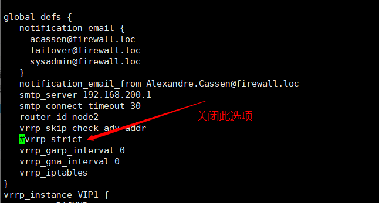
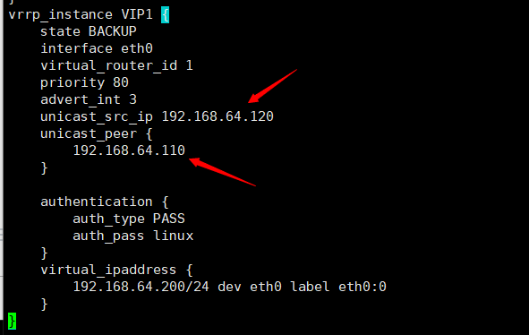
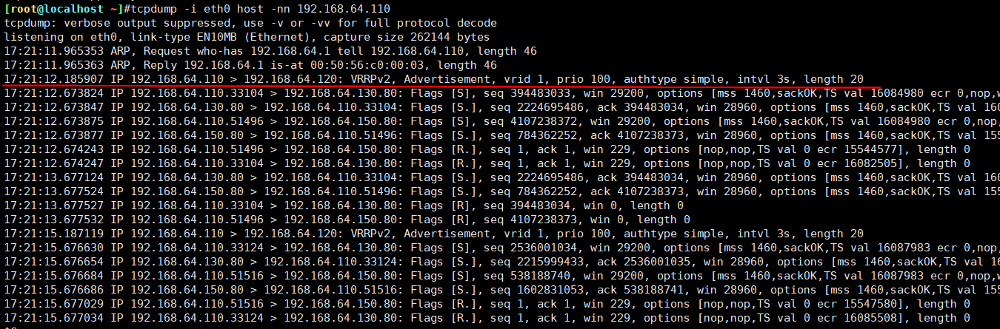

[root@localhost ~]#tcpdump -i eth0 host -nn 224.0.0.18

<!--more-->


前提

node1配置

```
vrrp_instance VIP1 {
    state MASTER
    interface eth0
    virtual_router_id 1
    priority 100
    advert_int 3
    unicast_src_ip 192.168.64.110
        unicast_peer {
            192.168.64.120
        }
    authentication {
        auth_type PASS
        auth_pass linux
    }
    virtual_ipaddress {
        192.168.64.200/24 dev eth0 label eth0:0
    }
}
```

node2配置

```
vrrp_instance VIP1 {
    state BACKUP
    interface eth0
    virtual_router_id 1
    priority 80
    advert_int 3
    unicast_src_ip 192.168.64.120
        unicast_peer {
            192.168.64.110
        }
    authentication {
        auth_type PASS
        auth_pass linux
    }
    virtual_ipaddress {
        192.168.64.200/24 dev eth0 label eth0:0
    }
}
```

抓包