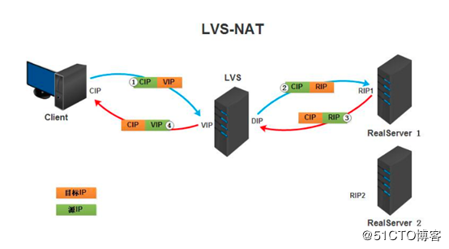
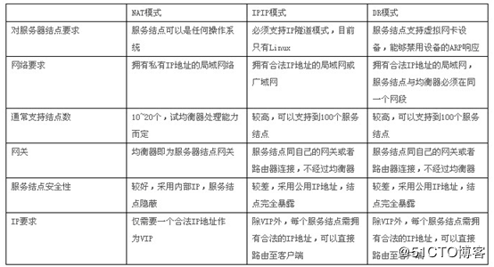

## LVS概念

<!--more-->

**lvs集群类型中的术语：**

> VS：Virtual Server，Director Server(DS) Dispatcher(调度器)，Load Balancer
> RS：Real Server(lvs), upstream server(nginx) backend server(haproxy)
> CIP：Client IP
> VIP: Virtual serve IP VS外网的IP
> DIP: Director IP VS内网的IP
> RIP: Real server IP 访问流程：CIP <–> VIP == DIP <–> RIP

## lvs集群的类型

lvs集群的类型： lvs-nat：修改请求报文的目标IP,多目标IP的DNAT
lvs-dr：操纵封装新的MAC地址
lvs-tun：在原请求IP报文之外新加一个IP首部
lvs-fullnat：修改请求报文的源和目标IP

## lvs-nat模式

本质是多目标IP的DNAT，通过将请求报文中的目标地址和目标端口修改为某挑出的RS的RIP和PORT实现转发
（1）RIP和DIP应在同一个IP网络，且应使用私网地址；RS的网关要指向DIP
（2）请求报文和响应报文都必须经由Director转发，Director易于成为系统瓶颈
（3）支持端口映射，可修改请求报文的目标PORT
（4）VS必须是Linux系统，RS可以是任意OS系统




[root@localhost ~]#hostnamectl set-hostname client
[root@localhost ~]#hostnamectl set-hostname LVS
[root@localhost ~]#hostnamectl set-hostname server1
[root@localhost ~]#hostnamectl set-hostname server2

[root@server1 ~]# echo server1 > /var/www/html/index.html
[root@server2 ~]# echo server2 > /var/www/html/index.html

[root@server1 ~]#systemctl start httpd.service
[root@server2 ~]#systemctl start httpd.service

[root@lvs ~]# yum install ipvsadm
[root@lvs ~]#ipvsadm -A -t 172.22.50.200:80
[root@lvs ~]#ipvsadm -a -t 172.22.50.200:80 -r 192.168.64.130 -m -w 3
[root@lvs ~]#ipvsadm -a -t 172.22.50.200:80 -r 192.168.64.140 –m –w 1

开启核心转发功能
[root@lvs ~]#vim /etc/sysctl.conf
net.ipv4.ip_forward=1
[root@lvs ~]#sysctl -p
net.ipv4.ip_forward = 1

[root@client ~]#while true; do curl 172.22.50.200 ;sleep 1;done
server1
server2

保存
[root@lvs ~]#ipvsadm-save -n > /etc/sysconfig/ipvsadm
[root@lvs ~]#systemctl start ipvsadm
[root@lvs ~]#systemctl enable ipvsadm.service

###  开启https

[root@server1 ~]# yum install mod_ssl
[root@server1 ~]# systemctl restart httpd
[root@lvs ~]#ipvsadm -A -t 172.22.50.200:443
[root@lvs ~]#ipvsadm -a -t 172.22.50.200:443 -r 192.168.64.130 -m -w 3
[root@lvs ~]#ipvsadm -a -t 172.22.50.200:443 -r 192.168.64.140 –m –w 1

## LVS-DR


router开启核心转发功能
[root@router ~]#vim /etc/sysctl.conf
net.ipv4.ip_forward=1
[root@router~]#sysctl -p
net.ipv4.ip_forward = 1

[root@client ~]#traceroute 192.168.64.130
traceroute to 192.168.64.130 (192.168.64.130), 30 hops max, 60 byte packets
1 gateway (172.22.143.144) 1.551 ms 7.670 ms 7.611 ms
2 192.168.64.130 (192.168.64.130) 7.559 ms 7.512 ms 7.465 ms

- RS服务器脚本

\#!/bin/bash
vip=’192.168.64.200′
iface=’lo:1′
mask=’255.255.255.255′
port=’80’
rs1=’192.168.64.130′
rs2=’192.168.64.140′
scheduler=’wrr’
type=’-g’
rpm -q ipvsadm &> /dev/null || yum -y install ipvsadm &> /dev/null

case $1 in
start)
ifconfig $iface $vip netmask $mask #broadcast $vip up
iptables -F

ipvsadm -A -t ${vip}:${port} -s $scheduler
ipvsadm -a -t ${vip}:${port} -r ${rs1} $type -w 1
ipvsadm -a -t ${vip}:${port} -r ${rs2} $type -w 1
echo “The VS Server is Ready!”
;;
stop)
ipvsadm -C
ifconfig $iface down
echo “The VS Server is Canceled!”
;;
*)
echo “Usage: $(basename $0) start|stop”
exit 1
;;
esac

- LVS服务器脚本

```
#!/bin/bash
vip=192.168.64.200
mask='255.255.255.255'
dev=lo:1
rpm -q httpd &> /dev/null || yum -y install httpd &>/dev/null
service httpd start &> /dev/null && echo "The httpd Server is Ready!"
echo "<h1>`hostname`</h1>" > /var/www/html/index.html

case $1 in
start)
    echo 1 > /proc/sys/net/ipv4/conf/all/arp_ignore
    echo 1 > /proc/sys/net/ipv4/conf/lo/arp_ignore
    echo 2 > /proc/sys/net/ipv4/conf/all/arp_announce
    echo 2 > /proc/sys/net/ipv4/conf/lo/arp_announce
    ifconfig $dev $vip netmask $mask #broadcast $vip up
    #route add -host $vip dev $dev
    echo "The RS Server is Ready!"
    ;;
stop)
    ifconfig $dev down
    echo 0 > /proc/sys/net/ipv4/conf/all/arp_ignore
    echo 0 > /proc/sys/net/ipv4/conf/lo/arp_ignore
    echo 0 > /proc/sys/net/ipv4/conf/all/arp_announce
    echo 0 > /proc/sys/net/ipv4/conf/lo/arp_announce
    echo "The RS Server is Canceled!"
    ;;
*) 
    echo "Usage: $(basename $0) start|stop"
    exit 1
    ;;
esac
```

[root@lvs ~]# ipvsadm -Ln –stats
IP Virtual Server version 1.2.1 (size=4096)
Prot LocalAddress:Port Conns InPkts OutPkts InBytes OutBytes
-> RemoteAddress:Port
TCP 192.168.64.200:80 7 42 0 2786 0
-> 192.168.64.130:80 3 18 0 1194 0
-> 192.168.64.140:80 4 24 0 1592 0

### RIP与VIP不同网段

将VIP改为：10.0.0.100
Router加一个地址 10.0.0.200 与内网网卡绑定
Ifconfig eth0:1 10.0.0.200/24

## MYSQL服务调度

[root@lvs ~]#ipvsadm -A -t 172.22.50.200:3306
[root@lvs ~]#ipvsadm -a -t 192.168.64.130:3306 -r 192.168.64.130 -m -w 3
[root@lvs ~]#ipvsadm -a -t 192.168.64.140:3306 -r 192.168.64.140 –m –w 1
添加授权账号

mysql -e ‘grant all on *.* to test@”%” identified by “centos” ’

mysql –uroot –pcentos –h

Firewall mark
iptables -t mangle -A PREROUTING -d 10.0.0.100 -p tcp -m multiport –dports 80,443 -j MARK –set-mark 10
[root@lvs ~]# ipvsadm -A -f 10 -s rr
[root@lvs ~]# ipvsadm -a -f 10 –r 192.168.64.130 -m -w 3
[root@lvs ~]# ipvsadm -a -f 10 –r 192.168.64.140 -m -w 3


## 持久连接

[root@lvs ~]# ipvsadm -A -f 10 -s rr –p



## LVS十种调度算法：

- LVS调度算法分为静态和动态两类：静态算法（4种）：
- 只根据算法进行调度 而不考虑后端服务器的实际连接情况和负载情况
- RR：轮叫调度（Round Robin）
  调度器通过”轮叫”调度算法将外部请求按顺序轮流分配到集群中的真实服务器上，它均等地对待每一台服务器，而不管服务器上实际的连接数和系统负载｡
- WRR：加权轮叫（Weight RR）
  调度器通过“加权轮叫”调度算法根据真实服务器的不同处理能力来调度访问请求。这样可以保证处理能力强的服务器处理更多的访问流量。调度器可以自动问询真实服务器的负载情况,并动态地调整其权值。
- DH：目标地址散列调度（Destination Hash ）
  根据请求的目标IP地址，作为散列键(HashKey)从静态分配的散列表找出对应的服务器，若该服务器是可用的且未超载，将请求发送到该服务器，否则返回空。
- SH：源地址 hash（Source Hash）
  源地址散列”调度算法根据请求的源IP地址，作为散列键(HashKey)从静态分配的散列表找出对应的服务器，若该服务器是可用的且未超载，将请求发送到该服务器，否则返回空｡动态算法（6种）：前端的调度器会根据后端真实服务器的实际连接情况来分配请求
- LC：最少链接（Least Connections）
  调度器通过”最少连接”调度算法动态地将网络请求调度到已建立的链接数最少的服务器上。如果集群系统的真实服务器具有相近的系统性能，采用”最小连接”调度算法可以较好地均衡负载。
- WLC：加权最少连接(默认采用的就是这种)（Weighted Least Connections）
  在集群系统中的服务器性能差异较大的情况下，调度器采用“加权最少链接”调度算法优化负载均衡性能，具有较高权值的服务器将承受较大比例的活动连接负载｡调度器可以自动问询真实服务器的负载情况,并动态地调整其权值。
- SED：最短延迟调度（Shortest Expected Delay ）
  在WLC基础上改进，Overhead = （ACTIVE+1）*256/加权，不再考虑非活动状态，把当前处于活动状态的数目+1来实现，数目最小的，接受下次请求，+1的目的是为了考虑加权的时候，非活动连接过多缺陷：当权限过大的时候，会倒置空闲服务器一直处于无连接状态。
- NQ永不排队/最少队列调度（Never Queue Scheduling NQ）
  无需队列。如果有台 realserver的连接数＝0就直接分配过去，不需要再进行sed运算，保证不会有一个主机很空间。在SED基础上无论+几，第二次一定给下一个，保证不会有一个主机不会很空闲着，不考虑非活动连接，才用NQ，SED要考虑活动状态连接，对于DNS的UDP不需要考虑非活动连接，而httpd的处于保持状态的服务就需要考虑非活动连接给服务器的压力。
- LBLC：基于局部性的最少链接（locality-Based Least Connections）
  基于局部性的最少链接”调度算法是针对目标IP地址的负载均衡，目前主要用于Cache集群系统｡该算法根据请求的目标IP地址找出该目标IP地址最近使用的服务器，若该服务器是可用的且没有超载，将请求发送到该服务器;若服务器不存在，或者该服务器超载且有服务器处于一半的工作负载，则用“最少链接”的原则选出一个可用的服务器，将请求发送到该服务器｡
- LBLCR：带复制的基于局部性最少连接（Locality-Based Least Connections with Replication）
  带复制的基于局部性最少链接”调度算法也是针对目标IP地址的负载均衡，目前主要用于Cache集群系统｡它与LBLC算法的不同之处是它要维护从一个目标IP地址到一组服务器的映射，而LBLC算法维护从一个目标IP地址到一台服务器的映射｡该算法根据请求的目标IP地址找出该目标IP地址对应的服务器组，按”最小连接”原则从服务器组中选出一台服务器，若服务器没有超载，将请求发送到该服务器；若服务器超载，则按“最小连接”原则从这个集群中选出一台服务器，将该服务器加入到服务器组中，将请求发送到该服务器｡同时，当该服务器组有一段时间没有被修改，将最忙的服务器从服务器组中删除，以降低复制的程度。