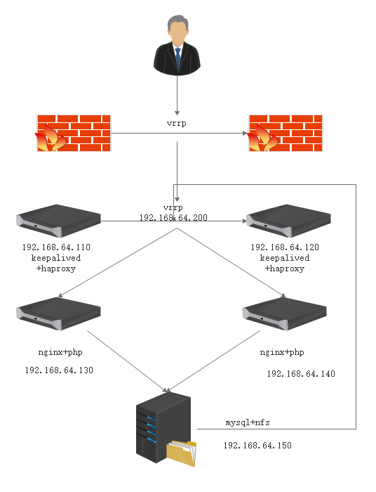
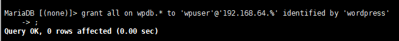
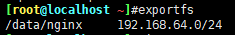
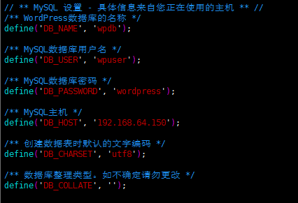
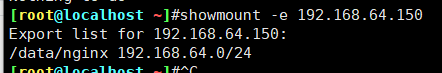
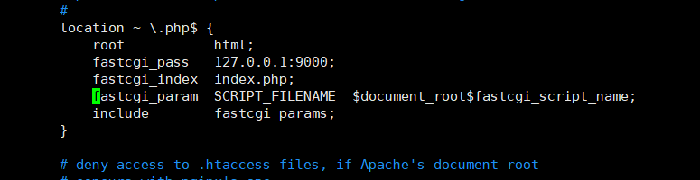
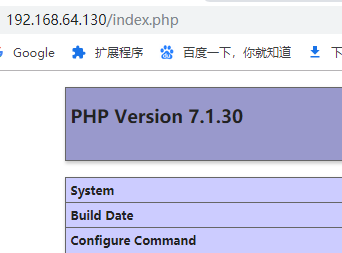
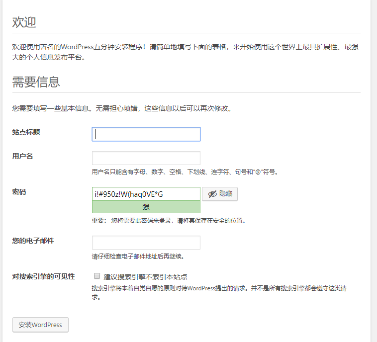

架构图

<!--more-->

## 110配置

```
yum install keepalived haproxy
vim /etc/keepalived/keepalived.conf
vrrp_iptables #开启
vrrp_instance VIP1 {
    state BACKUP
    interface eth0
    virtual_router_id 1
    priority 80
    advert_int 3
    unicast_src_ip 192.168.64.110
        unicast_peer {
            192.168.64.120
        }
    authentication {
        auth_type PASS
        auth_pass linux
    }
    virtual_ipaddress {
        192.168.64.200/24 dev eth0 label eth0:0
    }
}

systemctl start keepalived
yum install haproxy
vim /etc/haproxy/haproxy.cfg

listen WEB_PORT_80
        bind 192.168.64.200:80
        mode http
        balance roundrobin
        server web1 192.168.64.130:80 weight 2 check port 80 inter 3s fall 3 rise 5
        server web2 192.168.64.140:80 weight 1 check port 80 inter 3s fall 3 rise 5
listen MYSQL_PORT_3306
        bind 192.168.64.200:3306
        mode http
        balance roundrobin
        server web1 192.168.64.150:3306 weight 1 check port 3306 inter 3s fall 3 rise 5

systemctl start haproxy
```

## 120配置

```
yum install keepalived haproxy
vim /etc/keepalived/keepalived.conf
vrrp_iptables #开启
vrrp_instance VIP1 {
    state BACKUP
    interface eth0
    virtual_router_id 1
    priority 80
    advert_int 3
    unicast_src_ip 192.168.64.120
        unicast_peer {
            192.168.64.110
        }
    authentication {
        auth_type PASS
        auth_pass linux
    }
    virtual_ipaddress {
        192.168.64.200/24 dev eth0 label eth0:0
    }
}
yum install haproxy
vim /etc/haproxy/haproxy.cfg

listen WEB_PORT_80
        bind 192.168.64.200:80
        mode http
        balance roundrobin
        server web1 192.168.64.130:80 weight 2 check port 80 inter 3s fall 3 rise 5
        server web2 192.168.64.140:80 weight 1 check port 80 inter 3s fall 3 rise 5
listen MYSQL_PORT_3306
        bind 192.168.64.200:3306
        mode http
        balance roundrobin
        server web1 192.168.64.150:3306 weight 1 check port 3306 inter 3s fall 3 rise 5

systemctl start haproxy
```

## 150配置

```
yy mariadb mariadb-serverv nfs-utils
systemctl start mariadb.service
grant all on wpdb.* to 'wpuser'@'192.168.64.%' identified by 'wordpress'
mkdir /data/nginx

vim /etc/exports
/data/nginx 192.168.64.0/24(rw,sync)

useradd nginx -s /sbin/nologin -u 2000
chown nginx:nginx /data/nginx/ -R
systemctl start nfs
```






wordpress配置

```
cd /data/nginx
tar xf wordpress-5.0.3-zh_CN.tar.gz
mv wordpress/* .
rm wordpress/ -rf
cp wp-config-sample.php wp-config.php
```




```
define('AUTH_KEY',         '--M0bn,;,lc]O8KI+9l mS>U*g[{Sx/KxM-+g|X^?RgkOo}|*{S;*X$qw*,.yyva');
define('SECURE_AUTH_KEY',  '!YDPc(n_UVfz)q5Vo3{g,vm $aB=-LLTeM.tOdpYtN+nTw!NKzC77w,xW92T;B`.');
define('LOGGED_IN_KEY',    '*&J.n^q8o4H/F ff;5PA!E7y1k1Y=Lt:KK+7Z2jvW*5xXr ==c-K^t&)jmm5CsQ;');
define('NONCE_KEY',        '019noHvOs#{I;k?%q&,.n0DzUWfrOV}d^-bvt*HljD[KCB!=');
define('SECURE_AUTH_SALT', 'HuCEXpJ|yZVJK$is>PF#XdH}ap+Tie ?$OGL}T+H)*a U5-;%Y/t(!mk$2^`E ');
define('LOGGED_IN_SALT',   '^N&N1LM/>tXsF4KF.2dq9Q8<%>Q`H37-sS^mvMP$svxL|+B?63+SgT(nucvr(cE5');
define('NONCE_SALT',       '{pg)o-f+yskq#:F])/]G#QMN|8o}S@?b37hA0u-bI)|Ngi(I];6{/kJd|&~xM/');
```

## 130配置

一键安装Nginx

```
cat > onenginx.sh < /etc/profile.d/nginx.sh
sed -i "s@\/scripts$fastcgi_script_name@$document_root$fastcgi_script_name@g" /apps/nginx/conf/nginx.conf
/apps/nginx/sbin/nginx -V
EOF
```

一键安装PHP

```
cat > onephp.sh << EOF
yum  install -y  wget vim pcre pcre-devel openssl openssl-devel libicu-devel gcc gcc-c++ autoconf libjpeg libjpeg-devel libpng libpng-devel freetype freetype-devel libxml2 libxml2-devel zlib zlib-devel glibc glibc-devel glib2 glib2-devel ncurses ncurses-devel curl curl-devel krb5-devel libidn libidn-devel openldap openldap-devel nss_ldap jemalloc-devel cmake boost-devel bison automake libevent libevent-devel gd gd-devel libtool* libmcrypt libmcrypt-devel mcrypt mhash libxslt libxslt-devel readline readline-devel gmp gmp-devel libcurl libcurl-devel openjpeg-devel
cd /root
#wget https://www.php.net/distributions/php-7.2.19.tar.xz
tar xf php-7.1.30.tar.gz
cd php-7.1.30/
./configure --prefix=/apps/php --enable-fpm --with-fpm-user=www --with-fpm-group=www --with-pear --with-curl --with-png-dir --with-freetype-dir --with-iconv --with-mhash --with-zlib --with-xmlrpc --with-xsl --with-openssl --with-mysqli --with-pdo-mysql --disable-debug --enable-zip --enable-sockets --enable-soap --enable-inline-optimization --enable-xml --enable-ftp --enable-exif --enable-wddx --enable-bcmath --enable-calendar --enable-shmop --enable-dba --enable-sysvsem --enable-sysvshm --enable-sysvmsg
make -j 4 && make install
cd /apps/php/etc/php-fpm.d/
cp www.conf.default www.conf
sed -i "s/= www/= nginx/" www.conf
cd /apps/php/etc/
cp php-fpm.conf.default php-fpm.conf
/apps/php/sbin/php-fpm -t
useradd nginx -s /sbin/nologin -u 2000
/apps/php/sbin/php-fpm -c /apps/php/etc/php.ini
ps -ef | grep php-fpm
EOF
```

挂载nfs

```
yum install -y nfs-utils
showmount -e 192.168.64.150
```



```
mount -t nfs 192.168.64.150:/data/nginx /apps/nginx/html/
```

准备php测试页面

```
cat > /apps/nginx/html/index.php << EOF

EOF

vim /apps/nginx/conf/nginx.conf
$document_root
```



```
nginx
```




## 140同130


页面配置

