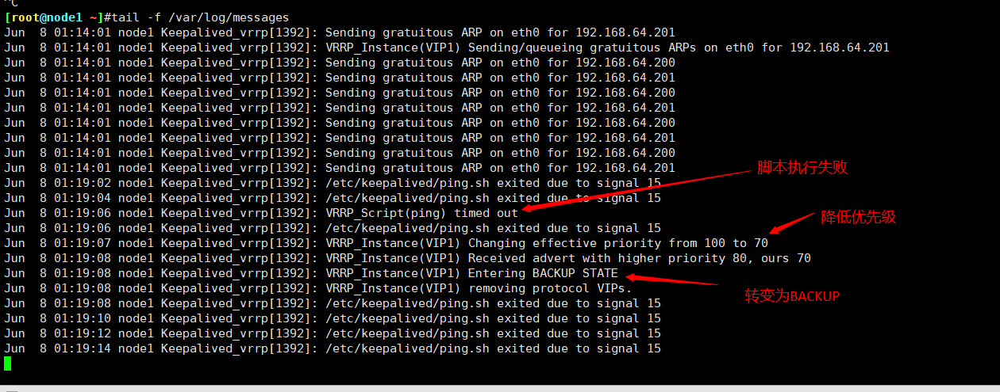
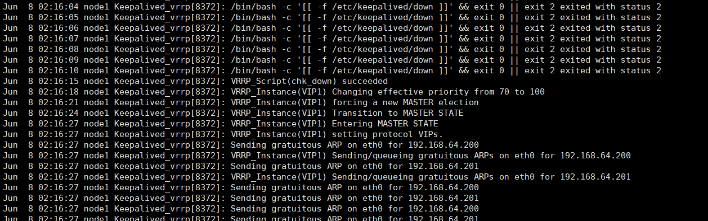

keepalived调用外部的辅助脚本进行资源监控，并根据监控的结果状态能实现优先动态调整

<!--more-->

vrrp_script:自定义资源监控脚本，vrrp实例根据脚本返回值进行下一步操作，脚本可被多个实例调用。
track_script:调用vrrp_script定义的脚本去监控资源，定义在实例之内，调用事先定义的vrrp_script
• 分两步：(1) 先定义一个脚本；(2) 调用此脚本

vrrp_script NAME{
script |
OPTIONS
}
track_script {
SCRIPT_NAME_1
SCRIPT_NAME_2
}

vrrp_script { #定义一个检测脚本，在global_defs 之外配置
script | # shell命令或脚本路径
interval # 间隔时间，单位为秒，默认1秒
timeout # 超时时间
weight # 权重，监测失败后会执行权重+操作
fall #脚本几次失败转换为失败
rise # 脚本连续监测成果后，把服务器从失败标记为成功的次数
user USERNAME [GROUPNAME] # 执行监测的用户或组
init_fail # 设置默认标记为失败状态，监测成功之后再转换为成功状态
}

1.基于ping实现

vim /etc/keepalived/ping.sh
\#!/bin/bash
ping -c 2 192.168.64.1>/dev/null
if [ $? -eq 0 ];then
exit 0
else
exit 2
fi

-30

vrrp_script ping {
script /etc/keepalived/ping.sh
interval 2
weight -30
fall 3
rise 5
timeout 2
}

track_script {
ping
}

测试1，node1现为master，更改脚本ip为ping不通的ip

将脚本中ip恢复

2.基于第三方仲裁设备

vrrp_script chk_down { #基于第三方仲裁设备
script “/bin/bash -c ‘[[ -f /etc/keepalived/down ]]’ && exit 0 || exit 7”
interval 1
weight -80
fall 3
rise 5
timeout 2
}
vrrp_instance VI_1 {
…
track_script {
chk_down
}
}

测试

3.haproxy

vrrp_script chk_nginx {
script “/etc/keepalived/chk_nginx.sh”
interval 1
weight -80
fall 3
rise 5
timeout 2
}
track_script {
chk_haproxy
}
[root@s1 ~]# yum install psmisc -y
[root@s1 ~]# cat /etc/keepalived/chk_nginx.sh
#!/bin/bash
/usr/bin/killall -0 nginx #可换haproxy
[root@s1 ~]# chmod a+x /etc/keepalived/chk_nginx.sh

可curl haproxy状态页 判断 haproxy是否存活