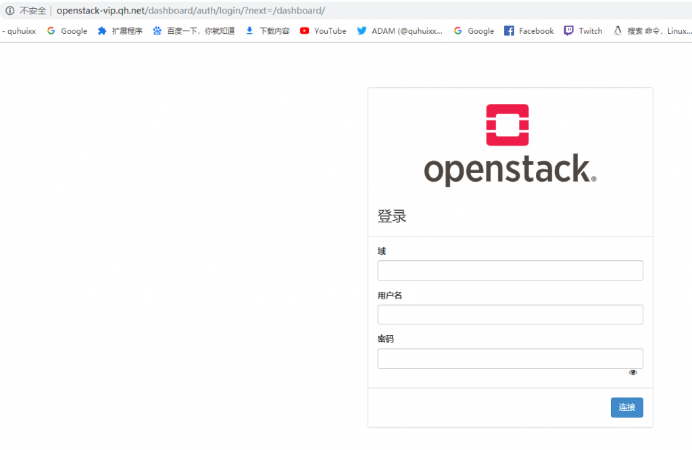

控制节点

<!--more-->

```
1、安装仪表盘软件包
[root@openstack ~]# yum install openstack-dashboard -y

2、编辑配置文件
[root@openstack ~]# vim /etc/openstack-dashboard/local_settings
ALLOWED_HOSTS = ['*',]

OPENSTACK_HOST = "openstack-vip.qh.com"
OPENSTACK_KEYSTONE_URL = "http://%s:5000/v3" % OPENSTACK_HOST    #启用3版API认证
OPENSTACK_KEYSTONE_DEFAULT_ROLE = "user"            #通过仪表盘创建的用户默认角色

ESSION_ENGINE = 'django.contrib.sessions.backends.cache'
                             #配置memcached会话存储服务
CACHES = {
    'default': {
         'BACKEND': 'django.core.cache.backends.memcached.MemcachedCache',
         'LOCATION': 'openstack-vip.qh.com:11211',
    }
}

OPENSTACK_KEYSTONE_MULTIDOMAIN_SUPPORT = True     #启用对域的支持

OPENSTACK_API_VERSIONS = {                        #配置API版本
#    "data-processing": 1.1,
    "identity": 3,
    "image": 2,
    "volume": 2,
#    "compute": 2,
}

OPENSTACK_KEYSTONE_DEFAULT_DOMAIN = 'Default'

OPENSTACK_NEUTRON_NETWORK = {                  #禁止支持三层网络服务
    'enable_router': False,
    'enable_quotas': False,
    'enable_ipv6': False,
    'enable_distributed_router': False,
    'enable_ha_router': False,
    'enable_lb': False,
    'enable_firewall': False,
    'enable_vpn': False,
    'enable_fip_topology_check': False,

TIME_ZONE = "Asia/Shanghai"                  #配置时区

3、重启httpd和memcached
[root@openstack ~]# systemctl restart httpd
[root@mysql ~]# systemctl restart memcached
http://openstack-vip.qh.com/dashboard
```

