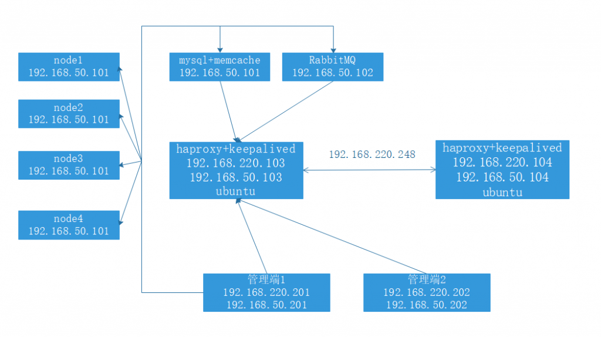
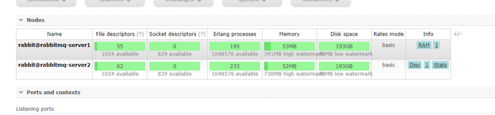
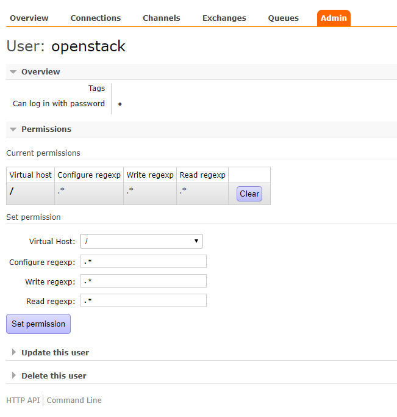
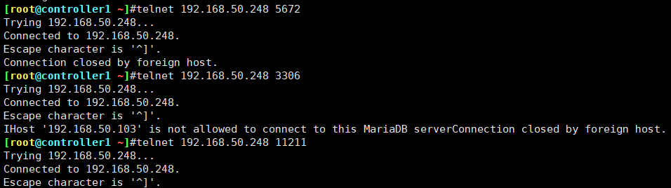

<!--more-->

```
https://docs.openstack.org/ocata/zh_CN/install-guide-rdo/ 中文手册
```

管理端

ocata yum源

```
[root@controller1 ~]#cat >/etc/yum.repos.d/ocata.repo <<EOF
[ocata]
name=ocata
baseurl=https://mirrors.aliyun.com/centos/7/cloud/x86_64/openstack-ocata/
gpgcheck=0
EOF
```

安装 openstack 客户端 在控制节点和计算节点。

```
[root@node1 ~]#yum install -y python-openstackclient
```

安装 mariadb+mem：

```
控制节点安装yum install -y python2-PyMySQL
```

数据库服务器

```
[root@linux-host4 ~]# yum install mariadb mariadb-server 
配置数据库：
[root@linux-host4 ~]# vim /etc/my.cnf.d/openstack.cnf
[mysqld]
bind-address = 0.0.0.0 #指定监听地址
default-storage-engine = innodb #默认引擎
innodb_file_per_table = on #开启每个表都有独立表空间
max_connections = 4096 #最大连接数
collation-server = utf8_general_ci #不区分大小写排序
character-set-server = utf8 #设置编码


systemctl enable mariadb.service
systemctl start mariadb.service


mysql_secure_installation

mysql -uroot -p123456
```

安装 消息队列

```
安全并配置组件
安装包：

# yum install rabbitmq-server
启动消息队列服务并将其配置为随系统启动：
# systemctl start rabbitmq-server.service
# systemctl enable rabbitmq-server.service
hostnamectl set-hostname rabbitmq-server1.qh.net
vim /etc/hosts
192.168.50.102 rabbitmq-server1


rabbitmq-plugins enable rabbitmq_management #开启web管理界面插件  node12都要开


http://192.168.50.102:15672/
guest  suest
###将rabbitMQ的节点添加到集群：
将启动服务的1的cookie 发送到 2的节点
[root@rabbitmq-server1 ~]#scp /var/lib/rabbitmq/.erlang.cookie 192.168.50.102:/var/lib/rabbitmq/
1服务启动 2服务停止
[root@rabbitmq-server1 ~]# rabbitmqctl  stop_app #停止应程序  node1关 node2不关
[root@rabbitmq-server1 ~]# rabbitmqctl   reset #清空元数据
[root@rabbitmq-server1 ~]# rabbitmqctl  join_cluster rabbit@rabbitmq-server2 --ram　＃将rabbitmq-server1添加到集群当中，并成为内存节点，不加--ram默认是磁盘节点
Clustering node 'rabbit@rabbitmq-server1' with 'rabbit@rabbitmq-server2' ...
...done.


[root@rabbitmq-server1 ~]#rabbitmqctl  join_cluster rabbit@rabbitmq-server2 --ram
Clustering node 'rabbit@rabbitmq-server1' with 'rabbit@rabbitmq-server2' ...
[root@rabbitmq-server1 ~]#rabbitmqctl  cluster_status
Cluster status of node 'rabbit@rabbitmq-server1' ...
[{nodes,[{disc,['rabbit@rabbitmq-server2']},
         {ram,['rabbit@rabbitmq-server1']}]},
 {alarms,[{'rabbit@rabbitmq-server2',[]}]}]
```



```
更改为镜像模式：
2.6.1：只要在其中一台节点执行以下命令即可：

[root@rabbitmq-server1 ~]# rabbitmqctl set_policy  ha-all "#"  '{"ha-mode":"all"}' #"#"为任意0个或多个即为所有，也可以使用"^test"匹配开头，还可以使用其他正则匹配
Setting policy "ha-all" for pattern "#" to "{\"ha-mode\":\"all\"}" with priority "0" ...
...done.
```

添加 openstack 用户：

```
[root@rabbitmq-server1 ~]#rabbitmqctl add_user openstack openstack123
Creating user "openstack" ...
```

给“openstack“用户配置写和读权限：

```
[root@rabbitmq-server1 ~]#rabbitmqctl set_permissions openstack ".*" ".*" ".*"
Setting permissions for user "openstack" in vhost "/" ..
```

验证



memcache配置

两个节点都安装memcache

```
yum install memcached
控制节点安装yum install python-memcached -y
vim /etc/sysconfig/memcached
PORT="11211"
USER="memcached"
MAXCONN="4096"
CACHESIZE="1024"
OPTIONS="-l 0.0.0.0,::1"

scp /etc/sysconfig/memcached 192.168.50.102:/etc/sysconfig/memcached
[root@rabbitmq-server1 ~]#systemctl start memcached.service
[root@rabbitmq-server1 ~]#systemctl enable memcached.service
```

haproxy

```
vim /etc/sysctl.conf
...
root@ubuntu:~# sysctl -p
net.ipv4.ip_nonlocal_bind = 1
net.ipv4.ip_forward = 1
root@ubuntu:~# vim /etc/haproxy/haproxy.cfg
listen MYSQL_PORT_3306
        bind 192.168.220.248:3306
        mode tcp
        balance roundrobin
        server web1 192.168.50.102:3306 weight 1 check port 3306 inter 3s fall 3 rise 5

listen OPENSTACK_RABBIT
        bind 192.168.220.248:5672
        mode tcp
        balance roundrobin
        server web1 192.168.50.102:5672 weight 1 check port 3306 inter 3s fall 3 rise 5
        server web1 192.168.50.101:5672 weight 1 check port 3306 inter 3s fall 3 rise 5 backup

listen OPENSTACK_memcache
        bind 192.168.220.248:11211
        mode tcp
        balance roundrobin
        server web1 192.168.50.101:11211 weight 1 check port 3306 inter 3s fall 3 rise 5
        server web1 192.168.50.102:11211 weight 1 check port 3306 inter 3s fall 3 rise 5 backup
```

测试

