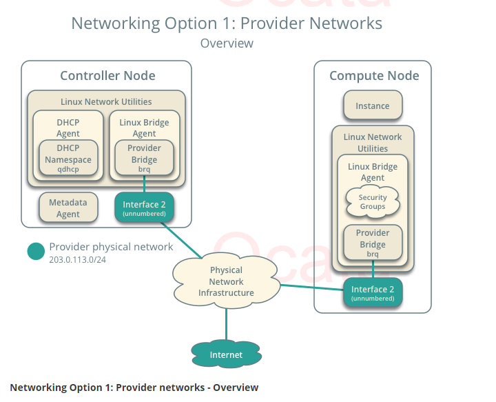
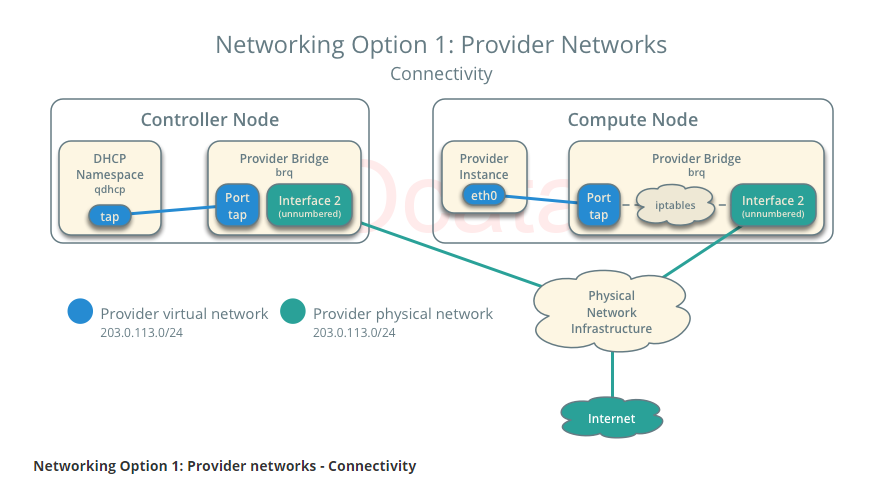
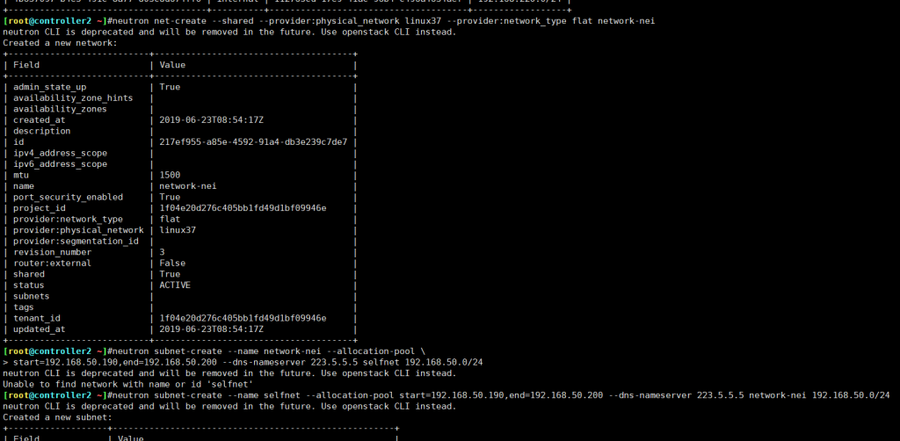

根据你在网络选项中的选择来创建虚拟网络。如果你选择选项1，只需创建一个公有网络。

如果你选择选项2，同时创建一个公有网络和一个私有网络

<!--more-->

## 提供者网络

在启动实例之前，您必须创建必须的虚拟机网络设施。对于网络选项1，实例使用提供者（外部）网络，提供者网络通过L2（桥/交换机）设备连接到物理网络。这个网络包括为实例提供IP地址的DHCP服务器。

[“](https://docs.openstack.org/ocata/zh_CN/install-guide-rdo/launch-instance-networks-provider.html#id1)admin“或者其他权限用户必须创建这个网络，因为它直接连接到物理网络设施。





### 创建桥接网络：

```
#openstack network create --在项目之间共享 --外部网络 --provider-physical-network --配置文件名称 --provider-network-type flat --自定义网络名称

openstack network create --share --external --provider-physical-network linux36 --provider-network-type flat network-wai

ml2_conf.ini:
[ml2_type_flat] flat_networks =  linux36, linux37    #一样

 linuxbridge_agent.ini:
[linux_bridge] physical_interface_mappings =  linux36:bond0,linux37:bond1
```

### 创建子网：

```
# openstack subnet create --network 上一步定义的网络名称 --allocation-pool start=开始IP,end=结束 IP --dns-nameserver DNS --gateway 网关 --subnet-range IP/掩码 自定义名称

openstack subnet create --network network-wai --allocation-pool start=192.168.220.55,end=192.168.220.70  --dns-nameserver  202.106.0.20  --gateway 192.168.220.2 --subnet-range 192.168.220.0/24 internal
验证网络：
[root@controller2 ~]#openstack network list
+--------------------------------------+-------------+--------------------------------------+
| ID                                   | Name        | Subnets                              |
+--------------------------------------+-------------+--------------------------------------+
| 112765cd-17e9-41ac-96b4-c496a4634aef | network-wai | 4b657097-b4e5-491c-8a77-805c8d674ff0 |
+--------------------------------------+-------------+--------------------------------------+
[root@controller2 ~]#openstack subnet list
 +--------------------------------------+----------+--------------------------------------+------------------+
 | ID                                   | Name     | Network                              | Subnet           |
 +--------------------------------------+----------+--------------------------------------+------------------+
 | 4b657097-b4e5-491c-8a77-805c8d674ff0 | internal | 112765cd-17e9-41ac-96b4-c496a4634aef | 192.168.220.0/24 |
 +--------------------------------------+----------+--------------------------------------+------------------+
[root@controller2 ~]#neutron net-list
 neutron CLI is deprecated and will be removed in the future. Use openstack CLI instead.
 +--------------------------------------+-------------+----------------------------------+-------------------------------------------------------+
 | id                                   | name        | tenant_id                        | subnets                                               |
 +--------------------------------------+-------------+----------------------------------+-------------------------------------------------------+
 | 112765cd-17e9-41ac-96b4-c496a4634aef | network-wai | 1f04e20d276c405bb1fd49d1bf09946e | 4b657097-b4e5-491c-8a77-805c8d674ff0 192.168.220.0/24 |
 +--------------------------------------+-------------+----------------------------------+-------------------------------------------------------+
[root@controller2 ~]#neutron subnet-list
 neutron CLI is deprecated and will be removed in the future. Use openstack CLI instead.
 +--------------------------------------+----------+----------------------------------+------------------+------------------------------------------------------+
 | id                                   | name     | tenant_id                        | cidr             | allocation_pools                                     |
 +--------------------------------------+----------+----------------------------------+------------------+------------------------------------------------------+
 | 4b657097-b4e5-491c-8a77-805c8d674ff0 | internal | 1f04e20d276c405bb1fd49d1bf09946e | 192.168.220.0/24 | {"start": "192.168.220.55", "end": "192.168.220.70"} |
 +--------------------------------------+----------+----------------------------------+------------------+------------------------------------------------------+
```



## 创建内网

```
neutron net-create --shared --provider:physical_network 网卡名(配置文件中) \
--provider:network_type flat network-nei(自定义网络名)

neutron net-create --shared --provider:physical_network linux37 \
--provider:network_type flat network-nei

neutron CLI is deprecated and will be removed in the future. Use openstack CLI instead.
Created a new network:
+---------------------------+--------------------------------------+
| Field                     | Value                                |
+---------------------------+--------------------------------------+
| admin_state_up            | True                                 |
| availability_zone_hints   |                                      |
| availability_zones        |                                      |
| created_at                | 2019-06-23T11:40:59Z                 |
| description               |                                      |
| id                        | d68f6c71-e865-40f8-a98a-e77cf89dc77c |
| ipv4_address_scope        |                                      |
| ipv6_address_scope        |                                      |
| mtu                       | 1500                                 |
| name                      | network-nei                          |
| port_security_enabled     | True                                 |
| project_id                | 1f04e20d276c405bb1fd49d1bf09946e     |
| provider:network_type     | flat                                 |
| provider:physical_network | linux37                              |
| provider:segmentation_id  |                                      |
| revision_number           | 3                                    |
| router:external           | False                                |
| shared                    | True                                 |
| status                    | ACTIVE                               |
| subnets                   |                                      |
| tags                      |                                      |
| tenant_id                 | 1f04e20d276c405bb1fd49d1bf09946e     |
| updated_at                | 2019-06-23T11:40:59Z                 |
+---------------------------+--------------------------------------+


neutron subnet-create --name 自定义字网名 --allocation-pool \
start=192.168.50.190,end=192.168.50.200 (--dns-nameserver 223.5.5.5)可不写 network-nei(上一步的自定义网络名) 192.168.50.0/24


neutron subnet-create --name selfnet --allocation-pool \
start=192.168.50.190,end=192.168.50.200 --dns-nameserver 223.5.5.5 network-nei 192.168.50.0/24


neutron CLI is deprecated and will be removed in the future. Use openstack CLI instead.
Created a new subnet:
+-------------------+------------------------------------------------------+
| Field             | Value                                                |
+-------------------+------------------------------------------------------+
| allocation_pools  | {"start": "192.168.50.190", "end": "192.168.50.200"} |
| cidr              | 192.168.50.0/24                                      |
| created_at        | 2019-06-23T11:42:59Z                                 |
| description       |                                                      |
| dns_nameservers   | 223.5.5.5                                            |
| enable_dhcp       | True                                                 |
| gateway_ip        | 192.168.50.1                                         |
| host_routes       |                                                      |
| id                | 9b5226f0-84a7-4538-95f4-d63331a78b9f                 |
| ip_version        | 4                                                    |
| ipv6_address_mode |                                                      |
| ipv6_ra_mode      |                                                      |
| name              | selfnet                                              |
| network_id        | d68f6c71-e865-40f8-a98a-e77cf89dc77c                 |
| project_id        | 1f04e20d276c405bb1fd49d1bf09946e                     |
| revision_number   | 2                                                    |
| service_types     |                                                      |
| subnetpool_id     |                                                      |
| tags              |                                                      |
| tenant_id         | 1f04e20d276c405bb1fd49d1bf09946e                     |
| updated_at        | 2019-06-23T11:42:59Z                                 |
+-------------------+------------------------------------------------------+
[root@controller2 ~]#openstack network list
 +--------------------------------------+-------------+--------------------------------------+
 | ID                                   | Name        | Subnets                              |
 +--------------------------------------+-------------+--------------------------------------+
 | d68f6c71-e865-40f8-a98a-e77cf89dc77c | network-nei | 9b5226f0-84a7-4538-95f4-d63331a78b9f |
 | e272aea4-a33f-4de5-a66f-8902436a52c1 | network-wai | 063cbca6-72fa-4d0f-9e5b-720ca19ffcf8 |
 +--------------------------------------+-------------+--------------------------------------+
[root@controller2 ~]#openstack subnet list
 +--------------------------------------+----------+--------------------------------------+------------------+
 | ID                                   | Name     | Network                              | Subnet           |
 +--------------------------------------+----------+--------------------------------------+------------------+
 | 063cbca6-72fa-4d0f-9e5b-720ca19ffcf8 | internal | e272aea4-a33f-4de5-a66f-8902436a52c1 | 192.168.220.0/24 |
 | 9b5226f0-84a7-4538-95f4-d63331a78b9f | selfnet  | d68f6c71-e865-40f8-a98a-e77cf89dc77c | 192.168.50.0/24  |
 +--------------------------------------+----------+--------------------------------------+------------------+
 [root@controller2 ~]#neutron net-list
 neutron CLI is deprecated and will be removed in the future. Use openstack CLI instead.
 +--------------------------------------+-------------+----------------------------------+-------------------------------------------------------+
 | id                                   | name        | tenant_id                        | subnets                                               |
 +--------------------------------------+-------------+----------------------------------+-------------------------------------------------------+
 | d68f6c71-e865-40f8-a98a-e77cf89dc77c | network-nei | 1f04e20d276c405bb1fd49d1bf09946e | 9b5226f0-84a7-4538-95f4-d63331a78b9f 192.168.50.0/24  |
 | e272aea4-a33f-4de5-a66f-8902436a52c1 | network-wai | 1f04e20d276c405bb1fd49d1bf09946e | 063cbca6-72fa-4d0f-9e5b-720ca19ffcf8 192.168.220.0/24 |
 +--------------------------------------+-------------+----------------------------------+-------------------------------------------------------+
 [root@controller2 ~]#neutron subnet-list
 neutron CLI is deprecated and will be removed in the future. Use openstack CLI instead.
 +--------------------------------------+----------+----------------------------------+------------------+------------------------------------------------------+
 | id                                   | name     | tenant_id                        | cidr             | allocation_pools                                     |
 +--------------------------------------+----------+----------------------------------+------------------+------------------------------------------------------+
 | 063cbca6-72fa-4d0f-9e5b-720ca19ffcf8 | internal | 1f04e20d276c405bb1fd49d1bf09946e | 192.168.220.0/24 | {"start": "192.168.220.55", "end": "192.168.220.70"} |
 | 9b5226f0-84a7-4538-95f4-d63331a78b9f | selfnet  | 1f04e20d276c405bb1fd49d1bf09946e | 192.168.50.0/24  | {"start": "192.168.50.190", "end": "192.168.50.200"} |
 +--------------------------------------+----------+----------------------------------+------------------+------------------------------------------------------+
```