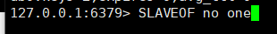
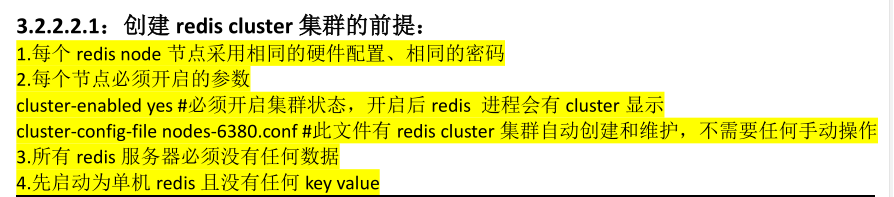
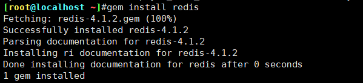
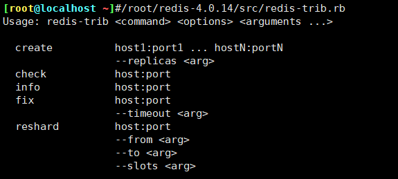
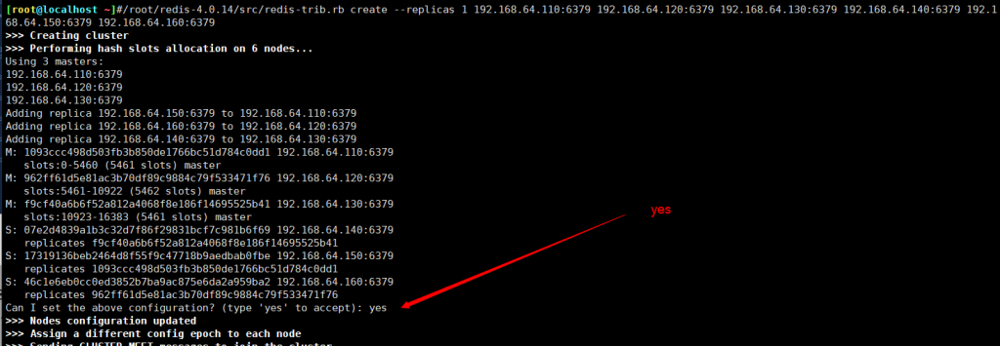
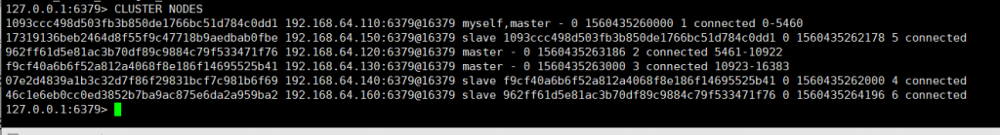
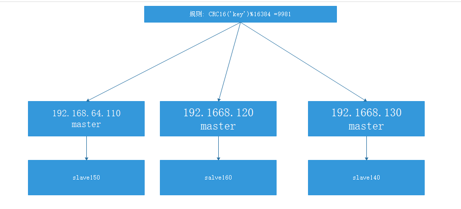
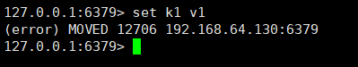
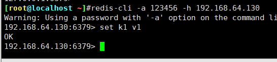
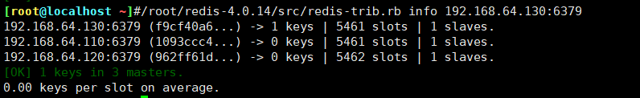

手动切换slave状态

<!--more-->




```
[root@s1 ~]# yum install ruby rubygems -y
[root@s1 ~]# find / -name redis-trib.rb
/usr/local/src/redis-4.0.14/src/redis-trib.rb
[root@s1 ~]# cp /usr/local/src/redis-4.0.14/src/redis-trib.rb /usr/bin/
[root@s1 src]# gem install redis
Fetching: redis-4.1.0.gem (100%)
ERROR: Error installing redis:
redis requires Ruby version >= 2.2.2.
#解决 ruby 版本较低问题：
[root@s1 src]# yum remove ruby rubygems -y
[root@s1 src]# wget https://cache.ruby-lang.org/pub/ruby/2.2/ruby-2.2.6.tar.gz
[root@s1 src]# tar xf ruby-2.2.6.tar.gz
[root@s1 src]# cd ruby-2.2.6
[root@s1 ruby-2.2.6]# ./configure
[root@s1 ruby-2.2.6]# make –j 4
[root@s1 ruby-2.2.6]# make install
[root@s5 ruby-2.2.6]# ln -sv /usr/local/src/ruby-2.2.6/bin/gem /usr/bin/
[root@s5 ruby-2.2.6]# ln -sv /usr/local/src/ruby-2.2.6/ruby /usr/bin/
[root@s1 ruby-2.2.6]# gem install redis
```





```
[root@s1 ruby-2.5.4]# vim /usr/local/lib/ruby/gems/2.5.0/gems/redis-4.1.0/lib/redis/client.rb #修改密码为
redis 登录密码
/root/redis-4.0.14/src/redis-trib.rb create --replicas 1 192.168.64.110:6379 192.168.64.120:6379 192.168.64.130:6379 192.168.64.140:6379 192.168.64.150:6379 192.168.64.160:6379
```







slave 可以更换master

要在130才能写入




