集群运行时间长久之后，难免由于硬件故障、网络规划、业务增长等原因对已有集群进行相应的调整，
比如增加 Redis node 节点、减少节点、节点迁移、更换服务器等。
增加节点和删除节点会涉及到已有的槽位重新分配及数据迁移。

<!--more-->

## 集群 维护 之动态 添加节点 ：

增加 Redis node 节点，需要与之前的 Redis node 版本相同、配置一致，然后分别启动两台 Redis node，因为一主一从。

案例：
因公司业务发展迅猛，现有的三主三从 redis cluster 架构可能无法满足现有业务的并发写入需求，因此公司紧急采购一台服务器 192.168.7.104，需要将其动态添加到集群当中其不能影响业务使用和数据丢失，则添加过程如下:

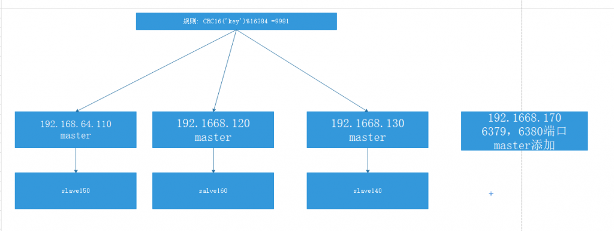

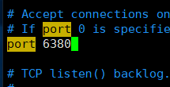

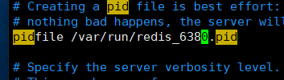

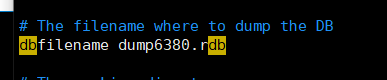

```
redis-trib.rb add-node 192.168.64.170:6379 192.168.64.110:6379
```

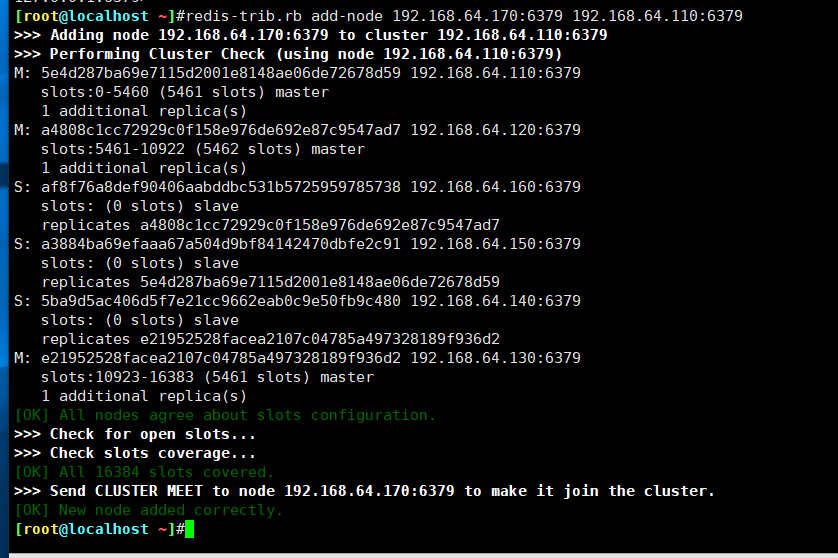

使用命令对新加的主机重新分配槽位:

```
redis-cli -a 123456 --cluster reshard 192.168.64.170:6379
```

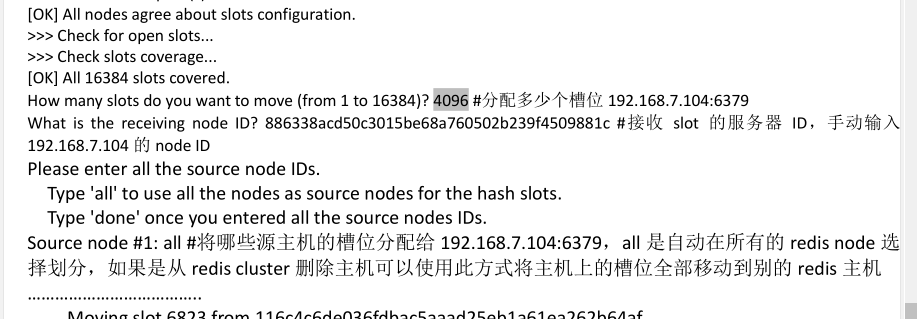

为新的 master 添加 slave

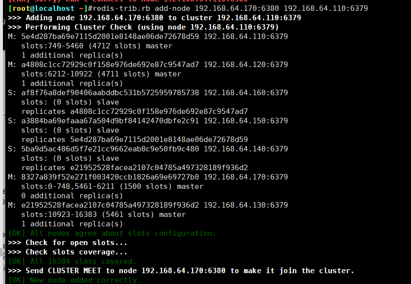

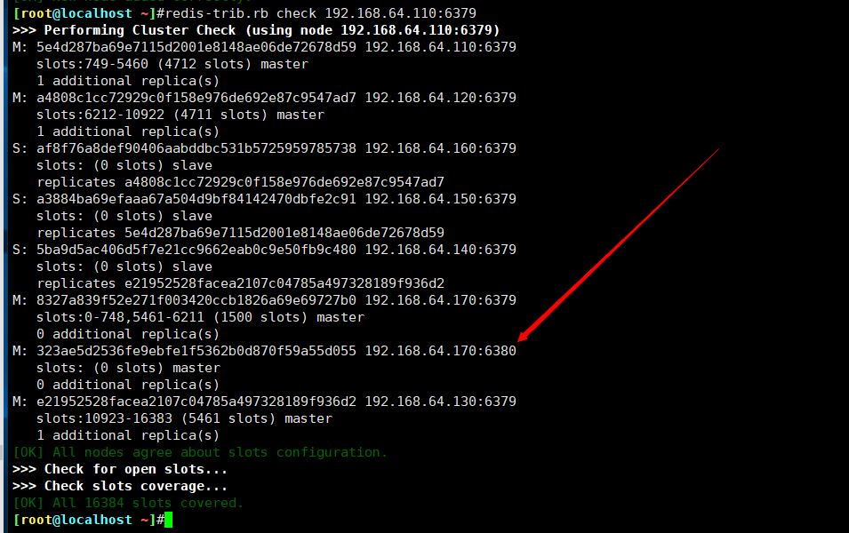

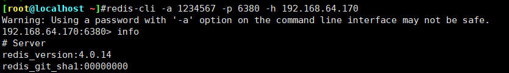


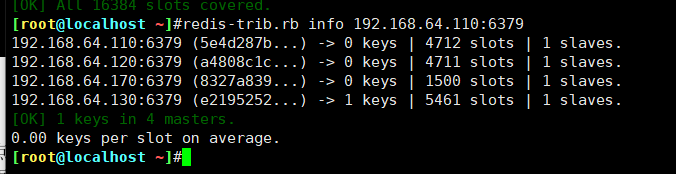

## 集群 维护 之动态删除 节点：

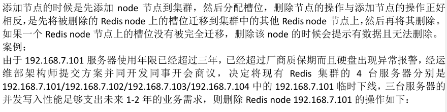

```
被迁移 Redis 服务器必须保证没有数据
[root@s1 ~]# redis-trib.rb reshard 172.18.64.170:6379
[root@s1 ~]# redis-trib.rb fix 172.18.64.170:6379 #迁移失败需要修复集群
```

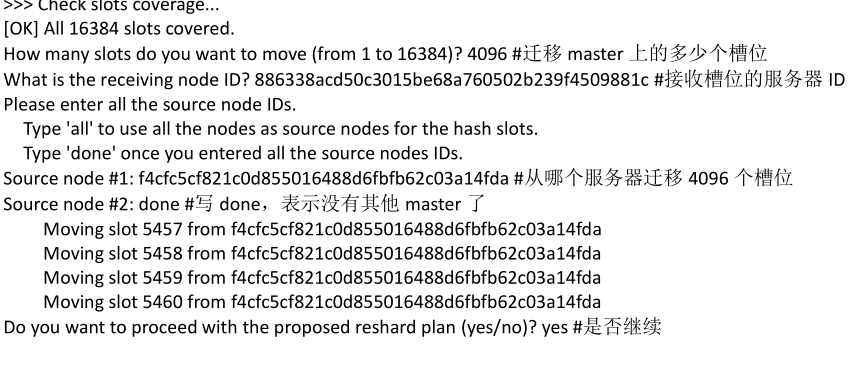

验证槽位迁移完成


从集群删除服务器


集群维护之导入现有 Redis


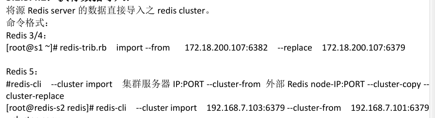