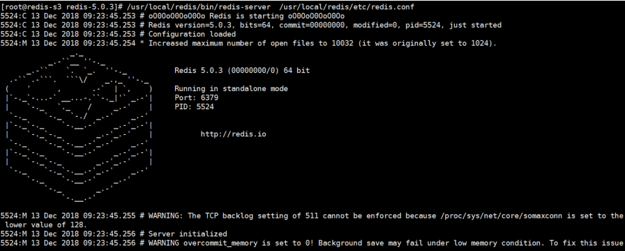

官方下载地址：http://download.redis.io/releases/

<!--more-->

### yum 安装 redis：

在 centos 系统上需要安装 epel 源。

安装 redis

```
# yum install redis –y
# systemctl start redis && systemctl enable redis
[root@redis-s3 ~]# redis-cli
127.0.0.1:6379> info
# Server
redis_version:3.2.12
redis_git_sha1:00000000
redis_git_dirty:0
redis_build_id:7897e7d0e13773f
redis_mode:standalone
os:Linux 3.10.0-862.el7.x86_64 x86_64
arch_bits:64
```

### 编译安装 redis：

下载当前最新 release 版本 redis 源码包：

https://redis.io/download


```
官方的安装命令：
# pwd
/usr/local/src
# tar xf redis-5.0.3.tar.gz
# cd redis-5.0.3
# make PREFIX=/usr/local/redis install
# ll /usr/local/redis/
total 0
drwxr-xr-x 2 root root 134 Dec 13 09:21 bin
# mkdir /usr/local/redis/etc
# cp redis.conf /usr/local/redis/etc/
```

### 前台启动 redis

```
# /usr/local/redis/bin/redis-server 
  /usr/local/redis/etc/redis.conf
```



解决 当前的警告 提示 ：

tcp-backlog ：
The backlog argument defines the maximum length。。。。

```
backlog 参数控制的是三次握手的时候 server 端收到 client ack 确认号之后的队列值。
net.core.somaxconn = 512
```

vm.overcommit_memory

```
0、表示内核将检查是否有足够的可用内存供应用进程使用；如果有足够的可用内存，内存申请允许；
否则，内存申请失败，并把错误返回给应用进程。
1、表示内核允许分配所有的物理内存，而不管当前的内存状态如何。
2、表示内核允许分配超过所有物理内存和交换空间总和的内存
vm.overcommit_memory = 1
```

transparent hugepage ：

```
开启大页内存动态分配，需要关闭让 redis 负责内存管理。
echo never > /sys/kernel/mm/transparent_hugepage/enabled
```

### 编辑 redis 服务启动脚本:

```
[root@s1 ~]# cat /usr/lib/systemd/system/redis.service
[Unit]
Description=Redis persistent key-value database
After=network.target
After=network-online.target
Wants=network-online.target
[Service]
#ExecStart=/usr/bin/redis-server /etc/redis.conf --supervised systemd
ExecStart=/apps/redis/bin/redis-server /apps/redis/etc/redis.conf --supervised systemd
ExecReload=/bin/kill -s HUP $MAINPID
ExecStop=/bin/kill -s QUIT $MAINPID
Type=notify
User=root
Group=root
RuntimeDirectory=redis
RuntimeDirectoryMode=0755
[Install]
WantedBy=multi-user.target
```

### 创建 redis 用户 和数据目录：

```
# groupadd -g 1000 redis && useradd -u 1000 -g 1000 redis -s /sbin/nologin
# mkdir -pv /usr/local/redis/{etc,logs,data,run}
# chown redis.redis -R /usr/local/redis/
```

### 验证 redis 启动

```
# useradd redis -s /sbin/nologin
# chown redis.redis /usr/local/redis/ -R
# chown redis.redis /usr/local/redis/ -R #注意目录权限
```


```
使用客户端连接  redis ：
#/usr/local/redis/bin/redis-cli -h IP/HOSTNAME -p PORT -a PASSWORD
创建命令软连接：
# ln -sv /usr/local/redis/bin/redis-* /usr/bin/
‘/usr/bin/redis-benchmark’ -> ‘/usr/local/redis/bin/redis-benchmark’
‘/usr/bin/redis-check-aof’ -> ‘/usr/local/redis/bin/redis-check-aof’
‘/usr/bin/redis-check-rdb’ -> ‘/usr/local/redis/bin/redis-check-rdb’
‘/usr/bin/redis-cli’ -> ‘/usr/local/redis/bin/redis-cli’
‘/usr/bin/redis-sentinel’ -> ‘/usr/local/redis/bin/redis-sentinel’
‘/usr/bin/redis-server’ -> ‘/usr/local/redis/bin/redis-server’
编译安装后的命令：
[root@redis-s1 ~]# ll /usr/local/redis/bin/
total 32656
-rwxr-xr-x 1 redis redis 4365488 Dec 13 09:21 redis-benchmark #redis 性能测试工具
-rwxr-xr-x 1 redis redis 8088920 Dec 13 09:21 redis-check-aof #AOF 文件检查工具
-rwxr-xr-x 1 redis redis 8088920 Dec 13 09:21 redis-check-rdb #RDB 文件检查工具
-rwxr-xr-x 1 redis redis 4800752 Dec 13 09:21 redis-cli #redis #客户端工具
lrwxrwxrwx 1 redis redis 12 Dec 13 09:21 redis-sentinel -> redis-server #哨兵，软连接到
server
-rwxr-xr-x 1 redis redis 8088920 Dec 13 09:21 #redis-server #redis 服务端
```