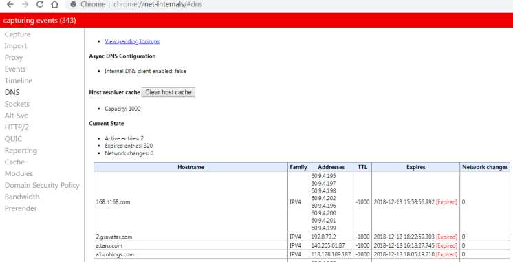
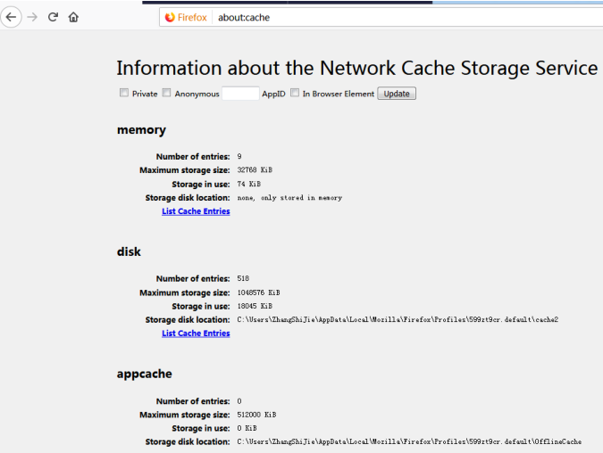
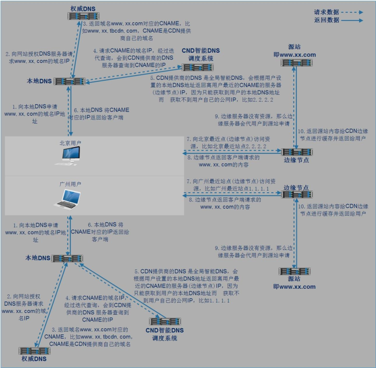
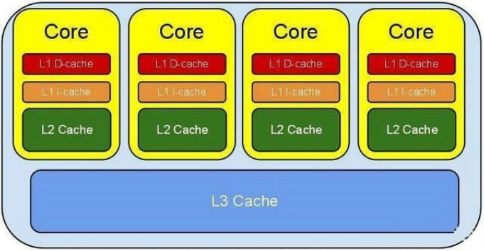

## 一 ： 缓存 概念 ：

缓存是为了调节速度不一致的两个或多个不同的物质的速度，在中间对速度较快的一方起到一个加
速访问速度较慢的一方的作用，比如 CPU 的一级、二级缓存是保存了 CPU 最近经常访问的数据，内存是保存 CPU 经常访问硬盘的数据，而且硬盘也有大小不一的缓存，甚至是物理服务器的 raid 卡有也缓存，都是为了起到加速 CPU 访问硬盘数据的目的，因为 CPU 的速度太快了，CPU 需要的数据硬盘往往不能在短时间内满足 CPU 的需求，因此 PCU 缓存、内存、Raid 卡以及硬盘缓存就在一定程度上满足了 CPU 的数据需求，即 CPU 从缓存读取数据可以大幅提高 CPU 的工作效率。

<!--more-->


## 1 .1 ： 系统缓存

### 1.1.1：buffer 与 cache：

buffer：缓冲也叫写缓冲，一般用于写操作，可以将数据先写入内存在写入磁盘，buffer 一般用于写缓冲，用于解决不同介质的速度不一致的缓冲，先将数据临时写入到里自己最近的地方，以提高写入速度，CPU 会把数据线写到内存的磁盘缓冲区，然后就认为数据已经写入完成看，然后内核的线程在后面的时间在写入磁盘，所以服务器突然断电会丢失内存中的部分数据。
cache：缓存也叫读缓存，一般用于读操作，CPU 读文件从内存读，如果内存没有就先从硬盘读到内存再读到 CPU，将需要频繁读取的数据放在里自己最近的缓存区域，下次读取的时候即可快速读取。

### 1.1.2：cache 的保存位置：

客户端：浏览器
内存：本地服务器、远程服务器
硬盘：本机硬盘、远程服务器硬盘

### 1.1.3：cache 的特性：

自动过期：给缓存的数据加上有效时间，超出时间后自动过期删除
过期时间：强制过期，源网站更新图片后 CDN 是不会更新的，需要强制是图片缓存过期
命中率：即缓存的读取命中率

## 1.2 ： 用户层缓存：

### 1.2.1：DNS 缓存：

默认为 60 秒，即 60 秒之内在访问同一个域名就不在进行 DNS 解析：
查看 chrome 浏览器的 DNS 缓存：
chrome://net-internals/#dns



### 1.2.2：火狐浏览器缓存：



### 1.2.3：浏览器缓存过期机制：

#### 1.. 2. 3.1 ： 最后修改时间：

系统调用会获取文件的最后修改时间，如果没有发生变化就返回给浏览器 304 的状态码，表示没有发生变化，然后浏览器就使用的本地的缓存展示资源，


#### 1. 2. 3.2 ：Etag 标记

基于 Etag 标记是否一致做判断页面是否发生过变化，比如基于 Nginx 的 etag on 来实现


#### 1.. 2. 3.3 ： 过期时间：

以上两种都需要发送请求，即不管资源是否过期都要发送请求进行协商，这样会消耗不必要的时间，因此有了缓存的过期时间，即第一次请求资源的时候带一个资源的过期时间，默认为 30 天，当前这种方式使用的比表较多，但是无法保证客户的时间都是准确并且一致的，因此假如一个最大生存周期，使用用户本地的时间计算缓存数据是否超过多少天，下面的过期时间为 2027 年，但是缓存的最大生存周期计算为天等于 3650 天即 10 年，过期时间如下：


## 1.3 ： CDN 缓存

### 1.3.1：什么是 CND：

内容分发网络（Content Delivery Network），通过将服务内容分发至全网加速节点，利用全球调度系统使用户能够就近获取，有效降低访问延迟，提升服务可用性，CDN 第一降低机房的使用带宽，因为很多资源通过 CDN 就直接返回用户了，第二解决不同运营商之间的互联，因为可以让联通的网络访问联通让电信的网络访问电信，起到加速用户访问的目的， 第三：解决用户访问的地域问题，就近返回用户资源。
百度 CDN：https://cloud.baidu.com/product/cdn.html
阿里 CDN：https://www.aliyun.com/product/cdn?spm=5176.8269123.416540.50.728y8n
腾讯 CDN：https://www.qcloud.com/product/cdn

### 1.3.2：用户请求 CDN 流程：

提前对静态内容进行预缓存，避免大量的请求回源，导致主站网络带宽被打满而导致数据无法更新，另外 CDN 可以将数据根据访问的热度不同而进行不同级别的缓存，例如访问量最高的资源访问 CDN边缘节点的内存，其次的放在 SSD 或者 SATA，再其次的放在云存储，这样兼顾了速度与成本。



### 1.3.3：CDN 主要优势：

提前对静态内容进行预缓存，避免大量的请求回源，导致主站网络带宽被打满而导致数据无法更新，另外 CDN 可以将数据根据访问的热度不同而进行不同级别的缓存，例如访问量最高的资源访问 CDN边缘节点的内存，其次的放在 SSD 或者 SATA，再其次的放在云存储，这样兼顾了速度与成本。缓存-缓存到最快的地方如内存，缓存的数据准确命中率高，访问速度就快
调度准确-将用户调度到最近的边缘节点
性能优化-CDN 专门用于缓存响应速度快
安全相关-抵御攻击
节省带宽：由于用户请求由边缘节点响应，因此大幅降低到源站带宽。

## 1.4 ：应用层缓存：

Nginx、PHP 等 web 服务可以设置应用缓存以加速响应用户请求，另外有些解释性语言比如 PHP/Python不能直接运行，需要先编译成字节码，但字节码需要解释器解释为机器码之后才能执行，因此字节码也是一种缓存，有时候会出现程序代码上线后字节码没有更新的现象。

## 1.5 ： 其他层面缓存

CPU 缓存(L1 的数据缓存和 L1 的指令缓存)、二级缓存、三级缓存



磁盘缓存
RAID 卡
分布式缓存：redis、memcache

```
# MegaCli64 -LDinfo -Lall -aAll
```