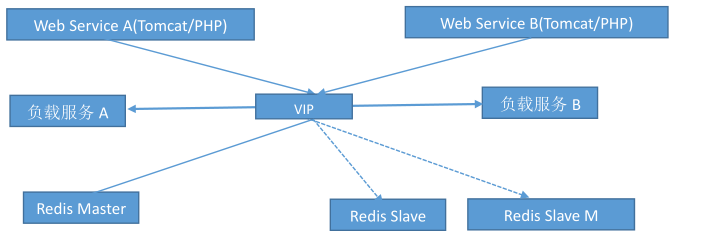
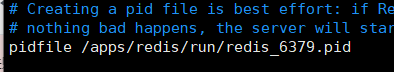
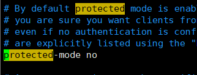
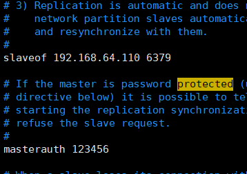
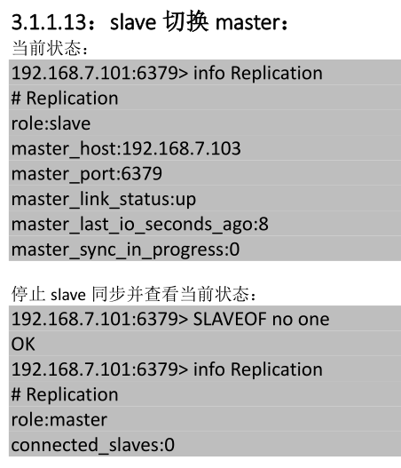
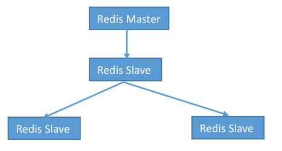

虽然 Redis 可以实现单机的数据持久化，但无论是 RDB 也好或者 AOF 也好，都解决不了单点宕机问题，即一旦 redis 服务器本身出现系统故障、硬件故障等问题后，就会直接造成数据的丢失，因此需要使用另外的技术来解决单点问题。

<!--more-->

配置 reids 主从：

主备模式，可以实现 Redis 数据的跨主机备份。
程序端连接到高可用负载的 VIP，然后连接到负载服务器设置的 Redis 后端 real server，此模式不需要在程序里面配置 Redis 服务器的真实 IP 地址，当后期 Redis 服务器 IP 地址发生变更只需要更改 redis相应的后端 real server 即可，可避免更改程序中的 IP 地址设置。

从服务器

主

## Slave 节点 再有 Slave ：

中间开启注释bind，最后slave一样