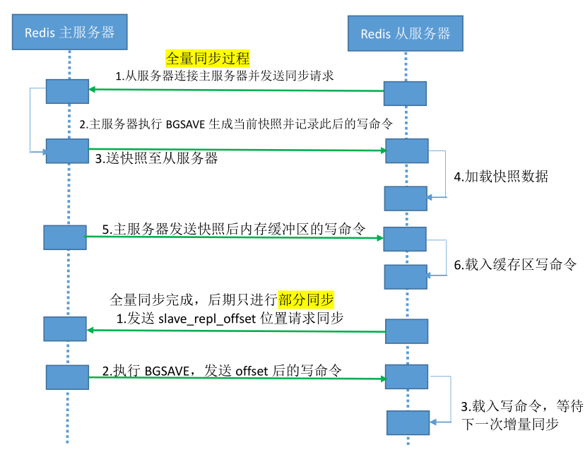

```
Redis 支持主从复制分为全量同步和增量同步，首次同步是全量同步
主从同步可以让从服务器从主服务器备份数据，而且从服务器还可与有从服务器，即另外一台 redis 服务器可以从一台从服务器进行数据同步，
redis 的主从同步是非阻塞的，其收到从服务器的 sync(2.8 版本之前是 PSYNC)命令会fork 一个子进程在后台执行 bgsave 命令，并将新写入的数据写入到一个缓冲区里面，bgsave 执行完成之后并生成的将 RDB 文件发送给客户端，客户端将收到后的 RDB 文件载入自己的内存，然后主 redis将缓冲区的内容在全部发送给从 redis，之后的同步从服务器会发送一个 offset 的位置(等同于 MySQL的 binlog 的位置)给主服务器，主服务器检查后位置没有错误将此位置之后的数据包括写在缓冲区的积压数据发送给 redis 从服务器，从服务器将主服务器发送的挤压数据写入内存，这样一次完整的数据同步，再之后再同步的时候从服务器只要发送当前的 offset 位 置给主服务器，然后主服务器根据响应的位置将之后的数据发送给从服务器保存到其内存即可。
```

<!--more-->

Redis 全量复制一般发生在 Slave 初始化阶段，这时 Slave 需要将Master 上的所有数据都复制一份。

具体步骤如下：

1）从服务器连接主服务器，发送 SYNC 命令；
2）主服务器接收到 SYNC 命名后，开始执行 BGSAVE 命令生成 RDB 快照文件并使用缓冲区记录此后执行的所有写命令；
3）主服务器 BGSAVE 执行完后，向所有从服务器发送快照文件，并在发送期间继续记录被执行的写命令；
4）从服务器收到快照文件后丢弃所有旧数据，载入收到的快照；
5）主服务器快照发送完毕后开始向从服务器发送缓冲区中的写命令；
6）从服务器完成对快照的载入，开始接收命令请求，并执行来自主服务器缓冲区的写命令；
7）后期同步会先发送自己 slave_repl_offset 位置，只同步新增加的数据，不再全量同步。

