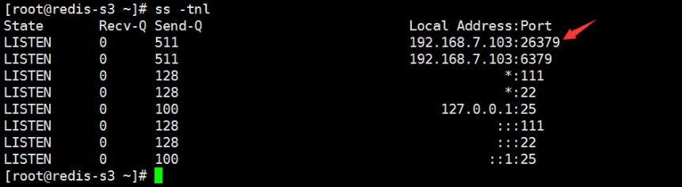

```
vim /apps/redis/etc/sentinel.conf
bind 0.0.0.0
port 26379
daemonize yes
pidfile "/apps/redis/redis-sentinel.pid"
logfile "/apps/redis/sentinel_26379.log"
dir "/apps/redis"
sentinel deny-scripts-reconfig yes
sentinel monitor mymaster 192.168.64.110 6379 2
sentinel auth-pass mymaster 123456
sentinel down-after-milliseconds mymaster 10000
sentinel parallel-syncs mymaster 1
sentinel failover-timeout mymaster 180000
```

<!--more-->

三台都一样

启动哨兵：

三台哨兵都要启动

```
/apps/redis/bin/redis-sentinel /apps/redis/etc/sentinel.conf 
```



