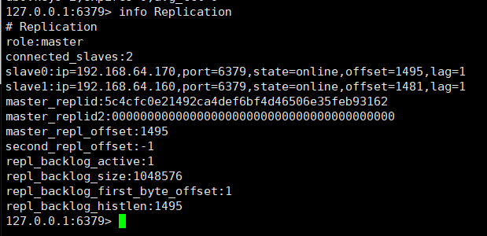

```
上一个步骤的主从架构无法实现 master 和 slave 角色的自动切换，即当 master 出现redis 服务异常、主机断电、磁盘损坏等问题导致 master 无法使用，而 redis 高可用无法实现自故障转移(将 slave 提升为 master)，需要手动改环境配置才能切换到 slave redis 服务器，另外也无法横向扩展 Redis 服务的并
行写入性能，当单台 Redis 服务器性能无法满足业务写入需求的时候就必须需要一种方式解决以上的两个核心问题，即：1.master 和 slave 角色的无缝切换，让业务无感知从而不影响业务使用 2.可以横向动态扩展 Redis 服务器，从而实现多台服务器并行写入以实现更高并发的目的。
```

Redis 集群实现方式：客户端分片 代理分片 Redis Cluster

<!--more-->

## Sentinel(哨兵)：

Sentinel 进程是用于监控 redis 集群中 Master 主服务器工作的状态，在 Master 主服务器发生故障的时候，可以实现 Master 和 Slave 服务器的切换，保证系统的高可用，其已经被集成在 redis2.6+的版本中，Redis 的哨兵模式到了 2.8 版本之后就稳定了下来。一般在生产环境也建议使用 Redis 的 2.8 版本的以后版本。哨兵(Sentinel) 是一个分布式系统，你可以在一个架构中运行多个哨兵(sentinel) 进程，这些进程使用流言协议(gossipprotocols)来接收关于 Master 主服务器是否下线的信息，并使用投票协议(Agreement Protocols)来决定是否执行自动故障迁移,以及选择哪个 Slave 作为新的 Master。每个哨兵(Sentinel)进程会向其它哨兵(Sentinel)、Master、Slave 定时发送消息，以确认对方是否”活”着，如果发现对方在指定配置时间(可配置的)内未得到回应，则暂时认为对方已掉线，也就是所谓的”主观认为宕机” ，英文名称：Subjective Down，简称 SDOWN。有主观宕机，肯定就有客观宕机。当“哨兵群”中的多数 Sentinel 进程在对 Master 主服务器做出 SDOWN 的判断，并且通过 SENTINEL is-master-down-by-addr 命令互相交流之后，得出的 Master Server 下线判断，这种方式就是“客观宕机”，英文名称是：Objectively Down， 简称 ODOWN。通过一定的 vote 算法，从剩下的 slave 从服务器节点中，选一台提升为 Master 服务器节点，然后自动修改相关配置，并开启故障转移（failover）。

Sentinel 机制可以解决 master 和 slave 角色的切换问题。

两台从服务器指向主服务器

