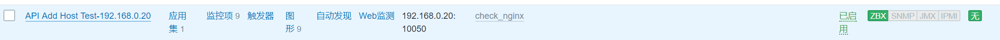

参考手册 https://www.zabbix.com/documentation/4.0/zh/manual/api

<!--more-->

```
API使用：

1、获取token:
 curl -s -X POST -H 'Content-Type:application/json' -d '
{
"jsonrpc": "2.0",
"method": "user.login",
"params": {
"user": "zabbixadmin",
"password": "123456"
},
"id": 1
}' http://192.168.6.10/zabbix/api_jsonrpc.php | python -m json.tool

显示token结果
{
"id": 1,
"jsonrpc": "2.0",
"result": "a55c7355a1063784b021f7c0b186001c"
}


2、示例：
a、通过名称获取数据
curl -s -X POST -H 'Content-Type:application/json' -d '
{
    "jsonrpc": "2.0",
    "method": "host.get",
    "params": {
        "filter": {
            "host": [
                "Zabbix server",
                "192.168.0.10"
            ]
        }
    },
    "auth": "a55c7355a1063784b021f7c0b186001c",
    "id": 1
}' http://192.168.6.10/zabbix/api_jsonrpc.php | python -m json.tool

b、显示结果
{
    "id": 1,
    "jsonrpc": "2.0",
    "result": [
        {
            "auto_compress": "1",
            "available": "1",
            "description": "",
            "disable_until": "0",
            "error": "",
            "errors_from": "0",
            "flags": "0",
            "host": "Zabbix server",
            "hostid": "10084",
            "ipmi_authtype": "-1",
            "ipmi_available": "0",
            "ipmi_disable_until": "0",
            "ipmi_error": "",
            "ipmi_errors_from": "0",
            "ipmi_password": "",
             ......
             ......
             ......


a、获取所有主机
curl -s -X POST -H 'Content-Type:application/json' -d '
{
    "jsonrpc": "2.0",
    "method": "host.get",
    "params": {
        "output": ["host"]
    },
    "auth": "a55c7355a1063784b021f7c0b186001c",
    "id": 1
}' http://192.168.6.10/zabbix/api_jsonrpc.php | python -m json.tool

b、显示效果
{
    "id": 1,
    "jsonrpc": "2.0",
    "result": [
        {
            "host": "Zabbix server",
            "hostid": "10084"
        },
        {
            "host": "192.168.2.10",
            "hostid": "10269"
        },
        {
            "host": "192.168.0.20",
            "hostid": "10275"
        }
        ......
        ......
        ......


a、获取用户信息
curl -s -X POST -H 'Content-Type:application/json' -d '
{
    "jsonrpc": "2.0",
    "method": "user.get",
    "params": {
        "output": "extend"
    },
    "auth": "a55c7355a1063784b021f7c0b186001c",
    "id": 1
}' http://192.168.6.10/zabbix/api_jsonrpc.php | python -m json.tool

b、显示效果
{
    "id": 1,
    "jsonrpc": "2.0",
    "result": [
        {
            "alias": "zabbixadmin",
            "attempt_clock": "1563333327",
            "attempt_failed": "0",
            "attempt_ip": "192.168.0.1",
            "autologin": "1",
            "autologout": "0",
            "lang": "zh_CN",
            "name": "Zabbix",
            "refresh": "30s",
            "rows_per_page": "50",
            "surname": "Administrator",
            "theme": "default",
            "type": "3",
            "url": "",
            "userid": "1"
        },
         ......
         ......
         ......

a、获取模板信息
curl -s -X POST -H 'Content-Type:application/json' -d '
{
    "jsonrpc": "2.0",
    "method": "template.get",
    "params": {
        "output": "extend",
        "filter": {
            "host": [
                "check_nginx"
            ]
        }
    },
    "auth": "a55c7355a1063784b021f7c0b186001c",
    "id": 1
}' http://192.168.6.10/zabbix/api_jsonrpc.php | python -m json.tool


3、基于脚本方式获取token
[root@Host1 ~]# vim token.py
#!/usr/bin/env python
# -*- coding:utf-8 -*-

url = 'http://192.168.6.10/zabbix/api_jsonrpc.php'
post_data = {
    "jsonrpc": "2.0",
    "method": "user.login",
    "params": {
        "user": "zabbixadmin",
        "password": "123456"
    },
    "id": 1
}
post_header = {'Content-Type': 'application/json'}

ret = requests.post(url, data=json.dumps(post_data), headers=post_header)

zabbix_ret = json.loads(ret.text)
if not zabbix_ret.has_key('result'):
    print 'login error'
else:
    print zabbix_ret.get('result')


[root@Host1 ~]# yum install python-pip      
[root@Host1 ~]# pip install requests        #安装requests模块

执行token.py脚本
[root@Host1 ~]# python token.py 
ec4018039a773cfe05328dae0b965eec

=========================================================================

通过API创建主机
API添加主机为预先知道要添加的主机IP、预先安装并配置好zabbix agent、预先知道要关联的模板ID/组ID等信息，然后同API提交请求添加

通过API添加主机-不带proxy模式
curl -s -X POST -H 'Content-Type:application/json' -d '
 {
     "jsonrpc": "2.0",
     "method": "host.create",
     "params": {
          "host": "192.168.0.20", 
          "interfaces": [
             {
                 "type": 1,
                 "main": 1,
                 "useip": 1, 
                 "ip": "192.168.0.20", 
                 "dns": "",
                 "port": "10050"
             }
         ],
         "groups": [
             {
                 "groupid": "15"
             }
         ],
         "templates": [
             {
                 "templateid": "10265"
             }
         ]
     },
     "auth": "ec4018039a773cfe05328dae0b965eec", 
     "id": 1
 }' http://192.168.6.10/zabbix/api_jsonrpc.php | python -m json.tool

显示结果
{
    "id": 1,
    "jsonrpc": "2.0",
    "result": {
        "hostids": [
            "10278"
        ]
    }
}

zabbix_server web界面验证是否添加成功
```



```
脚本批量创建
[root@localhost ~]# vim linux-add-host.sh
#!/bin/bash
IP="
192.168.1.10
192.168.1.20
192.168.1.30
"
for node_ip in ${IP};do
curl -s -X POST -H 'Content-Type:application/json' -d '
 {
     "jsonrpc": "2.0",
     "method": "host.create",
     "params": {
          "host": "'${node_ip}'", 
          "interfaces": [
             {
                 "type": 1,
                 "main": 1,
                 "useip": 1, 
                 "ip": "'${node_ip}'", 
                 "dns": "",
                 "port": "10050"
             }
         ],
         "groups": [
             {
                 "groupid": "15"
             }
         ],
         "templates": [
             {
                 "templateid": "10265"
             }
         ]
     },
     "auth": "ec4018039a773cfe05328dae0b965eec", 
     "id": 1
 }' http://192.168.6.10/zabbix/api_jsonrpc.php | python -m json.tool
done


通过API添加主机-proxy模式
[root@localhost ~]# vim linux-add-host.sh
#!/bin/bash
IP="
192.168.1.10
192.168.1.20
192.168.1.30
"

for node_ip in ${IP};do
 curl -s -X POST -H 'Content-Type:application/json' -d '
 {
     "jsonrpc": "2.0",
     "method": "host.create",
     "params": {
          "host": "'${node_ip}'", 
          "name": "'web1-nginx-${node_ip}'", 
          "proxy_hostid": "10268",
         "interfaces": [
             {
                 "type": 1,
                 "main": 1,
                 "useip": 1, 
                 "ip": "'${node_ip}'", 
                 "dns": "",
                 "port": "10050"
             }
         ],
         "groups": [
             {
                 "groupid": "15"
             }
         ],
         "templates": [
             {
                 "templateid": "10265"
             }
         ]
     },
     "auth": "ec4018039a773cfe05328dae0b965eec", 
     "id": 1
 }' http://192.168.6.10/zabbix/api_jsonrpc.php | python -m json.tool
done
```