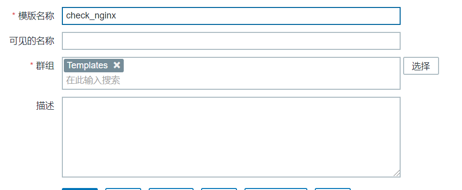
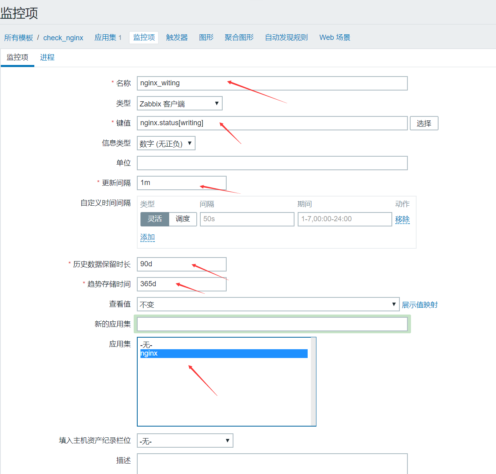
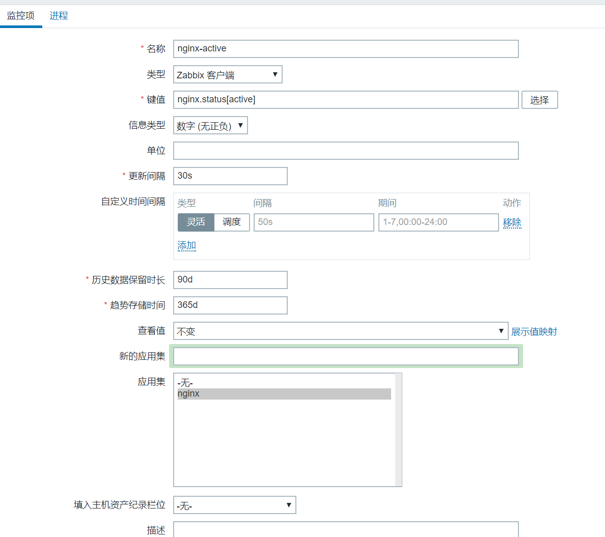
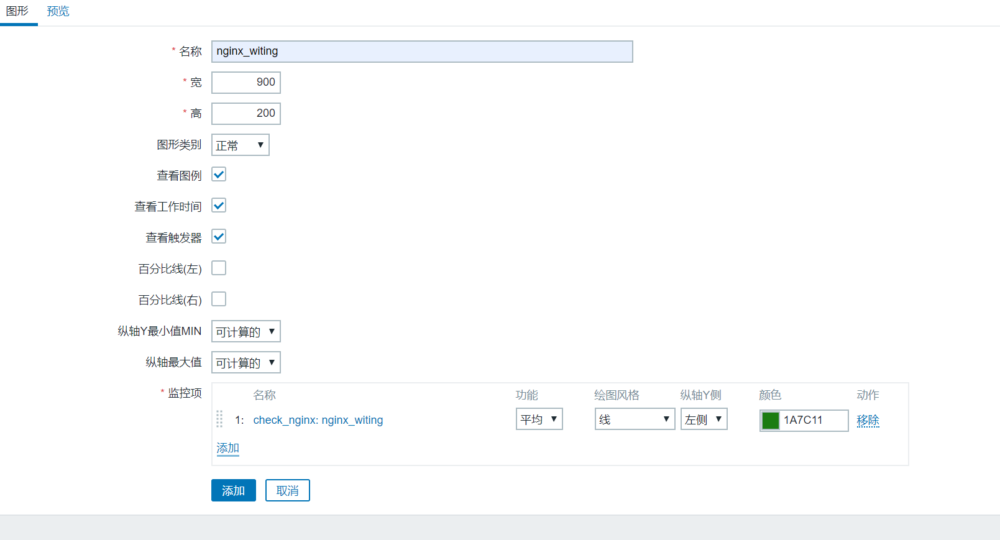
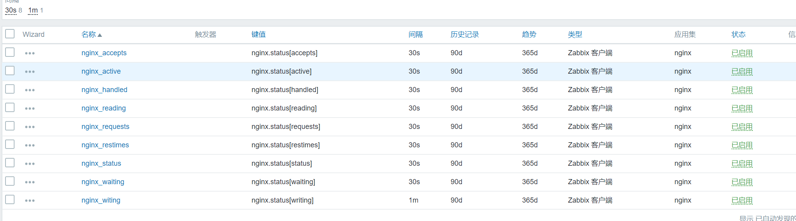
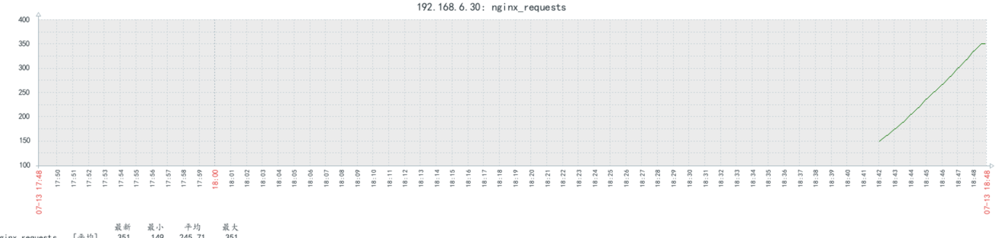

1、安装agent

<!--more-->

```
1、安装agent
# apt install zabbix-agent

# vim /etc/zabbix/zabbix_agentd.conf
Server=192.168.6.10
Hostname=192.168.6.30
AllowRoot=1
User=root

zabbix_agentd
# systemctl restart zabbix-agent

2、nginx开启状态页
# vim /app/nginx/conf/nginx.conf 
       location /nginx_status {
          stub_status;
        }

# nginx -t
# nginx


打开状态页信息
# curl http://192.168.6.30/nginx_status
Active connections: 2          
server accepts handled requests
 2 2 3 
Reading: 0 Writing: 1 Waiting: 1 

提取状态页脚本
# vim check_nginx.sh
#!/bin/bash
#
host=${2:-'127.0.0.1'}
port=${3:-'80'}
page=${4:-'nginx_status'}
info=$(/usr/bin/curl --connect-timeout 5 -s http://${host}:${port}/${page} 2>/dev/null)
code=$(/usr/bin/curl --connect-timeout 5 -o /dev/null -s -w %{http_code} http://${host}:${port}/${page})
proc=$(/usr/bin/pgrep nginx | wc -l)

case "$1" in
  status)
    echo "$code $proc" | awk '{code=$1}{proc=$2}END{if(code == "200" && proc != 0){printf("%d\n",1)}else{printf("%d\n",0)}}'
    ;;
  active)
    echo "$info" | awk '/^Active/{var=$NF}END{if(var~/^[0-9]+$/){printf("%d\n",var)}else{printf("%d\n",0)}}'
    ;;
  reading)
    echo "$info" | awk '/Reading/ {print $2}'
    ;;
  writing)
    echo "$info" | awk '/Writing/ {print $4}'
    ;;
  waiting)
    echo "$info" | awk '/Waiting/ {print $6}'
    ;;
  accepts)
    echo "$info" | awk 'NR==3 {print $1}'
    ;;
  handled)
    echo "$info" | awk 'NR==3 {print $2}'
    ;;
  requests)
    echo "$info" | awk 'NR==3 {print $3}'
    ;;
  restimes)
    echo "$info" | awk 'BEGIN{OFMT="%.3f"} NR==3 {print $4/$3}'
    ;;
  *)
    echo "ZBX_NOTSUPPORTED"
    ;;
esac


# cp check_nginx.sh /etc/zabbix/zabbix_agentd.conf.d/
3、导入脚本
root@zabbix-node2:~# vim /etc/zabbix/zabbix_agentd.conf
UserParameter=nginx.status[*],/etc/zabbix/zabbix_agentd.conf.d/check_nginx.sh $1 $2   #自定义监控项
4、使用zabbix_get命令测试
# /app/zabbix_server/bin/zabbix_get -s 192.168.6.30 -p 10050 -k "nginx.status[writing]"

5、创建模板
```



```
创建应用集
```


```
创建监控项
```





```
然后主机关联刚刚创建的check_nginx模板
```


```
添加图形
```







