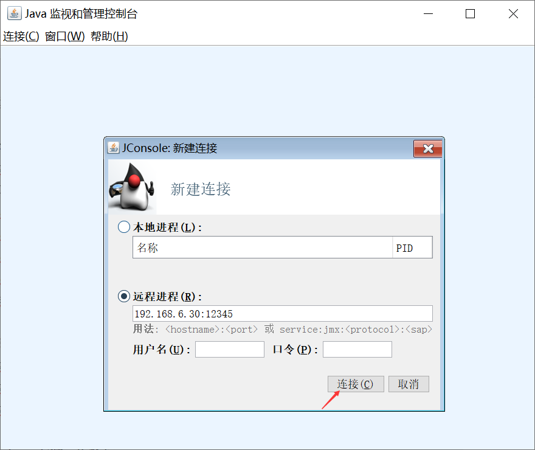
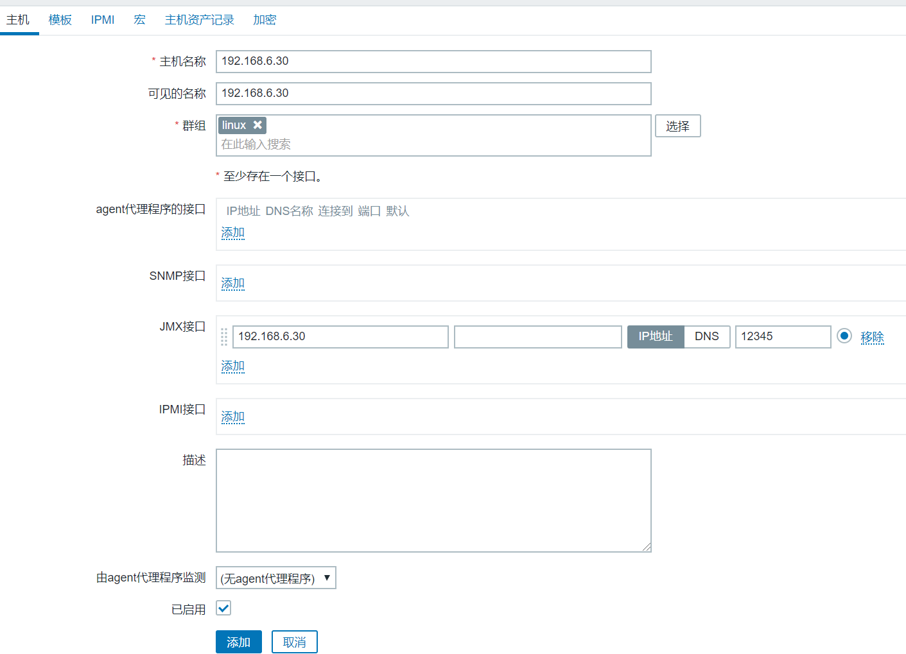
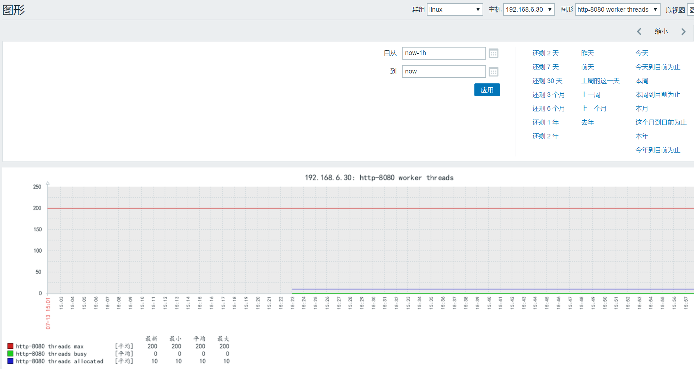

```
zabbix_get采集信息
zabbix_get -s 192.168.6.20 -p 10050 -k "system.hostname"
java gateway
```

<!--more-->


```
1、tomcat启动脚本加入监控参数
root@zabbix-node2:/app/tomcat# vim bin/catalina.sh
CATALINA_OPTS="$CATALINA_OPTS
-Dcom.sun.management.jmxremote             #启用远程监控JMX
-Dcom.sun.management.jmxremote.port=12345  #默认启动的JMX端口号，要和zabbix添加主机时候的端口一致即可
-Dcom.sun.management.jmxremote.authenticate=false  #不使用用户名密码
-Dcom.sun.management.jmxremote.ssl=false           #不使用ssl认证
-Djava.rmi.server.hostname=192.168.6.30"    #tomcat主机自己的IP地址，不要写zabbix服务器的地址

重启服务验证12345端口
root@zabbix-node2:/app/tomcat# ./bin/catalina.sh  stop
root@zabbix-node2:/app/tomcat# ./bin/catalina.sh  start
root@zabbix-node2:/app/tomcat# ss -nlt

2、windows安装jdk环境
默认安装目录
C:\Program Files\Java\jdk1.8.0_202\bin
找到jconsole.exe  
点击连接测试
```



```
检测采集数据正常
```


```
3、配置java gateway ，最好单独一台服务器装java gateway
root@zabbix-server:~# ll /app/zabbix_server/sbin/zabbix_java/settings.sh 
LISTEN_IP="0.0.0.0"
START_POLLERS=20              #采集数量
TIMEOUT=30                    #采集到数据，返回时间

启动java gateway
root@zabbix-server:~# /app/zabbix_server/sbin/zabbix_java/startup.sh 
root@zabbix-server:~# ss -nlt
10052端口

..............................................................
apt安装gateway 配置和编译的一样
root@zabbix-server:~# apt-get install zabbix-java-gateway
/etc/zabbix/zabbix_java_gateway.conf
systemctl restart zabbix-java-gateway.service
...............................................................

4、配置zabbix-server
root@zabbix-server:~# vim /app/zabbix_server/etc/zabbix_server.conf
......
JavaGateway=192.168.6.10         #javagateway服务器地址
JavaGatewayPort=10052            #监听端口
StartJavaPollers=20              #发送请求数量给javagateway，最好和START_POLLERS=20一样

root@zabbix-server:~# systemctl restart zabbix-server.service
root@zabbix-server:~# ps -ef | grep java
java进程是否匹配配置的20个
```

5、添加tomcat主机、模板






```
配置完监控，一直采集不到数据，而且确定配置没有问题的话采用命令来采集数据

使用cmdline-jmxclient-0.10.3.jar 

root@zabbix-server:/usr/local/src# java -jar cmdline-jmxclient-0.10.3.jar --help

测试能否获取到java 当前已经分配的线程数
root@zabbix-server:/usr/local/src# java -jar cmdline-jmxclient-0.10.3.jar - 192.168.6.30:12345 'Catalina:name="http-bio-8080",type=ThreadPool' currentThreadCount

root@zabbix-server:/usr/local/src# java -jar cmdline-jmxclient-0.10.3.jar - 192.168.6.30:12345 'Catalina:name="http-nio-8080",type=ThreadPool' currentThreadCount
07/13/2019 08:46:26 +0000 org.archive.jmx.Client currentThreadCount: 10

root@zabbix-server:/usr/local/src# java -jar cmdline-jmxclient-0.10.3.jar - 192.168.6.30:12345 'Catalina:name="http-nio-8080",type=ThreadPool' maxThreads
07/13/2019 08:48:32 +0000 org.archive.jmx.Client maxThreads: 200
```