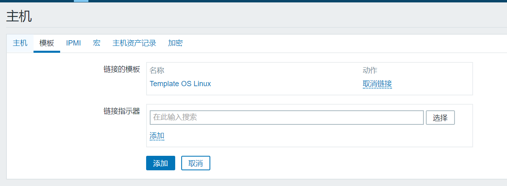

```
 1、在需要监控的服务器安装agent 
root@zabbix-node1:~/zabbix-4.0.10# ./configure --prefix=/app/zabbix_agent --enable-agent
root@zabbix-node1:~/zabbix-4.0.10# make && make install

修改agent配置
root@zabbix-node1:~# vim /app/zabbix_agent/etc/zabbix_agentd.conf
Server=192.168.6.10           #指定server端，被动模式
Hostname=192.168.6.20         #在server监控的主机名显示

AllowRoot=1                   #允许root启动
User=root                     #root用户启动

root@zabbix-node1:~# /app/zabbix_agent/sbin/zabbix_agentd 
root@zabbix-node1:~# ss -nlt
2、在zabbix-server端创建主机、模板
```

<!--more-->




