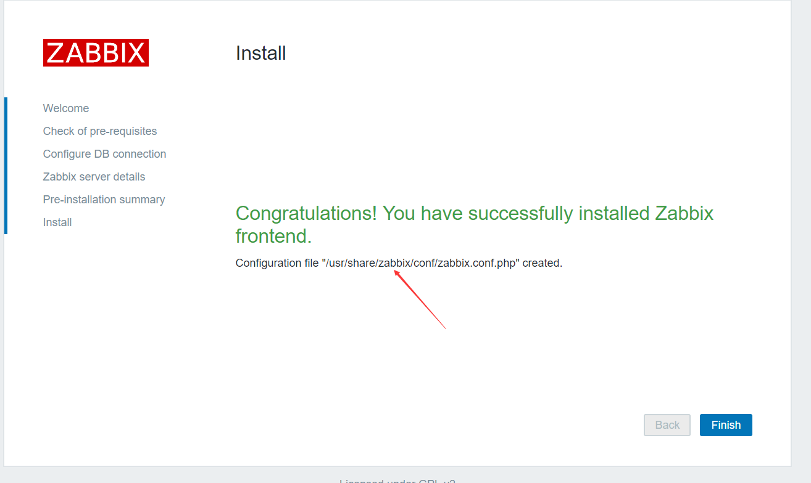
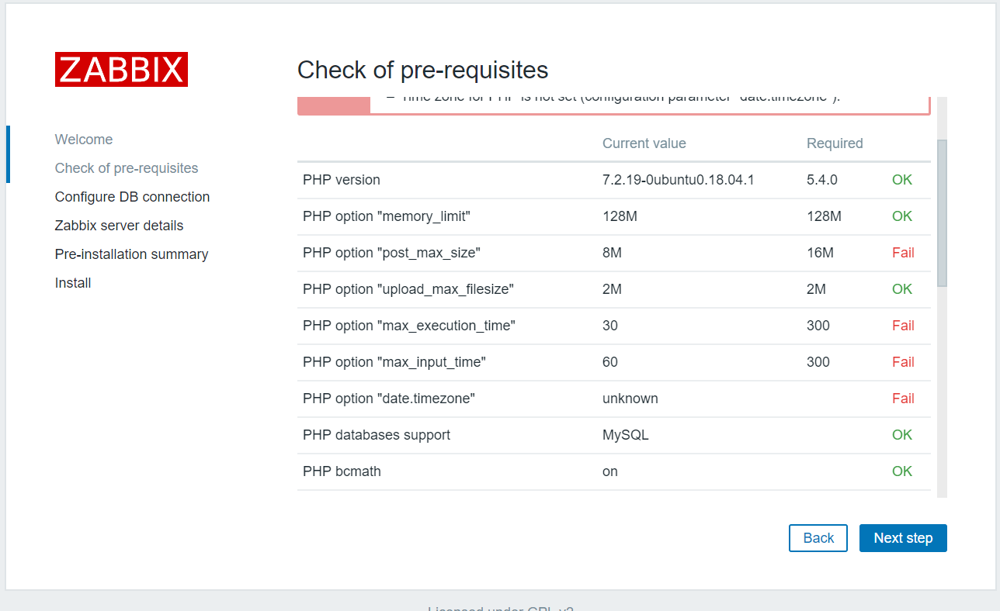
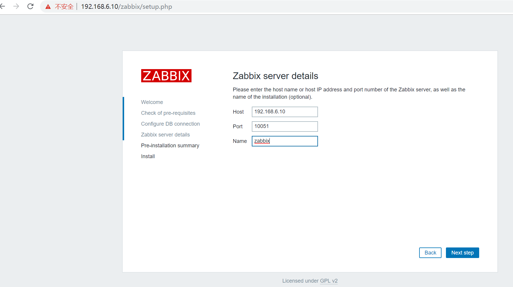

**ubuntu apt安装zabbix**

<!--more-->

```
1、安装数据库
root@zabbix-server:~# wget https://repo.zabbix.com/zabbix/4.0/ubuntu/pool/main/z/zabbix-release/zabbix-release_4.0-2+bionic_all.deb
root@zabbix-server:~# dpkg -i zabbix-release_4.0-2+bionic_all.deb
root@zabbix-server:~# apt update


2、安装Zabbix server，Web前端，agent
root@zabbix-server:~# apt -y install zabbix-server-mysql zabbix-frontend-php zabbix-agent

3、初始化数据库
MariaDB [(none)]> create database zabbix character set utf8 collate utf8_bin;
MariaDB [(none)]> grant all privileges on zabbix.* to zabbix@192.168.6.10 identified by '123456';


修改端口
root@zabbix-server:~# grep 127.0.0.1 /etc/mysql/ -R
root@zabbix-server:~# vim /etc/mysql/mariadb.conf.d/50-server.cnf

root@zabbix-server:~# systemctl restart mariadb

验证登录
root@zabbix-server:~# mysql -uzabbix -p123456 -h192.168.6.10
导入初始架构和数据，
root@zabbix-server:~# zcat /usr/share/doc/zabbix-server-mysql*/create.sql.gz | mysql -uzabbix -p123456 -h192.168.6.10 zabbix

MariaDB [zabbix]> show tables;
配置数据库
root@zabbix-server:~# vim /etc/zabbix/zabbix_server.conf
DBHost=192.168.6.10
DBPassword=123456

配置前端PHP
root@zabbix-server:~# vim /etc/zabbix/apache.conf
php_value date.timezone Asia/Shanghai

启动Zabbix server和agent进程，并为它们设置开机自启
root@zabbix-server:~# systemctl restart zabbix-server zabbix-agent apache2
root@zabbix-server:~# systemctl enable zabbix-server zabbix-agent apache2

配置zabbix前端
http://192.168.6.10/zabbix/setup.php
```



```
zabbix加入中文语言

root@zabbix-server:~# find / -name defines.inc.php
/usr/share/zabbix/include/defines.inc.php

root@zabbix-server:~# vim /usr/share/zabbix/include/defines.inc.php
......
define('ZBX_GRAPH_FONT_NAME',        'simkai'); // font file name
.......

define('ZBX_FONT_NAME', 'simkai');

搜索字体存放位置
root@zabbix-server:~# find / -name graphfont*
/usr/share/zabbix/assets/fonts/graphfont.ttf

放入新的字体（下载楷体常规）
root@zabbix-server:~# cp simkai.ttf /usr/share/zabbix/assets/fonts/
```


```
========================================================================= 
ubuntu编译安装zabbix 4.0.10

https://www.zabbix.com/download_sources#tab:40LTS

zabbix-server:192.168.6.10
zabbix-mysql:192.168.6.20

1、安装mariadb数据库
root@zabbix-mysql:~# apt-get install mariadb-server mariadb-client apt-get  install  mariadb-server mariadb-client

建立数据库
MariaDB [(none)]> create database zabbix character set utf8 collate utf8_bin;
Query OK, 1 row affected (0.05 sec)

授权
MariaDB [(none)]> grant all privileges on zabbix.* to zabbix@"192.168.6.%" identified by '123456';
Query OK, 0 rows affected (0.00 sec)

安全加固脚本
root@zabbix-mysql:/usr/local/src/zabbix-4.0.10/database/mysql# mysql_secure_installation

修改监听端口
root@zabbix-mysql:~# grep 127.0.0.1 /etc/mysql/ -R
/etc/mysql/mariadb.conf.d/50-server.cnf:bind-address = 127.0.0.1

root@zabbix-mysql:~# systemctl restart mariadb
root@zabbix-mysql:~# systemctl enable mariadb

zabbix服务端测试登录数据库
root@zabbix-server:~# mysql -uzabbix -p123456 -h192.168.6.20
2、安装zabbix依赖包
root@zabbix-server:~# apt-get  install   apache2 apache2-bin apache2-data apache2-utils fontconfig-config fonts-dejavu-core fping libapache2-mod-php   libapache2-mod-php7.2 libapr1 libaprutil1 libaprutil1-dbd-sqlite3 libaprutil1-ldap libfontconfig1 libgd3 libiksemel3   libjbig0 libjpeg-turbo8 libjpeg8 liblua5.2-0 libodbc1 libopenipmi0 libsensors4 libsnmp-base libsnmp30 libsodium23 libssh2-1  libtiff5 libwebp6 libxpm4 php-bcmath php-common php-gd php-ldap php-mbstring php-mysql php-xml php7.2-bcmath php7.2-cli  php7.2-common php7.2-gd php7.2-json php7.2-ldap php7.2-mbstring php7.2-mysql php7.2-opcache php7.2-readline   php7.2-xml snmpd  ssl-cert ttf-dejavu-core      libmysqlclient-dev  libxml2-dev  libxml2 snmp  libsnmp-dev   libevent-dev  openjdk-8-jdk curl libcurl4-openssl-dev
3、开始编译安装zabbix4.0.10

root@zabbix-server:~# cd /usr/local/src/
root@zabbix-server:src# tar xvf zabbix-4.0.10.tar.gz 

root@zabbix-server:/usr/local/src/zabbix-4.0.10# ./configure --prefix=/app/zabbix_server  --enable-server --enable-agent --with-mysql  --with-net-snmp --with-libcurl --with-libxml2  --enable-java

root@zabbix-server:/usr/local/src/zabbix-4.0.10# make && make install 
4、数据库初始化
root@zabbix-server:~# cd /usr/local/src/zabbix-4.0.10/database/mysql/
root@zabbix-server:/usr/local/src/zabbix-4.0.10/database/mysql# mysql -uzabbix -p123456 -h192.168.6.20 zabbix  < schema.sql
root@zabbix-server:/usr/local/src/zabbix-4.0.10/database/mysql# mysql -uzabbix -p123456 -h192.168.6.20 zabbix  <  images.sql
root@zabbix-server:/usr/local/src/zabbix-4.0.10/database/mysql# mysql -uzabbix -p123456 -h192.168.6.20 zabbix  <  data.sql 

5、编辑zabbix配置文件
root@zabbix-server:/usr/local/src/zabbix-4.0.10/database/mysql# vim /app/zabbix_server/etc/zabbix_server.conf
......
DBHost=192.168.6.20

DBName=zabbix

DBUser=zabbix
DBPassword=123456

6、创建zbbix用户
root@zabbix-server:~# useradd zabbix
root@zabbix-server:~# chown zabbix.zabbix /app/zabbix_server -R

7、启动zabbix
root@zabbix-server:~# /app/zabbix_server/sbin/zabbix_server -c /app/zabbix_server/etc/zabbix_server.conf
root@zabbix-server:~# ss -nlt
8、安装zabbix-web界面
root@zabbix-server:~# rm -rf /var/www/html/index.html
root@zabbix-server:~# mkdir /var/www/html/zabbix
root@zabbix-server:~# cp -a /usr/local/src/zabbix-4.0.10/frontends/php/* /var/www/html/zabbix/
root@zabbix-server:~# chown zabbix.zabbix /var/www/html/zabbix -R


9、启动apache2
root@zabbix-server:~# systemctl restart apache2

10、安装php依赖包
root@zabbix-server:/usr/local/src/zabbix-4.0.10# apt-get   install php-gettext   php-xml php-net-socket php-gd php-mysql
11、web界面部署zabbix
```




```
解决报错
root@zabbix-server:~# find / -name php.ini
/etc/php/7.2/apache2/php.ini

root@zabbix-server:~# vim /etc/php/7.2/apache2/php.ini
post_max_size = 16M
max_execution_time = 300
max_input_time = 300
date.timezone = Asia/Shanghai

root@zabbix-server:~# systemctl restart apache2
```


```
初始化数据库配置
```




```
更改权限  chown zabbix.zabbix zabbix.conf.php
```


```
默认账户密码 Admin zabbix
```


```
zabbix选择中文语言需要更改字体
1、
放入新的字体（可以从windows中获取）
root@zabbix-server:~# cd /var/www/html/zabbix/assets/fonts/
simkai.ttf

2、
/var/www/html/zabbix
root@zabbix-server:zabbix# vim include/defines.inc.php
......
define('ZBX_GRAPH_FONT_NAME', 'simkai'); // font file name       #69行 
.......
define('ZBX_FONT_NAME', 'simkai');          #110行


启动zabbix_agentd监控本机
root@zabbix-server:~# /app/zabbix_server/sbin/zabbix_agentd -c /app/zabbix_server/etc/zabbix_agentd.conf
```


```
============================================================================
制作启动脚本
zabbix-agent.service  zabbix-server.service

1、配置文件设定pid路径
root@zabbix-server:~# vim /app/zabbix_server/etc/zabbix_server.conf
PidFile=/app/zabbix_server/run/zabbix_server.pid

2、创建pid目录
root@zabbix-server:~# mkdir /app/zabbix_server/run
root@zabbix-server:~# chown zabbix.zabbix /app/zabbix_server/run

3、配置zabbix-server脚本
root@zabbix-server:~# vim /lib/systemd/system/zabbix-server.service 
[Unit]
Description=Zabbix Server
After=syslog.target
After=network.target

[Service]
Environment="CONFFILE=/app/zabbix_server/etc/zabbix_server.conf"
EnvironmentFile=-/etc/default/zabbix-server
Type=forking
Restart=on-failure
PIDFile=/app/zabbix_server/run/zabbix_server.pid
KillMode=control-group
ExecStart=/app/zabbix_server/sbin/zabbix_server -c $CONFFILE
ExecStop=/bin/kill -SIGTERM $MAINPID
RestartSec=10s
TimeoutSec=infinity

[Install]
WantedBy=multi-user.target

4、验证启动、停止
root@zabbix-server:~# systemctl daemon-reload
root@zabbix-server:~# systemctl start zabbix-server.service 
root@zabbix-server:~# systemctl stop zabbix-server.service
.................................................................................
1、配置文件设定pid路径
root@zabbix-server:~# vim /app/zabbix_server/etc/zabbix_agentd.conf
PidFile=/app/zabbix_agent/run/zabbix_agentd.pid

2、创建pid目录
root@zabbix-server:~# mkdir /app/zabbix_agent/run/ -p
root@zabbix-server:~# chown zabbix.zabbix /app/zabbix_agent 

3、配置zabbix-agent.service脚本
root@zabbix-server:~# vim /lib/systemd/system/zabbix-agent.service
[Unit]
Description=Zabbix Agent
After=syslog.target
After=network.target

[Service]
Environment="CONFFILE=/app/zabbix_server/etc/zabbix_agentd.conf"
EnvironmentFile=-/etc/default/zabbix-agent
Type=forking
Restart=on-failure
PIDFile=/app/zabbix_agent/run/zabbix_agentd.pid
KillMode=control-group
ExecStart=/app/zabbix_server/sbin/zabbix_agentd -c $CONFFILE
ExecStop=/bin/kill -SIGTERM $MAINPID
RestartSec=10s

[Install]
WantedBy=multi-user.target

4、验证启动、停止
root@zabbix-node1:~# systemctl daemon-reload
root@zabbix-node1:~# systemctl restart zabbix-agent.service 
root@zabbix-node1:~# ps -ef | grep zabbix

配置文件

root@zabbix-server:~# mkdir /app/zabbix_server/logs
root@zabbix-server:~# chown zabbix.zabbix /app/zabbix_server/logs/

root@zabbix-server:~# vim /app/zabbix_server/etc/zabbix_server.conf
LogFile=/app/zabbix_server/logs/zabbix_server.log     #日志

AllowRoot=0             #0关闭root启动，1开启root启动
User=zabbix             #启动zabbix服务的用户   
```