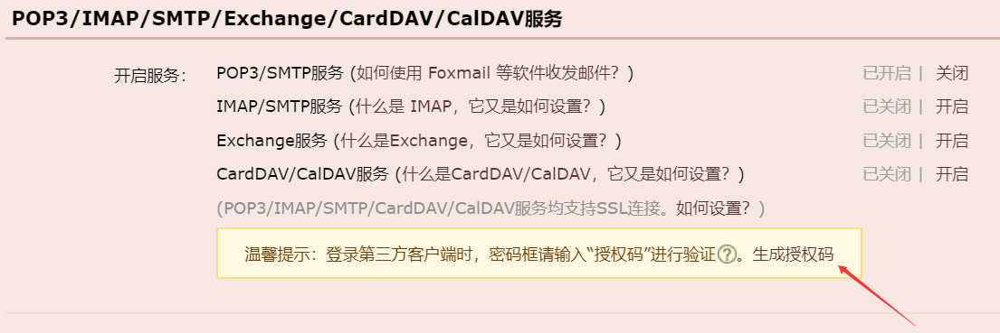
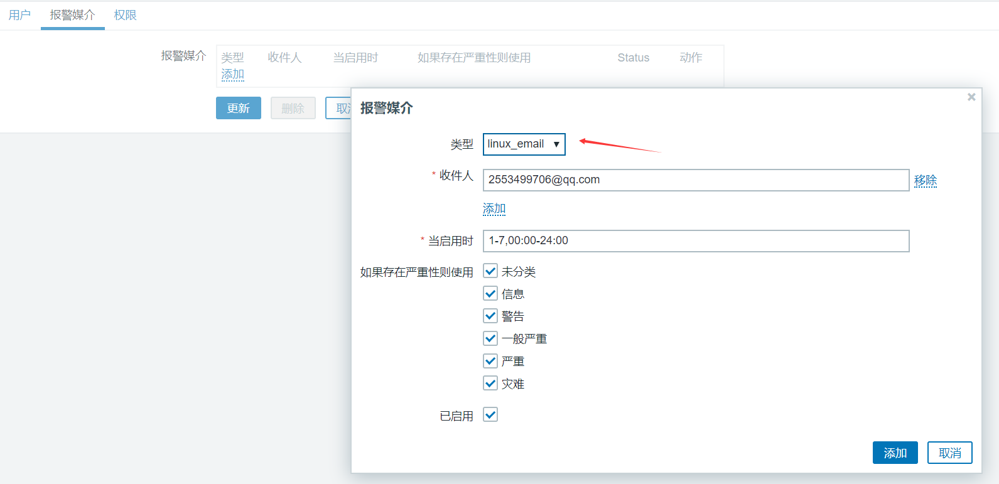
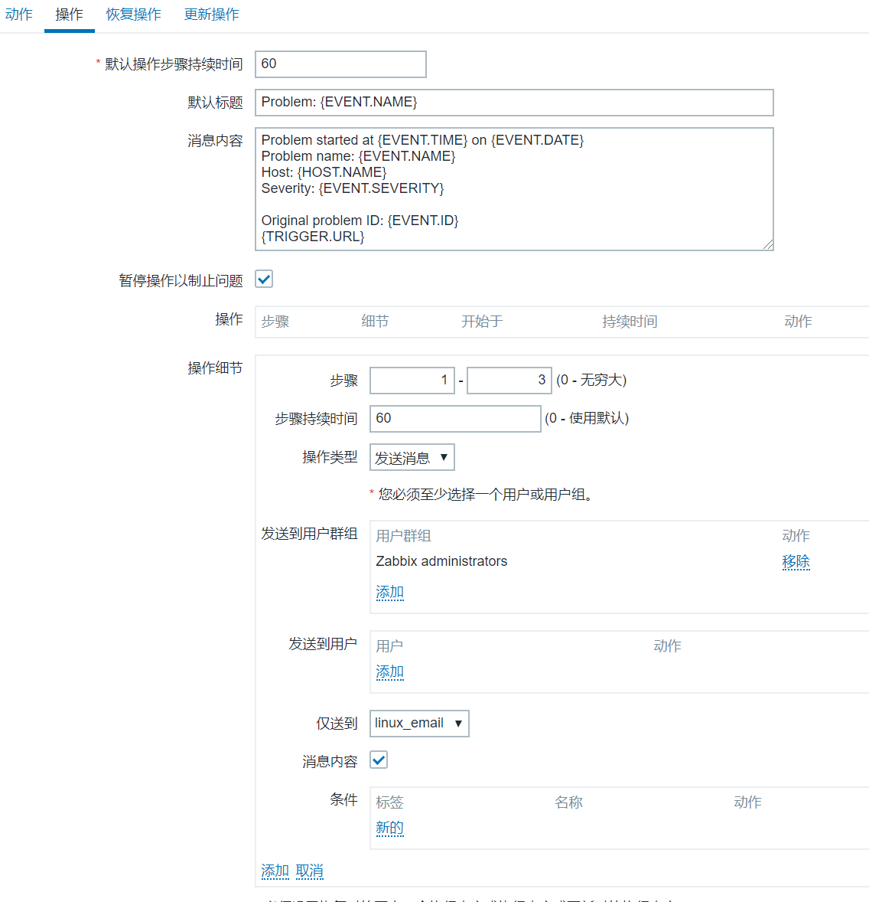

<!--more-->

```
1、创建报警媒介类型
```


```
2、添加报警媒介
```



```
3、配置动作，创建动作
```


```
操作
```




```
===================================================================
前提：agent服务器
1、
# vim /etc/zabbix/zabbix_agentd.conf
EnableRemoteCommands=1        #开启远程命令
UnsafeUserParameters=1        #允许执行特殊字符

2、授权
# vim /etc/sudoers
zabbix  ALL=(ALL)     NOPASSWD: ALL
创建动作


创建操作


停止tomcat测试
catalina.sh stop
============================================================================

监控snmp设备
centos模拟网络设备，被zabbix监听

centos常用的部分OID


1、centos
[root@localhost ~]# yum install net-snmp

[root@localhost ~]# vim /etc/snmp/snmpd.conf
view    systemview    included   .1.3.6.
[root@localhost ~]# systemctl restart snmpd
[root@localhost ~]# systemctl enable snmpd

[root@localhost ~]# ss -ntlup        161端口

2、zabbix_server
root@zabbix-node1:~# snmpwalk -h

测试
root@zabbix-node1:~# snmpwalk -v2c -c public 192.168.0.20 .1.3.6.1.4.1.2021.10.1.3.1
iso.3.6.1.4.1.2021.10.1.3.1 = STRING: "0.00"

3、添加主机
=====================================================================

监控MySQL服务


1、MySQL服务器安装zabbix_agent
[root@localhost ~]# yum -y install zabbix-agent

2、MySQL服务器安装procona
[root@localhost ~]# wget https://www.percona.com/downloads/percona-monitoring-plugins/percona-monitoring-plugins-1.1.8/binary/redhat/7/x86_64/percona-zabbix-templates-1.1.8-1.noarch.rpm
[root@localhost ~]# rpm -ivh percona-zabbix-templates-1.1.8-1.noarch.rpm

#参考安装教程
https://www.percona.com/doc/percona-monitoring-plugins/LATEST/zabbix/index.html#installation-instructions

[root@localhost ~]# cp /var/lib/zabbix/percona/templates/userparameter_percona_mysql.conf /etc/zabbix/zabbix_agentd.d/

3、MySQL服务器修改agent配置
[root@localhost ~]# vim /etc/zabbix/zabbix_agentd.conf
[root@localhost ~]# systemctl restart zabbix-agent

4、zabbix添加主机验证监控正常


5、MySQL服务器创建配置文件授权
[root@localhost ~]# vim /var/lib/zabbix/percona/scripts/ss_get_mysql_stats.php.cnf
<?php
$mysql_user = 'root';
$mysql_pass = '';

6、安装php
[root@localhost ~]# yum -y install php php-mysql

7、测试命令
[root@localhost ~]# /var/lib/zabbix/percona/scripts/get_mysql_stats_wrapper.sh gg
[root@localhost ~]# vim /etc/zabbix/zabbix_agentd.d/userparameter_percona_mysql.conf
UserParameter=MySQL.Sort-scan,/var/lib/zabbix/percona/scripts/get_mysql_stats_wrapper.sh kt
UserParameter=MySQL.slave-stopped,/var/lib/zabbix/percona/scripts/get_mysql_stats_wrapper.sh jh
UserParameter=MySQL.Com-replace,/var/lib/zabbix/percona/scripts/get_mysql_stats_wrapper.sh jz
UserParameter=MySQL.innodb-lock-structs,/var/lib/zabbix/percona/scripts/get_mysql_stats_wrapper.sh lp
UserParameter=MySQL.Com-load,/var/lib/zabbix/percona/scripts/get_mysql_stats_wrapper.sh kg
......
......

8、在zabbix_server端使用命令测试
root@zabbix-server:~# /app/zabbix_server/bin/zabbix_get -s 192.168.0.20 -p 10050 -k "MySQL.Com-load"

9、导入自制mysql模板zbx_mysql_export_templates.xml.xml

效果图
......................................................................

自定义监控MySQL脚本
提取Slave_IO_Running、Slave_SQL_Running、Seconds_Behind_Master

[root@localhost ~]# vim /etc/zabbix/zabbix_agentd.d/mysql_monitor.sh 
#!/bin/bash
Seconds_Behind_Master(){
        NUM=`mysql -uroot -hlocalhost   -e "show slave status\G;"  | grep "Seconds_Behind_Master:" | awk -F: '{print $2}'`
        echo $NUM
}

master_slave_check(){
NUM1=`mysql -uroot -hlocalhost   -e "show slave status\G;"  | grep "Slave_IO_Running" | awk -F:  '{print $2}' | sed 's/^[ \t]*//g'`
#echo $NUM1
NUM2=`mysql -uroot -hlocalhost   -e "show slave status\G;"  | grep "Slave_SQL_Running:" | awk -F:  '{print $2}' | sed 's/^[ \t]*//g'`
#echo $NUM2
if test $NUM1 == "Yes" &&  test $NUM2 == "Yes";then
    echo 50
else
    echo 100
fi
}

main(){
    case $1 in
        Seconds_Behind_Master)
           Seconds_Behind_Master;
           ;;
        master_slave_check)
           master_slave_check
           ;;
    esac
}
main $1


............................................................................
测试脚本
1、
[root@localhost zabbix_agentd.d]# bash mysql_monitor.sh Seconds_Behind_Master
0
[root@localhost zabbix_agentd.d]# bash mysql_monitor.sh master_slave_check
50

2、
MariaDB [(none)]> stop slave;
Query OK, 0 rows affected (0.01 sec)

[root@localhost zabbix_agentd.d]# bash mysql_monitor.sh master_slave_check
100

......................................................................................
--------------------------------------------------------------------------------------

agent端添加监控项
[root@localhost zabbix_agentd.d]# vim mysql_monitor.conf
UserParameter=mysql_monitor[*],/etc/zabbix/zabbix_agentd.d/mysql_monitor.sh $1

[root@localhost zabbix_agentd.d]# chmod a+x mysql_monitor.sh
[root@localhost zabbix_agentd.d]# systemctl restart zabbix-agent.service

server端远程监测
root@zabbix-server:~# /app/zabbix_server/bin/zabbix_get -s 192.168.0.20 -p 10050 -k "mysql_monitor[master_slave_check]"
50
root@zabbix-server:~# /app/zabbix_server/bin/zabbix_get -s 192.168.0.20 -p 10050 -k "mysql_monitor[Seconds_Behind_Master]"
0


自定义监控模板


创建监控项


添加自建模板


创建图形
```