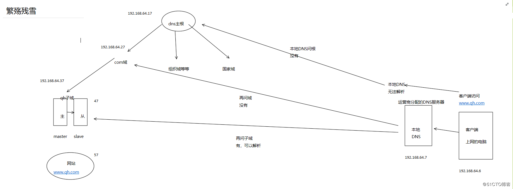
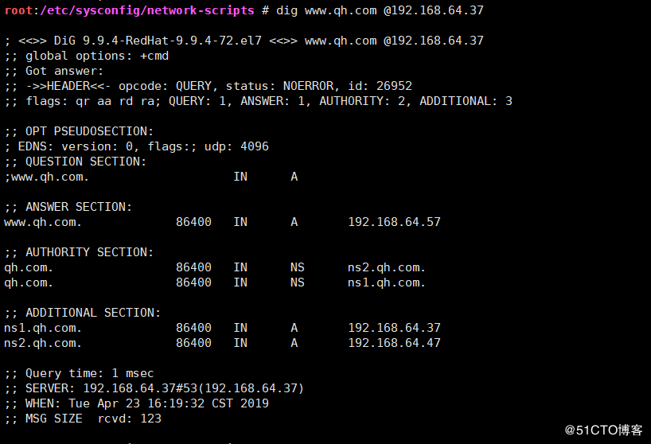
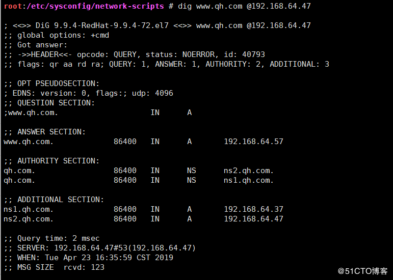
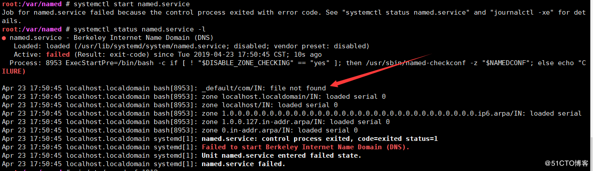

## 互联网DNS架构实验

## 针对系统学习DNS后的一个实验

- 架构图
  
  
  <!--more-->
  
- 共7台主机，联合实现互联网dns架构
  
  
- 1将客户端dns服务器指向本地dns服务器
  
  
- 2将网站搭建好

```
root:~ # yum install httpd
root:~ # cd /var/www/html/
root:/var/www/html # echo 192.168.64.57,hello >index.html
root:/var/www/html # chmod a+r index.html
root:/var/www/html # service httpd restart
```

- 3客户端测试

  

  

- 4配置主masterDNS

```
root:~ # yum install bind
root:~ # vi /etc/named.conf
//      listen-on port 53 { 127.0.0.1; };
//      allow-query     { localhost; };
allow-transfer {192.168.64.47;}; 
root:~ # vi /etc/named.rfc1912.zones
zone "qh.com" IN {
        type master;
        file "qh.com.zone";
};

root:~ # cd /var/named/
root:/var/named # vi qh.com.zone
$TTL 1D
@ IN SOA ns1 qh.mail.com. ( 1 1H 10M 1D 3H )
        NS ns1
        NS ns2

ns1 A 192.168.64.37
ns2 A 192.168.64.47
www A 192.168.64.57

root:/var/named # chgrp named qh.com.zone
root:/var/named # chmod 640 qh.com.zone
#### 语法检查
root:/var/named # named-checkconf
#### 启动服务
root:/var/named # systemctl start named.service
```

- 5客户端测试master服务器
  
- 6搭建从服务器

```
root:~ # yum install bind
root:~ # vi /etc/named.conf
//      listen-on port 53 { 127.0.0.1; };
//      allow-query     { localhost; };
allow-transfer {none;}; 
root:~ # vi /etc/named.rfc1912.zones
zone "qh.com" {
    type slave;
    masters {192.168.64.37;};                                              
    file "slaves/qh.com.slave";
};
root:/var/named/slaves # systemctl start named.service 
root:/var/named/slaves # rndc reload                   
root:/var/named/slaves # ll
total                                  #已同步
-rw-r--r-- 1 named named 269 Apr 23 16:34 qh.com.slave
```

- 7测试从服务器
  
- 8配置com域服务器

```
root:~ # yum install bind
root:~ # vi /etc/named.conf
//      listen-on port 53 { 127.0.0.1; };
//      allow-query     { localhost; };
allow-transfer {none;}; 
------------------------------------------------
root:~ # vi /etc/named.rfc1912.zones
zone "com" IN {
        type master;
        file "com.zone";
};
---------------------------------------------------------
root:~ # cd /var/named/
root:/var/named # vim com.zone
$TTL 1D
@ IN SOA NS1 qh.mail.com. (1 1D 1H 1W 3D )
        NS ns1
qh      NS qhns1
qh      NS qhns2
ns1 A 192.168.64.27
qhns1 A 192.168.64.37   #主服务器
qhns2 A 192.168.64.47   #从服务器

root:/var/named # chgrp named com.zone 
root:/var/named # chmod g+w com.zone 
root:/var/named # systemctl start named.service 
root:/var/named # rndc reload
server reload successful
```

- 9测试 （通过父域192.168.64.27测试）
  
- 10搭建根DNS

```
root:~ # yum install bind
root:~ # vi /etc/named.conf
//      listen-on port 53 { 127.0.0.1; };
//      allow-query     { localhost; };
zone "." IN {
        type master;          #改为master自己做根
        file "root.zone";
};

root:~ # cd /var/named/
root:/var/named # vim root.zone
$TTL 1D
@ IN SOA ns1 qh.mail.com. (1 1D 1H 1W 3D )
        NS ns1
com     NS comns1
ns1 A 192.168.64.17
comns1 A 192.168.64.27

root:/var/named # chgrp named com.zone 
root:/var/named # chmod g+w com.zone 
root:/var/named # systemctl start named.service 
```

- 11测试（通过主根服务器测试）
  
- 12配置本地dns服务器

```
root:~ # yum install bind
root:~ # vi /etc/named.conf
//      listen-on port 53 { 127.0.0.1; };
//      allow-query     { localhost; };

root:/etc/sysconfig/network-scripts # vi /var/named/named.ca #改为下面配置
.                       518400  IN      NS      a.root-servers.net.

a.root-servers.net.     3600000 IN      A       192.168.64.17
```

- 13清缓存

```
root:/var/named # rndc flush #清理所有dns缓存
```

- 14在本地dns修改安全配置

```
root:~ # vi /etc/named.conf 
dnssec-enable no;
dnssec-validation no;
```

- 15测试
  

## 一些过程中可能遇到的错误

```
root:/var/named # systemctl start named.service
Job for named.service failed because the control process exited with error code. See "systemctl status named.service" and "journalctl -xe" for details.
```

一般可以通过systemctl status named.service -l 命令可以查看当前错误类型


> ```
> #dig A example.com
> ; <<>> DiG 9.9.4-RedHat-9.9.4-14.el7 <<>> A example.com
> ;; global options: +cmd
> ;; Got answer:
> ;; ->>HEADER<<- opcode: QUERY, status: NOERROR, id: 30523
> ...
> SERVFAIL:The nameserver encountered a problem while processing the query.
> • 可使用dig +trace排错，可能是网络和防火墙导致
> NXDOMAIN：The queried name does not exist in the zone.
> • 可能是CNAME对应的A记录不存在导致
> REFUSED：The nameserver refused the client's DNS request due to policy
> restrictions.
> • 可能是DNS策略导致
> • NOERROR不代表没有问题，也可以是过时的记录
> •查看是否为权威记录，flags:aa标记判断
> •被删除的记录仍能返回结果，可能是因为*记录存在
> •如：*.example.com． IN A 172.25.254.254
> •注意“.”的使用
> •避免CNAME指向CNAME记录，可能产生回环
> •est.example.com. IN CNAME lab.example.com.
> •lab.example.com. IN CNAME test.example.com.
> •正确配置PTR记录，许多服务依赖PTR，如sshd,MTA
> •正确配置轮询round-robin记录
> ```