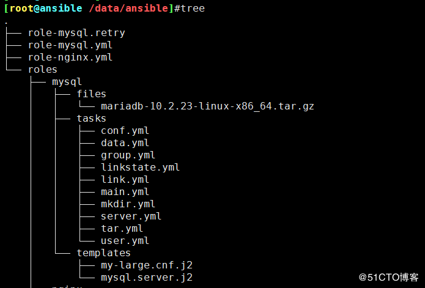
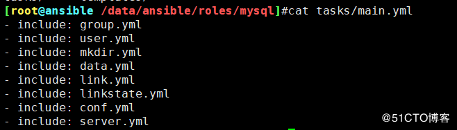
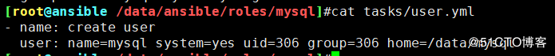
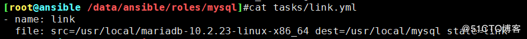

## 总结构



<!--more-->

### 1



```
- include: group.yml
- include: user.yml
- include: mkdir.yml
- include: data.yml
- include: link.yml
- include: linkstate.yml
- include: conf.yml
- include: server.yml
```

### 2


```
- name: create group
  group: name=mysql system=yes gid=306
```

### 3



```
- name: create user
  user: name=mysql system=yes uid=306 group=306 home=/data/mysql
```

### 4


```
- name: mkdir
  file: name=/data/mysql owner=root group=mysql state=directory
```

### 5


```
- name: copy data
  unarchive: src=mariadb-10.2.23-linux-x86_64.tar.gz  dest=/usr/local
```

### 6



```
- name: link
  file: src=/usr/local/mariadb-10.2.23-linux-x86_64 dest=/usr/local/mysql state=link
```

### 7


```
- name: link state
  file: name=/usr/local/mysql owner=root group=mysql
```

### 8


```
- name: mkdir conf 
  file: path=/etc/mysql state=directory
- name: copy conf
  template: src=my-large.cnf.j2 dest=/etc/mysql/my.cnf
```

### 9


```
- name: install
  shell: /usr/local/mysql/scripts/mysql_install_db --datadir=/data/mysql --user=mysql
- name: copy service conf
  template: src=mysql.server.j2 dest=/etc/rc.d/init.d/mysqld
- name: add service
  shell: chkconfig --add mysqld
- name: chmod
  shell: chmod +x /etc/init.d/mysqld
- name: start server
  shell: service mysqld start
- name: PATH
  shell: echo PATH=/usr/local/mysql/bin:$PATH > /etc/profile.d/mysql
- name: source
  shell: source /etc/profile.d/mysql
```

### 10 安全初始化

```
#!/usr/bin/expect
set timeout 60
#set password [lindex $argv 0]
spawn mysql_secure_installation
expect {
        "enter for none" { send "\r"; exp_continue}
        "Change the root password" { send "\r"; exp_continue}
        "New password" { send "new passwd\r"; exp_continue}
        "Re-enter new password" { send "newpasswd\r"; exp_continue}
        "Remove anonymous users" { send "\r"; exp_continue}
        "Disallow root login remotely" { send "n\r"; exp_continue}
        "Remove test database and access to it" { send "\r"; exp_continue}
        "Reload privilege tables now" { send "\r"; exp_continue}
        "Cleaning up" { send "\r"}
}
interact ' > mysql_secure_installation.exp
```