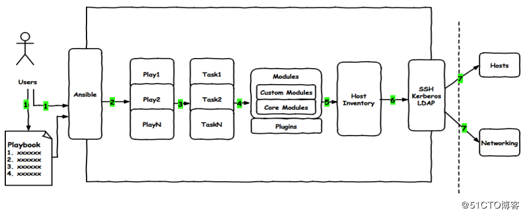
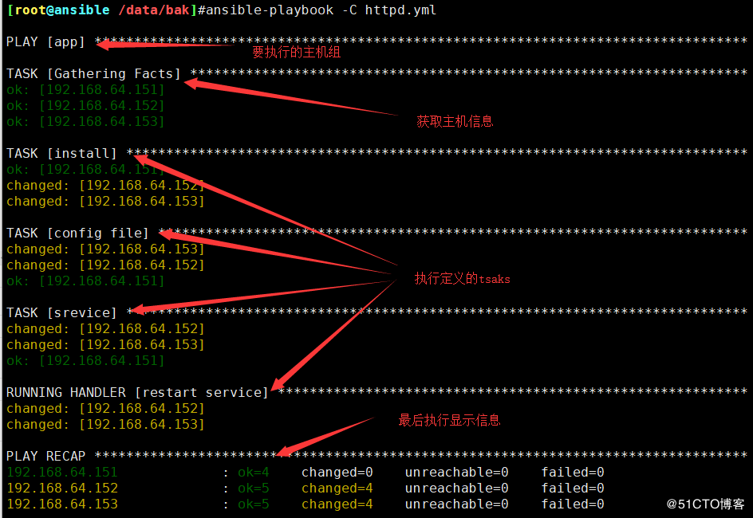
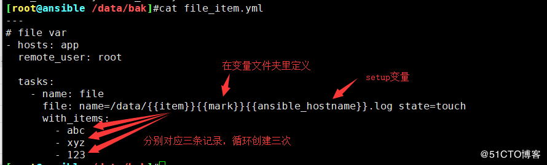
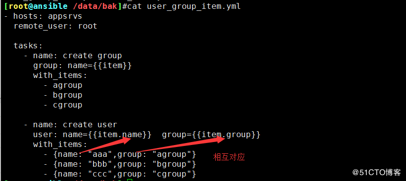
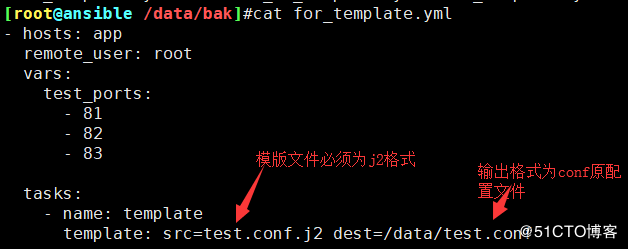

## 介绍



<!--more-->

## 命令用法

- 运行playbook的方式

```
ansible-playbook <filename.yml> ... [options]
```

- 常见选项
  –check -C 只检测可能会发生的改变，但不真正执行操作
  –list-hosts 列出运行任务的主机
  –list-tags 列出tag
  –list-tasks 列出task
  –limit 主机列表 只针对主机列表中的主机执行
  -v -vv -vvv 显示过程
- 示例
  ansible-playbook file.yml –check 只检测
  ansible-playbook file.yml
  ansible-playbook file.yml –limit websrvs

## Playbook核心元素

- Hosts 执行的远程主机列表
- Tasks 任务集
- Varniables 内置变量或自定义变量在playbook中调用
- Templates 模板，可替换模板文件中的变量并实现一些简单逻辑的文件
- Handlers 和 notity 结合使用，由特定条件触发的操作，满足条件方才执行，
  否则不执行
- tags 标签 指定某条任务执行，用于选择运行playbook中的部分代码。ansible
  具有幂等性，因此会自动跳过没有变化的部分，即便如此，有些代码为测试其
  确实没有发生变化的时间依然会非常地长。此时，如果确信其没有变化，就可
  以通过tags跳过此些代码片断

## playbook执行的文件为yml格式

- 此为范例

```
---
- hosts: all    # 代表在所有主机执行
  remote_user: root #以root身份执行
  tasks:
    - name: hello world #标签名
      command: /usr/bin/wall hello world #执行的命令
```

## 与shell脚本对比

SHELL脚本

```
#!/bin/bash
# 安装Apache
yum install --quiet -y httpd
# 复制配置文件
cp /tmp/httpd.conf /etc/httpd/conf/httpd.conf
cp/tmp/vhosts.conf /etc/httpd/conf.d/
# 启动Apache，并设置开机启动
service httpd start
chkconfig httpd on
```

Playbook定义

```
---
- hosts: all
 tasks:
 - name: "安装Apache"
 yum: name=httpd
 - name: "复制配置文件"
 copy: src=/tmp/httpd.conf dest=/etc/httpd/conf/
 - name: "复制配置文件"
 copy: src=/tmp/vhosts.conf dest=/etc/httpd/conf.cd/
 - name: "启动Apache，并设置开机启动"
 service: name=httpd state=started enabled=yes
```

## handlers和notify结合使用触发条件

> - Handlers
>   是task列表，这些task与前述的task并没有本质上的不同,用于当关注的资源发生
>   变化时，才会采取一定的操作
> - Notify此action可用于在每个play的最后被触发，这样可避免多次有改变发生
>   时每次都执行指定的操作，仅在所有的变化发生完成后一次性地执行指定操作。
>   在notify中列出的操作称为handler，也即notify中调用handler中定义的操作


## 自己的yml范例

```
#install httpd
- hosts: appsrvs
  remote_user: root

  tasks:
    - name: install package
      yum: name=httpd
    - name: config file
      copy: src=files/httpd.conf dest=/etc/httpd/conf/ backup=yes
      notify: restart service
      tags: config
    - name: service
      service: name=httpd state=started enabled=yes
      tags: service
    - name: restart service
      service: name=httpd state=restarted 
      tags: service
  handlers:
    - name: restart service
      service: name=httpd state=restarted 
```



## 

### item和变量使用

```
---
# file var
- hosts: app
  remote_user: root

  tasks:
    - name: file
      file: name=/data/{{item}}{{mark}}{{ansible_hostname}}.log state=touch 
      with_items:
        - abc
        - xyz
        - 123
```


\* item 组

```
- hosts: appsrvs
  remote_user: root

  tasks:
    - name: create group
      group: name={{item}}
      with_items:
        - agroup
        - bgroup
        - cgroup

    - name: create user
      user: name={{item.name}}  group={{item.group}}
      with_items:
        - {name: "aaa",group: "agroup"}
        - {name: "bbb",group: "bgroup"}
        - {name: "ccc",group: "cgroup"}
```



## templates使用

```
---
  - hosts: all
  - vars:
    test_ports: 
      - 81
      - 82
      - 83
    tasks:
      - name: test
        template: src=test.conf.j2 dest=/data/test.conf
```



```

server {
    listen  {{i}}
    server_name www.a.com
    root   /app/websitea/
}

---
# file var
- hosts: appsrvs
  remote_user: root
  vars_files:
    - vars.yml
  vars:
    - port: 1234

  tasks:
    - name: file
      file: name=/data/{{ansible_hostname}}{{mark}}{{port}}.log state=touch 
```