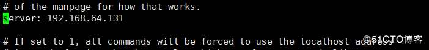
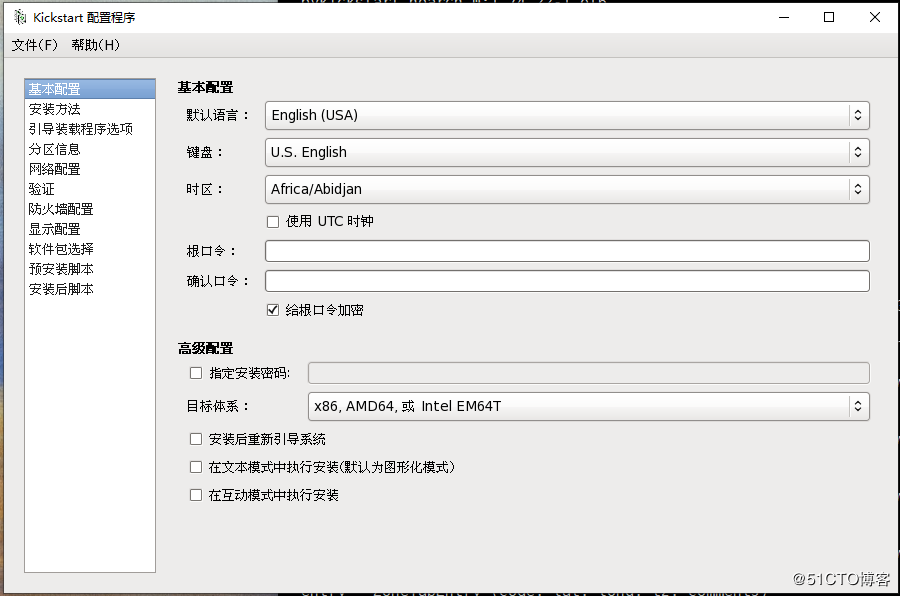

## 1 安装包和配置服务

```
root:~# yum install cobbler  dhcp -y
root:~# systemctl enable tftp dhcpd httpd cobblerd
root:~# systemctl start tftp  httpd cobblerd
```

<!--more-->

## 2 修改cobbler 配置文件

```
vim /etc/cobbler/settings
server: cobblerIP  384
```


““`
next_server: cobblerIP 272

```

```

default_password_crypted: “$1$VBqc7U0W$F2qhI5oZwR8chJBU.mAly1” 101

```

```

manage_dhcp: 1 242 #可自动配置dhcp

```

```

root:~# cobbler get-loaders
task started: 2019-04-19_074328_get_loaders
task started (id=Download Bootloader Content, time=Fri Apr 19 07:43:28 2019)
downloading https://cobbler.github.io/loaders/README to /var/lib/cobbler/loaders/README
downloading https://cobbler.github.io/loaders/COPYING.elilo to /var/lib/cobbler/loaders/COPYING.elilo
downloading https://cobbler.github.io/loaders/COPYING.yaboot to /var/lib/cobbler/loaders/COPYING.yaboot
downloading https://cobbler.github.io/loaders/COPYING.syslinux to /var/lib/cobbler/loaders/COPYING.syslinux
downloading https://cobbler.github.io/loaders/elilo-3.8-ia64.efi to /var/lib/cobbler/loaders/elilo-ia64.efi
downloading https://cobbler.github.io/loaders/yaboot-1.3.17 to /var/lib/cobbler/loaders/yaboot
downloading https://cobbler.github.io/loaders/pxelinux.0-3.86 to /var/lib/cobbler/loaders/pxelinux.0
downloading https://cobbler.github.io/loaders/menu.c32-3.86 to /var/lib/cobbler/loaders/menu.c32
downloading https://cobbler.github.io/loaders/grub-0.97-x86.efi to /var/lib/cobbler/loaders/grub-x86.efi
downloading https://cobbler.github.io/loaders/grub-0.97-x86_64.efi to /var/lib/cobbler/loaders/grub-x86_64.efi
*** TASK COMPLETE ***
root:~# cobbler sync
task started: 2019-04-19_074450_sync

------

!!! TASK FAILED !!!

```
## 3 配置dhcp服务
```

root:~# vim /etc/cobbler/dhcp.template
subnet 192.168.64.0 netmask 255.255.255.0 {
option routers 192.168.64.254;
option domain-name-servers 1.1.1.1;
option subnet-mask 255.255.255.0;
range dynamic-bootp 192.168.64.100 192.168.64.254

root:~# cobbler sync
task started: 2019-04-19_075613_sync
task started (id=Sync, time=Fri Apr 19 07:56:13 2019)
running pre-sync triggers
…………………………….
running shell triggers from /var/lib/cobbler/triggers/change/*
*** TASK COMPLETE ***
““

## 4导入安装源文件

### 将光盘挂载好

> root:~# df
> Filesystem 1K-blocks Used Available Use% Mounted on
> /dev/mapper/centos-root 52403200 2066756 50336444 4% /
> devtmpfs 919432 0 919432 0% /dev
> tmpfs 931612 0 931612 0% /dev/shm
> tmpfs 931612 9744 921868 2% /run
> tmpfs 931612 0 931612 0% /sys/fs/cgroup
> /dev/sda1 1038336 149004 889332 15% /boot
> /dev/mapper/centos-home 154057220 33100 154024120 1% /home
> tmpfs 186324 0 186324 0% /run/user/0
> /dev/sr0 10491772 10491772 0 100% /mnt/7
> /dev/sr1 3897932 3897932 0 100% /mnt/6

```
root:~# cobbler import --path=/mnt/6 --name=Centos-6.10 --arch=x86_64
task started: 2019-04-19_080352_import
task started (id=Media import, time=Fri Apr 19 08:03:52 2019)
Found a candidate signature: breed=redhat, version=rhel6
Found a matching signature: breed=redhat, version=rhel6
Adding distros from path /var/www/cobbler/ks_mirror/Centos-6.10-x86_64:
creating new distro: Centos-6.10-x86_64
trying symlink: /var/www/cobbler/ks_mirror/Centos-6.10-x86_64 -> /var/www/cobbler/links/Centos-6.10-x86_64
creating new profile: Centos-6.10-x86_64
associating repos
checking for rsync repo(s)
checking for rhn repo(s)
checking for yum repo(s)
starting descent into /var/www/cobbler/ks_mirror/Centos-6.10-x86_64 for Centos-6.10-x86_64
processing repo at : /var/www/cobbler/ks_mirror/Centos-6.10-x86_64
need to process repo/comps: /var/www/cobbler/ks_mirror/Centos-6.10-x86_64
looking for /var/www/cobbler/ks_mirror/Centos-6.10-x86_64/repodata/*comps*.xml
Keeping repodata as-is :/var/www/cobbler/ks_mirror/Centos-6.10-x86_64/repodata
*** TASK COMPLETE ***
```

### 查看现有安装选项

```
root:~# cobbler profile list
   Centos-6.10-x86_64
[root@localhost ~]# cobbler distro list  #安装原文件名称
[root@localhost ~]# cat /var/lib/tftpboot/pxelinux.cfg/default 
DEFAULT menu
PROMPT 0
MENU TITLE Cobbler | http://cobbler.github.io/
TIMEOUT 200
TOTALTIMEOUT 6000
ONTIMEOUT local

LABEL local
        MENU LABEL (local)
        MENU DEFAULT
        LOCALBOOT -1

LABEL Centos-6.10-x86_64
        kernel /images/Centos-6.10-x86_64/vmlinuz
        MENU LABEL Centos-6.10-x86_64
        append initrd=/images/Centos-6.10-x86_64/initrd.img ksdevice=bootif lang=  kssendmac text  ks=http://192.168.64.131/cblr/svc/op/ks/profile/Centos-6.10-x86_64
        ipappend 2


MENU end
cobbler profile remove --name=NAME
cobbler distro remove --name=NAME
```

### 现在已经可以自动化安装了，不过cobbler默认配置文件为最小化安装，想要自定义的花要修改配置文件

### Centos 7.0下使用system-config-kickstart

```
修改CentOS-Base.repo

[base]                     修改 ---------->[development]  
name=CentOS-$releasever - Base
root:~# yum install -y system-config-kickstart.noarch
root:~  # env LANG=zh_CN.UTF-8 system-config-kickstart #生成自定义配置文件
```

## 将ks文件和系统关联，生成启动菜单

```
cobbler profile add --name=Centos6_mini --distro=Centos-6.10-x86_64 --kickstart=/var/lib/cobbler/kickstarts/ks6mini.cfg
```



### 将所有选项选完即可左上角保存

### centos6ks文件

```
#platform=x86, AMD64, or Intel EM64T
#version=DEVEL
# Firewall configuration
firewall --disabled
# Install OS instead of upgrade
install
# Use CDROM installation media
url --url=$tree
# Root password
rootpw --iscrypted $1$RR1QsW0t$qYYwsKO5LloO6y3WaTkdj0
# System authorization information
auth  --useshadow  --passalgo=sha512
# Use text mode install
text
# System keyboard
keyboard us
# System language
lang en_US
# SELinux configuration
selinux --disabled
# Do not configure the X Window System
skipx
# Installation logging level
logging --level=info
# Reboot after installation
reboot
# System timezone
timezone  Asia/Shanghai
# Network information
network  --bootproto=dhcp --device=eth0 --onboot=on
# System bootloader configuration
bootloader --location=mbr --md5pass="$1$EmYezDTP$mBxhDFd/BRDIn6ZBAOtL00"
# Clear the Master Boot Record
zerombr
# Partition clearing information
clearpart --all --initlabel 
# Disk partitioning information
part /boot --fstype="ext4" --size=1024
part / --fstype="ext4" --grow --size=1

%post
mkdir /root/.ssh
chmod 700 /root/.ssh
cat > /root/.ssh/authorized_keys <<EOF
ssh-rsa AAAAB3NzaC1yc2EAAAABIwAAAQEAtSEz3OSOAI6UMkRjIVk3cXwVf/tYa9YsBOVd4vamGtrAuPN5+zgOj9T9p+QI0nJHva6LR4Wz5es46zXoSrLoKY4rTpqnmuPNYuG3B/cybOv99+hriq7Vs9/OqMIgsLbtk4R99Rg75wL9jXpcyxgKtCyVYG4sjdlfyQXQXuauzai6u9oqKo7MmDyWiC9QJSqfilrQKhUB+OfVo4/vkYxKLsRy8N6k2BoRTk2VIp7XKB4gr3sutgutXk35A3O08ukGBSA+378G2csDmf9nctGv4kSw/gR6Mdy2LnhcxcnPA5IP39Buvkdp2eqXOnY1zWxTiUdLtfAb81rFpwMudtaK1w== rsa 2048-041619
EOF
chmod 600 /root/.ssh/authorized_keys
systemctl stop firewalld
systemctl disable firewalld.service
systemctl stop NetworkManager
systemctl disable NetworkManager
%end

%packages
@base
@debugging
@network-tools

%end
```

## centos7ks文件

```
#platform=x86, AMD64, or Intel EM64T
#version=DEVEL
# Install OS instead of upgrade
install
# Keyboard layouts
keyboard 'us'
# Root password
rootpw --iscrypted $1$F4q00dyi$IQ1/CLubGYHtDw6EvSiln0
# System language
lang en_US
# System authorization information
auth  --useshadow  --passalgo=sha512
# Use CDROM installation media
url --url=$tree
# Use graphical install
text
# SELinux configuration
selinux --disabled
# Do not configure the X Window System
skipx

# Firewall configuration
firewall --disabled
# Network information
network  --bootproto=dhcp --device=ens33
# Halt after installation
halt
# System timezone
timezone Asia/Shanghai
# System bootloader configuration
bootloader --append=" crashkernel=auto" --location=mbr --boot-drive=sda
# Partition clearing information
clearpart --all --initlabel
reboot
# Disk partitioning information
part /boot --fstype="xfs" --size=1024
part / --fstype="xfs" --grow --size=1

%post
mkdir /root/.ssh
chmod 700 /root/.ssh
cat > /root/.ssh/authorized_keys <<EOF
ssh-rsa AAAAB3NzaC1yc2EAAAABIwAAAQEAtSEz3OSOAI6UMkRjIVk3cXwVf/tYa9YsBOVd4vamGtrAuPN5+zgOj9T9p+QI0nJHva6LR4Wz5es46zXoSrLoKY4rTpqnmuPNYuG3B/cybOv99+hriq7Vs9/OqMIgsLbtk4R99Rg75wL9jXpcyxgKtCyVYG4sjdlfyQXQXuauzai6u9oqKo7MmDyWiC9QJSqfilrQKhUB+OfVo4/vkYxKLsRy8N6k2BoRTk2VIp7XKB4gr3sutgutXk35A3O08ukGBSA+378G2csDmf9nctGv4kSw/gR6Mdy2LnhcxcnPA5IP39Buvkdp2eqXOnY1zWxTiUdLtfAb81rFpwMudtaK1w== rsa 2048-041619
EOF
chmod 600 /root/.ssh/authorized_keys
systemctl stop firewalld
systemctl disable firewalld.service
systemctl stop NetworkManager
systemctl disable NetworkManager
sed -i 's/SELINUX=enforcing/SELINUX=disabled/' /etc/selinux/config
mkdir /etc/yum.repo.d/bak
mv /etc/yum.repos.d/*.repo /etc/yum.repos.d/bak/
cat > /etc/yum.repos.d/Centos-Base.repo <<EOF
[development]
name=CentOS-$releasever - Base - mirrors.aliyun.com
failovermethod=priority
baseurl=http://mirrors.aliyun.com/centos/$releasever/os/$basearch/
        http://mirrors.aliyuncs.com/centos/$releasever/os/$basearch/
        http://mirrors.cloud.aliyuncs.com/centos/$releasever/os/$basearch/
gpgcheck=1
gpgkey=http://mirrors.aliyun.com/centos/RPM-GPG-KEY-CentOS-7

#released updates 
[updates]
name=CentOS-$releasever - Updates - mirrors.aliyun.com
failovermethod=priority
baseurl=http://mirrors.aliyun.com/centos/$releasever/updates/$basearch/
        http://mirrors.aliyuncs.com/centos/$releasever/updates/$basearch/
        http://mirrors.cloud.aliyuncs.com/centos/$releasever/updates/$basearch/
gpgcheck=1
gpgkey=http://mirrors.aliyun.com/centos/RPM-GPG-KEY-CentOS-7

#additional packages that may be useful
[extras]
name=CentOS-$releasever - Extras - mirrors.aliyun.com
failovermethod=priority
baseurl=http://mirrors.aliyun.com/centos/$releasever/extras/$basearch/
        http://mirrors.aliyuncs.com/centos/$releasever/extras/$basearch/
        http://mirrors.cloud.aliyuncs.com/centos/$releasever/extras/$basearch/
gpgcheck=1
gpgkey=http://mirrors.aliyun.com/centos/RPM-GPG-KEY-CentOS-7

#additional packages that extend functionality of existing packages
[centosplus]
name=CentOS-$releasever - Plus - mirrors.aliyun.com
failovermethod=priority
baseurl=http://mirrors.aliyun.com/centos/$releasever/centosplus/$basearch/
        http://mirrors.aliyuncs.com/centos/$releasever/centosplus/$basearch/
        http://mirrors.cloud.aliyuncs.com/centos/$releasever/centosplus/$basearch/
gpgcheck=1
enabled=0
gpgkey=http://mirrors.aliyun.com/centos/RPM-GPG-KEY-CentOS-7

#contrib - packages by Centos Users
[contrib]
name=CentOS-$releasever - Contrib - mirrors.aliyun.com
failovermethod=priority
baseurl=http://mirrors.aliyun.com/centos/$releasever/contrib/$basearch/
        http://mirrors.aliyuncs.com/centos/$releasever/contrib/$basearch/
        http://mirrors.cloud.aliyuncs.com/centos/$releasever/contrib/$basearch/
gpgcheck=1
enabled=0
gpgkey=http://mirrors.aliyun.com/centos/RPM-GPG-KEY-CentOS-7
EOF

cat > /etc/yum.repos.d/epel.repo << EOF
[epel]
name=Extra Packages for Enterprise Linux 7 - $basearch
baseurl=http://mirrors.aliyun.com/epel/7/$basearch
failovermethod=priority
enabled=1
gpgcheck=0
gpgkey=file:///etc/pki/rpm-gpg/RPM-GPG-KEY-EPEL-7

[epel-debuginfo]
name=Extra Packages for Enterprise Linux 7 - $basearch - Debug
baseurl=http://mirrors.aliyun.com/epel/7/$basearch/debug
failovermethod=priority
enabled=0
gpgkey=file:///etc/pki/rpm-gpg/RPM-GPG-KEY-EPEL-7
gpgcheck=0

[epel-source]
name=Extra Packages for Enterprise Linux 7 - $basearch - Source
baseurl=http://mirrors.aliyun.com/epel/7/SRPMS
failovermethod=priority
enabled=0
gpgkey=file:///etc/pki/rpm-gpg/RPM-GPG-KEY-EPEL-7
gpgcheck=0
EOF
%end

%packages
@base
@network-tools

%end
```

## web管理

### 阿里云太新会出错，用搜狐

```
vi /etc/yum.repos.d/epel.repo
[epel]
name=Extra Packages for Enterprise Linux 7 - $basearch
baseurl=http://mirrors.sohu.com/fedora-epel/7/x86_64/
enabled=1
gpgcheck=0
[root@localhost ~]# yum clean all
[root@localhost network-scripts]# yum install cobbler-web
[root@localhost network-scripts]# service httpd restart
[root@localhost network-scripts]# htdigest /etc/cobbler/users.digest Cobbler cobbleradmin(添加新管理用户)
```